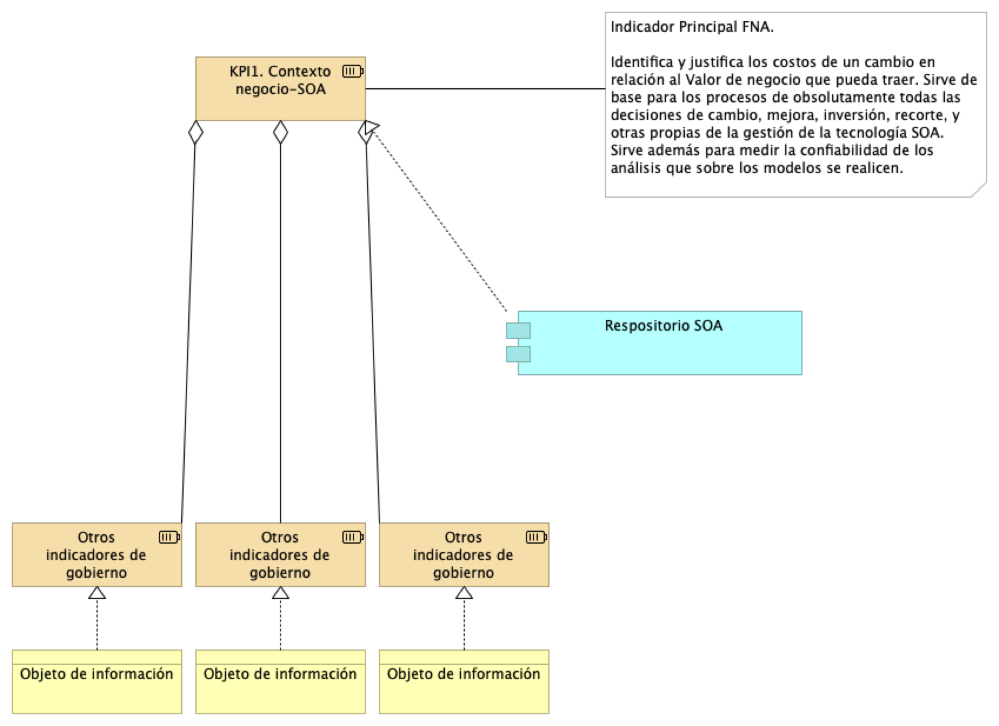

|Tema|Gobierno SOA: **Mejora de los indicadores de efectividad (madurez) SOA**
|----|-------------------------------------------------|
|Palabras clave|SOA, Inversión TI, Eficacia, KPI, Proceso SOA|
|Autor||
|Fuente||
|Version|$COMMIT del $FECHA_COMPILACION|
|Vínculos|[Fase 2 PR6 Gobierno SOA](N03a%a20Vsta%20aSegenta%20SOA%20FNA.md)|

 

## Indicadores de Efectividad del Gobierno SOA
Más allá de los índices propuestos por el análisis de madurez SOA desarrollado en la Fase 1 de este diagnóstico, _para el FNA es clave mantener activo el vínculo de sus activos tanto de infraestructura como los activos SOA (y de todos, aunque se escapen del alcance de este ejercicio) con el contexto de negocio de las vicepresidencias de Operaciones y de Crédito_. Esto es, el principal indicador del gobierno SOA es la existencia y actualidad de los vínculos entre los contextos de negocio y la arquitectura de referencia SOA FNA, y su tecnología.

Este solo indicador del gobierno SOA, el del vínculo de los contextos negocio-tecnología SOA, que es útil también para otras disciplinas de gestión TI, _identifica y justifica los costos de un cambio en relación al Valor de negocio que pueda traer_. Sirve de base para los procesos de obsolutamente todas las decisiones de cambio, mejora, inversión, recorte, y otras propias de la gestión de la tecnología SOA.
Sirve además para medir la confiabilidad de los análisis que sobre los modelos se realicen. _Es por estas razones que para el Fondo este es el principal indicador de gobierno SOA a desarrollar_.

De todos, el indicador de Vínculo Contexto Negocio-SOA es el más importante para el FNA. Para mantener el puntaje de este indicador alto debe recurrir a la actualización y mantenimiento del repositorio de arquitectura. En la medida en que este repositorio capture la mayor cantidad de información de los contextos referidos, el indicador aumentará, a la vez que el repositorio será un activo clave para todas las opeaciones de gestión de TI del FNA.

[Imagen 1.]() Indicador principal del gobierno SOA: KPI de Vínculo Contexto Negocio-SOA. Identifica y justifica los cambios SOA en relación al Valor de negocio.

_Fuente: elaboración propia._

 

## Indicadores Complementarios del Gobierno SOA
Los siguientes indicadores sirven de base de pirámide para el indicador principal. 

 

***
El principal aspecto que determina 
Through its linking of the business context to information technology, enterprise architecture readily identifies and provides justification for the cost of change programs in relation to the business value to be derived from the effort. Enterprise architecture may provide the context and analysis capabilities to support:

Showing how SOA solutions can be effectively architected to support business capabilities
Showing which services should be built and which should be re-used
Showing how services should be designed