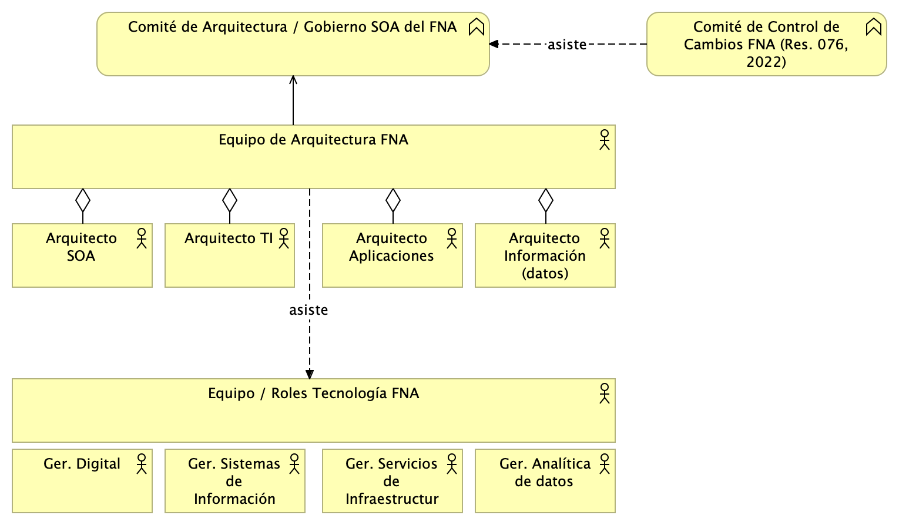
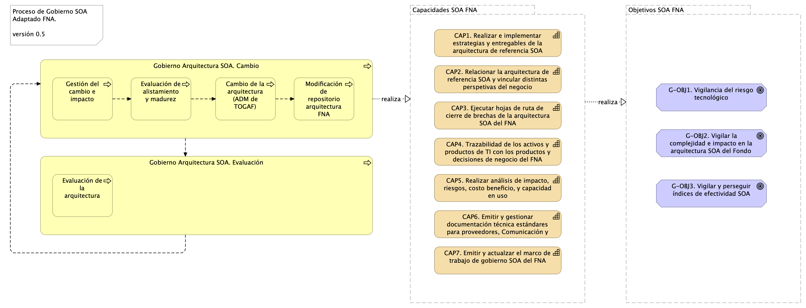

|Tema            |Gobierno SOA: **Consideraciones para la puesta en marcha del gobierno SOA en el FNA** |
|----------------|---------------------------------------------------|
|Palabras clave|SOA, Inversión TI, Eficacia, KPI, Proceso SOA|
|Autor          ||
|Fuente         ||
|Version        |**$COMMIT** del $FECHA_COMPILACION|
|Vínculos       |[Fase 2 PR6 Gobierno SOA](N03a%a20Vsta%20aSegenta%20SOA%20FNA.md)|

 

## Consideraciones para Implementación del Gobierno SOA en FNA

### Marco de Trabajo para Implementar Gobierno SOA en FNA
Un Marco de trabajo adaptado para la organización que responde y gestiona los cambios evolutivos de la arquitectura de referencia SOA instalada en el Fondo. Esta versión del marco de gobierno, que necesariamente es una versión inicial para el FNA dado el resultado del análisis de madurez de la Fase 1, procura únicamente la gestión de cambios de la arquitectura. Versiones posteriores de este modelo puede y deberá abordar problemáticas señaladas por nuevos análisis.

[Imagen 1.]() Actores del FNA necesarios para el Gobierno SOA.

_Fuente: elaboración propia._

 

### Equpo de Trabajo para el Gobierno SOA del FNA
El equipo de trabajo requerido conforme el modelo de gobierno SOA presentado aquí se compone del capital humano en los roles de gestión de la tecnología y arquitectura en los ámbitos de diseño de servicios y componentes, infraestructura tecnológica y redes, aplicaciones de solución y herramientas de software y del especialista de las estructuras de negocio e información. Estos recursos deben ser preferiblemente internos a la organización debido a la gestión de conocimiento del _activo más importante del gobierno SOA, la arquitectura de referencia y los vínculos de esta con los contextos de negocio y TI_.

[Imagen 2.]() Roles y Grupos de trabajo del gobierno SOA del FNA.

_Fuente: elaboración propia._

 

### Proceso de Gobierno SOA para el FNA
Por último, el proceso de gobierno SOA es la conjugación de las dos condiciones aquí presentadas, el marco de trabajo (acciones y herramientas) y el equipo de trabajo, que son los recursos de capital humano y sus intereacciones. Este proceso adaptado al FNA busca alcanzar los objetivos SOA determinados por este diagnóstico. (ver imagen abajo)

[Imagen 3.]() Actividades y relaciones del proceso principal de gobierno SOA para el FNA. Relación con capacidades y objetivos SOA necesarios para el FNA.

_Fuente: elaboración propia._

 

El proceso de gobierno SOA está en línea y apoya a las capacidades SOA que el FNA debe implementar. De esa manera, las capacidades SOA relacionadas con este proceso buscan lograr los objetivos SOA establecidos por esta consultoría y que el FNA debe perseguir.
