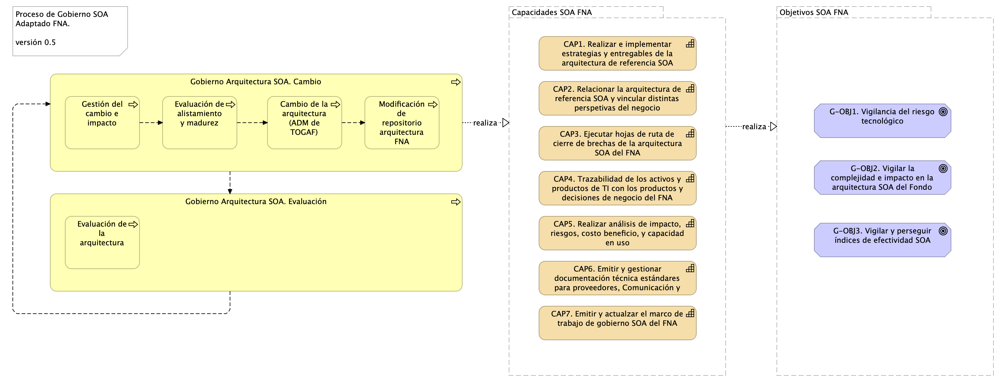

| Tema           | Gobierno SOA: **Consideraciones para la puesta en marcha del gobierno SOA en el FNA** |
|----------------|---------------------------------------------------------------------------------------|
| Palabras clave | SOA, Inversión TI, Eficacia, KPI, Proceso SOA                                         |
| Autor          |                                                                                       |
| Fuente         |                                                                                       |
| Version        | **$COMMIT** del $FECHA_COMPILACION                                                    |
| Vínculos       | [Fase 2 PR6 Gobierno SOA](N03a%a20Vsta%20aSegenta%20SOA%20FNA.md)                     |

 

## Consideraciones para Implementación del Gobierno SOA en FNA

### Marco de Trabajo para Implementar Gobierno SOA en FNA
Antes de implementar lo que llamamos Gobierno SOA del FNA, es requisito contar con un marco de trabajo adaptado para el segmento de la empresa y que responda y gestione los cambios evolutivos de la arquitectura de referencia SOA instalada en el Fondo. Esta versión del marco de gobierno, que necesariamente es una versión inicial para el FNA dado el resultado del análisis de madurez de la Fase 1, procura únicamente cubrir de entrada la gestión de cambios de la arquitectura. Versiones posteriores de este modelo pueden y deberán abordar otras problemáticas señaladas por este diagnóstico o alguna de sus actualizaciones.

[Imagen 1.]() Actores del FNA necesarios para el Gobierno SOA.

_Fuente: elaboración propia._

 

Un primer nivel de detalle del marco de gobierno introduce los actores y la interacción entre estos: ante un evento de cambio de la arquitectura SOA instanciada, sea por un requerimiento de arquitectura, o un ajuste del negocio (por ej., vicepresidencia de Crédito o de Operaciones), el arquitecto responsable debe realizar el proceso de gobierno SOA descrito más adelante. Debe también crear o actualizar el(los) artefactos del repositorio de arquitectura del FNA implicados en el impacto. Por último, hay que asegurar o elaborar los insumos mínimos para que el Comité de Arquitectura pueda desempeñar la evaluación de los modelos en cualquier momento.

 

### Equipo de Trabajo para el Gobierno SOA del FNA
El equipo de trabajo requerido conforme el modelo de gobierno SOA presentado aquí se compone del capital humano en los roles de gestión de la tecnología y arquitectura en los ámbitos de diseño de servicios SOA y componentes de software, infraestructura tecnológica y redes, aplicaciones de solución y herramientas de software, y del especialista de las estructuras de datos e información del negocio. Estos recursos deben ser preferiblemente propios de la organización (no terceros) debido a la gestión de conocimiento del _activo más importante del gobierno SOA, la arquitectura de referencia y los vínculos de esta con los contextos de negocio y TI_.

[Imagen 2.]() Roles y Grupos de trabajo del gobierno SOA del FNA.

_Fuente: elaboración propia._

 

### Perfiles del Equipo de Trabajo de Gobierno
El personal propuesto arriba en equipo de trabajo necesario para la ejecución del gobierno SOA, que se materializa en la puesta en marcha de una oficina de arquitectura interna, compone un grupo interdisciplinario en el que recae la no menor responsabilidad del éxito del gobierno, y con ello, la consecusión de los objetivos que de la Vicepresidencia de Tecnología se espera. Por tanto, este equipo interdiscioplinario deberá cumplir con niveles altos de formación y experiencia tales que estén a la altura de esta exigencia.

La formación y experiencia que desde este ejercicio de diagnóstico declaramos necesario para la oficina de arquitectura del FNA que garanticen la adecuada ejecución de las actividades propias de esta nueva oficina y del gobierno SOA del FNA es la siguiente.

| Perfil                     | Formación                                                                                                                                                                                                                                                                                                                                                                                                             | Experiencia                                           | Responsabilidad                                                                                                                                                                                                                                                                                                        |
|----------------------------|-----------------------------------------------------------------------------------------------------------------------------------------------------------------------------------------------------------------------------------------------------------------------------------------------------------------------------------------------------------------------------------------------------------------------|-------------------------------------------------------|------------------------------------------------------------------------------------------------------------------------------------------------------------------------------------------------------------------------------------------------------------------------------------------------------------------------|
| Arquitecto SOA             | Profesional en Ingeniería de Sistemas, Electrónica, o afines. Especialización o maestría en ingeniería de software, sistemas de información, o computación o arquitectura de software o arquitectura empresarial, o infraestructura o gerencia de tecnología. Con Certificación en TOGAF, nivel 1 y 2, 9.1 o superior; o en construcción de software o Gerencia de Tecnología o computación en nube, o DevOps. | Mínimo de ocho (8) años en ejercicio de su profesión. | Es responsable de vigilar las decisiones técnicas de la arquitectura de referencia del FNA y observar las especificaciones tecnológicas que usarán los equipos de desarrollo internas y externas, fábricas, y proveedores que implementan las herramientas, servicios, componentes y soluciones de software del Fondo. |
| Arquitecto TI              | Profesional en Ingeniería de Sistemas o afines, o Electrónica y especialización o maestría en áreas afines con la Ingeniería de Sistemas. Postgrado en la modalidad de Especialización o Maestría en las áreas del conocimiento afines a: Ingeniería de Software o ingeniería de sistemas o arquitectura de sistemas de información o especialización en infraestructura de tecnología o Gerencia de Tecnología. | Mínimo de seis (6) años en ejercicio de su profesión. | Es responsable de vigilar las decisiones de diseño y montaje de la infraestructura de la arquitectura de referencia del FNA y observar las especificaciones técnicas que usarán los equipos de desarrollado, fábricas, proveedores, para implementar las herramientas, servicios, componentes y soluciones de software del Fondo                                      |
| Arquitecto de Aplicaciones | Profesional en Ingeniería de Sistemas o afines, o Electrónica y especialización o maestría en áreas afines con la Ingeniería de Sistemas. Postgrado en la modalidad de Especialización o Maestría en las áreas del conocimiento afines a: Ingeniería de Software o ingeniería de sistemas o arquitectura de sistemas de información o especialización en construcción de software o Gerencia de Tecnología.      | Mínimo de seis (6) años en ejercicio de su profesión. | Es responsable de vigilar las decisiones técnicas de los componentes y aplicaciones constituyentes de la arquitectura de referencia del FNA y observar las especificaciones de reutilización, seguridad y construcción de los componentes que usarán los equipos de desarrollado, fábricas, proveedores, para implementar las herramientas, servicios, componentes y soluciones de software del Fondo                                      |
| Arquitecto de Información  | Profesional en Ingeniería de Sistemas o afines, o Electrónica y especialización o maestría en áreas afines con la Ingeniería de Sistemas. Postgrado en la modalidad de Especialización o Maestría en las áreas del conocimiento afines a: Ingeniería de Software o ingeniería de sistemas o arquitectura de sistemas de información o especialización en uso y explotación de datos o Gerencia de Tecnología.    | Mínimo de seis (6) años en ejercicio de su profesión. | Es responsable de vigilar las decisiones de diseño de los conceptos y entidades de datos de la arquitectura de referencia del FNA y observar las especificaciones de estructuración y distribución de los productos de datos que usarán los equipos de desarrollado, fábricas, proveedores, para implementar las herramientas, servicios, componentes y soluciones de software del Fondo                                      |

Estos recursos deben ser preferiblemente propios de la organización (no terceros) debido a la gestión de conocimiento del _activo más importante del gobierno SOA, la arquitectura de referencia y los vínculos de esta con los contextos de negocio y TI_.

 

### Proceso de Gobierno SOA para el FNA
Por último, el proceso de gobierno SOA es la conjugación de las dos consideraciones anteriores aquí presentadas, el marco de trabajo (acciones y herramientas) y el equipo de trabajo, que traídos al contexto del FNA son los recursos de capital humano y la manera cómo deben operar. Este proceso adaptado al FNA busca alcanzar los objetivos SOA determinados por este diagnóstico. (ver imagen abajo)

[Imagen 3.]() Actividades y relaciones del proceso principal de gobierno SOA para el FNA. Relación con capacidades y objetivos SOA necesarios para el FNA.

_Fuente: elaboración propia._

 

El proceso de gobierno SOA está en línea y apoya a las capacidades SOA que el FNA debe implementar. Al alinear las capacidades SOA con este proceso aseguramos que se persigan los objetivos SOA establecidos por esta consultoría.

Por otro lado, esta implementación de Gobierno SOA debe ser un proceso más del Fondo, no es un proyecto. En este sentido, los pasos de este proceso son un bucle activo de mejora continua, y debe hacer parte del mapa de calidad del Fondo (como uno más de los procesos operativos existentes).

 

### Gestión del cambio e impacto (incepción)
Es la definición del alcance del reajuste en la arquitectura, distinto a un cambio en una aplicación, sistema de información, datos o plataforma del FNA. el cambio a gestionar debe ser analizado desde la perspectiva de la arquitectura actual o candidata. En este sentido, el cambio es descrito en términos del qué, dónde, quién y cómo cambiar la arquitectura SOA del Fondo.

Una entrada razonable de este paso es la discución mediante vistas de la potencialidad del cambio (dificultades y beneficios) y las preocupaciones de los interesados, gerentes y dueños de procesos / productos. Es ncesario a veces complementar o contrastar el cambio con otros requerimientos.

El resultado o salida de este paso es el bosquejo de la adaptación, que son las tareas mínimas y más impactantes para la implementación del cambio / iteración en la arquitectura.

Como herramienta para la realización de este paso del proceso presentamos un ficha de descripción del evento de cambio.

 

| Parte de la arquitectura a cambiar | Contexto del cambio…                               |
|------------------------------------|----------------------------------------------------|
| Justificación                      |                                                    |
| Implicaciones                      | Restricciones: utilización de estándares abiertos… |
|                                    | Condiciones: doble revisión…                       |

[Tabla.]() Ficha descriptiva inicial para el FNA. La ficha presenta e inicia el paso de descripción del cambio en la arquitectura del FNA.

_Fuente: elaboración propia._
