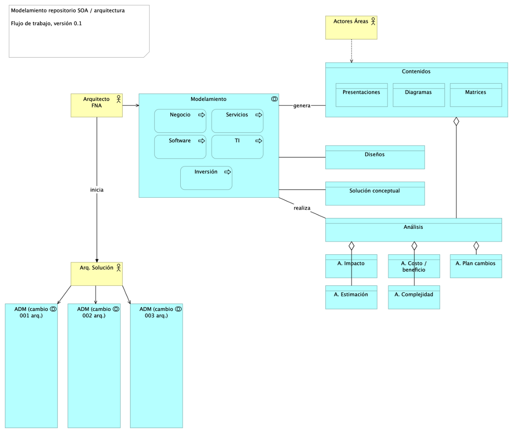

| Tema           | Gobierno SOA: **Consideraciones para la puesta en marcha del gobierno SOA en el FNA** |
|----------------|---------------------------------------------------------------------------------------|
| Palabras clave | SOA, Flujo de trabajo, Eficacia, KPI, Proceso SOA                                         |
| Autor          |                                                                                       |
| Fuente         |                                                                                       |
| Version        | **$COMMIT** del $FECHA_COMPILACION                                                    |
| Vínculos       | [Fase 2 PR6 Gobierno SOA](N03a%a20Vsta%20aSegenta%20SOA%20FNA.md)                     |

 

Un flujo básico de trabajo para la oficina de arquitectura toma como evento inicial la petición de cambiar o la necesidad de analizar un cambio. Los demás pasos se resumen a continuación.

1. Recibe el cambio​
1. Inicia el proceso ADM - fase de preliminar: alistamiento y aprobación​
1. Inicia el modelado​
1. Continúa el proceso ADM - solicita implementación / gobierno

La siguiente imagen ilustra los pasos descritos.

[Imagen 3.]() Actividades y relaciones de los estados de un flujo de trabajo de la oficina de arquitectura con arreglo al proceso ADM de TOGAF. Flujo recomendado para la oficina de arquitectura del FNA.

_Fuente: elaboración propia._

Una variante del flujo de trabajo arquitectura ADM, y más significativa para el FNA, incorpora los tipos de análisis que dentro del flujo se llevan a cabo.

1. Arq1 recibe el cambio
1. Inicia el proceso ADM - fase de preliminar: alistamiento y probación
1. Inicia el modelado
    1. Creación de contenidos
    1. Diseño
        1. Inicia diseño conceptual (nivel 100): appl, datos, TI, servicios, inversión
        1. Bloques de construcción abstractos
    1. Solución
        1. Bloques de construcción de solución
        1. Solicita diseño detallado (nivel 200, 300, 400 o 500): appl, datos, técnica, servicios
    1. Inicia análisis
        1. Impacto
        1. Costo / beneficio
        1. Plan de cambios
        1. Estimación
        1. Complejidad
        1. Estructural
        1. Otros
1. Solicita al Arq solución el inicio del proceso ADM - fases de implementación / gobierno

 
