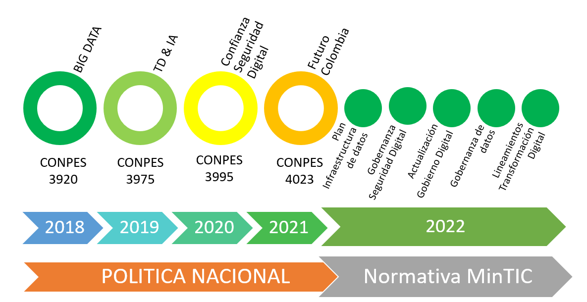
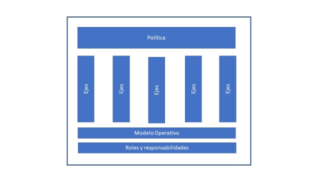
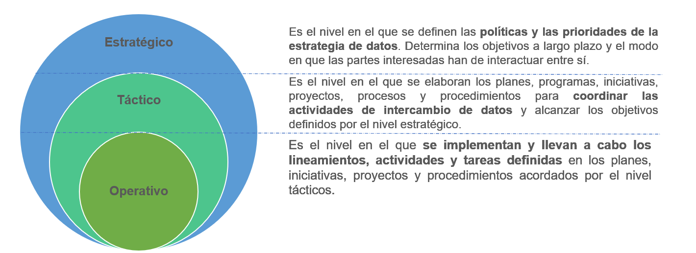
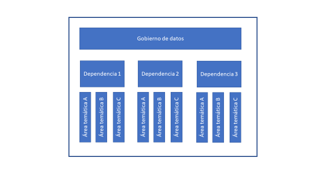
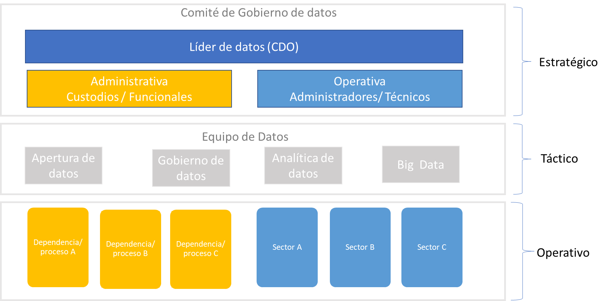

| Tema           | Gobierno de Datos: **Consideraciones para la puesta en marcha del gobierno de Datos del FNA** |
|----------------|---------------------------------------------------------------------------------------|
| Palabras clave | SOA, Estructuras de datos, Arquitectura de inbformación, Entidades, Producto de datos, SOA                                         |
| Autor          |                                                                                       |
| Fuente         |                                                                                       |
| Version        | **$COMMIT** del $FECHA_COMPILACION                                                    |
| Vínculos       | [Fase 2 PR6 Gobierno SOA](N03a%a20Vsta%20aSegenta%20SOA%20FNA.md)                     |

<br>

# Contenido

[2 Tabla de Ilustraciones
[1](#tabla-de-ilustraciones)](#tabla-de-ilustraciones)

[3 Introducción [2](#introducción)](#introducción)

[4 Alcance [3](#alcance)](#alcance)

[5 Antecedentes Política Pública y Normativa
[3](#antecedentes-política-pública-y-normativa)](#antecedentes-política-pública-y-normativa)

[6 Marco teórico [6](#marco-teórico)](#marco-teórico)

[6.1 Definición de Gobierno de Datos
[6](#definición-de-gobierno-de-datos)](#definición-de-gobierno-de-datos)

[6.2 Marco de Trabajo de Gobierno de Datos
[7](#_Toc110853530)](#_Toc110853530)

[7 Modelo de Gobierno
[9](#modelo-de-gobierno-propuesto)](#modelo-de-gobierno-propuesto)

[7.1 Articulación [10](#articulación)](#articulación)

[7.1.1 Horizontal [10](#horizontal)](#horizontal)

[7.1.2 Centrado en la persona
[10](#centrado-en-la-persona)](#centrado-en-la-persona)

[7.1.3 Vertical [11](#vertical)](#vertical)

[7.2 Política [11](#política)](#política)

[7.3 Ejes [12](#ejes)](#ejes)

[7.4 Componentes [12](#componentes)](#componentes)

[7.5 Modelo Operativo [13](#modelo-operativo)](#modelo-operativo)

[7.6 Comité Gobierno de datos
[14](#comité-gobierno-de-datos)](#comité-gobierno-de-datos)

[7.7 Roles y Funciones [16](#roles-y-funciones)](#roles-y-funciones)

[8 Referencias [19](#_Toc110853542)](#_Toc110853542)

# Tabla de Ilustraciones

[Ilustración 1 Política Pública y Normativa
[3](#_Toc110619194)](#_Toc110619194)

[Ilustración 2: Definición y Beneficios del Gobierno de Datos
[7](#_Toc110619195)](file:///C:/Users/ASUS/Downloads/5_Modelo_Gobierno_DatosV2.docx#_Toc110619195)

[Ilustración 3: Pilares de un Marco de Trabajo para el Gobierno de Datos
[8](#_Toc110619196)](file:///C:/Users/ASUS/Downloads/5_Modelo_Gobierno_DatosV2.docx#_Toc110619196)

[Ilustración 4: Modelo de Gobierno de Datos
[9](#_Toc110619197)](#_Toc110619197)

[Ilustración 5 Estructura Federada de Gobierno de Datos
[14](#_Toc110619198)](file:///C:/Users/ASUS/Downloads/5_Modelo_Gobierno_DatosV2.docx#_Toc110619198)

[Ilustración 6 Comité Gobierno de Datos
[15](#_Toc110619199)](#_Toc110619199)

[Ilustración 7: Roles de gobierno de datos
[18](#_Toc82980949)](#_Toc82980949)

# Introducción

El Gobierno nacional aprobó el documento CONPES 3920 de 2018 que define
la política de explotación de datos (Big Data) para el Estado
colombiano. Con este documento, el país asume el liderazgo regional al
ser el primero en Latinoamérica, y octavo en el mundo, con una política
pública integral que habilita el aprovechamiento de los datos para
generar desarrollo social y económico. \[1\]

El gobierno de datos es necesario para la explotación de datos teniendo
en cuenta la arquitectura del modelo de explotación de datos; este
instrumento permite identificar en las entidades las capacidades
organizacionales y en **recurso humano, tecnológico y financiero** que
deben desarrollar para mejorar el aprovechamiento de datos y, a su vez,
visibilizar el efecto que tiene la explotación y la analítica de datos
para generar valor público a partir de la optimización en la prestación
de bienes y servicios a los ciudadanos, mejorar la eficiencia en la
gestión pública, y diseñar políticas públicas basadas en evidencia.
\[2\]

La elaboración de este documento se realizó mediante el análisis de los
principales marcos de trabajo para la gestión de datos (MINTIC, DAMA,
IBM) que existen en la actualidad, por parte de los integrantes del
equipo del Fondo Nacional del Ahorro se tuvieron en cuenta los
siguientes factores representativos de la entidad: su estructura
organizativa, cultura, nivel de madurez en el gobierno de datos, apoyo
del nivel directivo, entre otros.

Los lineamientos y definiciones propuestos en este documento se basan en
la política pública, la normativa que hasta la fecha se ha expedido y la
guía del Ministerio De Tecnología de la Información y las Comunicaciones
(en adelante MINTIC) "G.INF.06 Guía Técnica de Información - Gobierno
del dato", la cual contempla los datos desde la perspectiva de
componentes de información (CI).

# Alcance

Definir un modelo de gobierno de datos de alto nivel que sirva de guía a
las demás funciones de gestión de datos, para mejorar los procesos de
toma de decisiones al momento de priorizar las inversiones, asignar
recursos, medir los resultados y conocer cómo los datos se gestionan y
despliegan de forma adecuada, para el apoyo continúo a las necesidades
de la ciudadanía y para aportar al cumplimiento de los objetivos de cada
una de las dependencias, departamentos y gerencias del Fondo Nacional
del Ahorro.

# Antecedentes Política Pública y Normativa

{width="6.004166666666666in"
height="3.0909722222222222in"}

[]{#_Toc110619194 .anchor}Ilustración 1 Política Pública y Normativa

El documento CONPES 3920 de 2018 "Política Nacional De Explotación De
Datos (Big Data)" estableció la necesidad de diseñar e implementar la
infraestructura de datos, al ser los datos activos que generan valor
económico y social, que requieren su definición, implementación,
mantenimiento y explotación a partir de la infraestructura de datos.

El Documento CONPES 3975 de 2019, \"Política Nacional para la
Transformación Digital e Inteligencia Artificial", establece que
Colombia debe seguir desarrollando una infraestructura de datos completa
y que permita el diseño e implementación de sistemas de IA en el país,
priorizando la creación e identificación de bases de datos masivos que
sean interoperables y contengan información estructurada, así como
disminuyendo barreras innecesarias e injustificadas al acceso a datos,
para los desarrolladores de esta tecnología.

El Documento CONPES 3995 de 2020, "Política Nacional de Confianza Y
Seguridad Digital", señala como un objetivo establecer medidas para
desarrollar la confianza digital a través de la mejora en la seguridad
digital de manera que Colombia sea una sociedad incluyente y competitiva
en el futuro digital mediante el fortalecimiento de capacidades y la
actualización del marco de gobernanza en seguridad digital, así como con
la adopción de modelos con énfasis en nuevas tecnologías.

"Finalmente, en respuesta al CONPES 3920 -2018 se incorpora en la
Política de Gobierno Digital uno de los componentes esenciales para
asegurar la transformación digital del Estado denominado como el Modelo
de implementación de Explotación de Datos que permite que las entidades
evalúen sus capacidades organizacionales y en recurso humano,
tecnológico y financiero para la explotación de datos. A la vez que
proporciona insumos para construir una hoja de ruta para mejorar
estas capacidades. ​

Una mayor madurez de las capacidades para la explotación de datos de la
entidad permitirá que se implementen procesos de analítica de datos y
bigdata, como base para la implementación de iniciativas basadas en
tecnologías emergentes"

El documento CONPES 4023 de 2021, "Política para la Reactivación, la
Repotenciación y el Crecimiento Sostenible e Incluyente: Nuevo
Compromiso por el Futuro de Colombia", establece que la consolidación de
la infraestructura de datos en el país carece de un marco de gobernanza
que articule las políticas, normativas y lineamientos para
la disponibilidad, intercambio y reutilización de datos y que permita su
sostenibilidad en el largo plazo.

​

El Ministerio de Tecnologías de la Información y las Comunicaciones
(MinTIC) para el presente año (2022) ha expedido normativa:

La Resolución 460 de 2022, Plan Nacional de Infraestructura de Datos
(PNID) y su Hoja de Ruta, con el fin de impulsar la transformación
digital del Estado y el desarrollo de una economía basada en los datos.

El Decreto 767 de 2022 - El numeral 4 del artículo 2.2.9.1.2.1 Decreto
1078 de 2015, Decreto Único Reglamentario del Sector de Tecnologías
de la Información y las Comunicaciones, establece como uno de los
elementos que componen la estructura de la Política de Gobierno Digital,
la línea de acción denominada "Decisiones basadas en datos", la
cual busca promover el desarrollo económico y social del país impulsado
por datos, entendiéndolos como infraestructura y activos estratégicos, a
través de mecanismos de gobernanza para el acceso, intercambio,
reutilización y explotación de los datos, que den cumplimiento a las
normas de protección y tratamiento de datos personales y permitan
mejorar la toma de decisiones y la prestación de servicios de los
sujetos obligados.

Para explotar el potencial que tienen los datos de transformar el actuar
del sector público, resulta fundamental establecer reglas y principios
claros y comunes a todos los actores que intervienen en las etapas
relevantes del ciclo de vida de los datos, desde entidades públicas,
funcionarios públicos, usuarios, sector privado, academia, y demás
actores.

El Decreto 1389 de 2022 que establece los lineamientos generales para la
gobernanza en la infraestructura de datos y se crea el Modelo de
gobernanza de la infraestructura de datos (Componentes, niveles,
instancias, roles y otras disposiciones), Este decreto se articula con
el [Plan Nacional de Infraestructura de
Datos](https://www.mintic.gov.co/portal/inicio/Sala-de-prensa/Noticias/198952:MinTIC-expide-el-Plan-Nacional-de-Infraestructura-de-Datos-que-impulsara-la-transformacion-digital-del-Estado),
establecido a través de la Resolución 460 de 2022 y con la [Política de
Gobierno
Digital](https://mintic.gov.co/portal/inicio/Sala-de-prensa/Noticias/210461:Ministerio-TIC-expide-el-Decreto-767-del-2022-la-actualizacion-Politica-Colombiana-de-Gobierno-Digital) actualizada
desde el pasado 16 de mayo con el Decreto 767 de 2022.

 

# Marco teórico

## Definición de Gobierno de Datos

El gobierno de los datos (Data Governance) es la estrategia corporativa
que define la política, los procedimientos, los procesos, las normas,
los responsables y la tecnología que ha de gobernar o regir la
utilización de los datos corporativos para una eficaz gestión de la
información en una organización o empresa. \[3\]

El objetivo principal en el gobierno de datos es ayudar a maximizar el
valor de los datos dentro de una organización, es decir, obtener el
máximo rendimiento de los datos como un activo primordial de la empresa.
Hoy en día, existen numerosas definiciones de Data Governance \[3\], a
continuación, se exponen algunas de ellas:

-   DAMA (Data Management Association) propone que "el gobierno de datos
    es el ejercicio de autoridad y el control (la planificación, el
    seguimiento y la aplicación) a través de la gestión de activos de
    datos". \[4\]

-   El Instituto Data Governance (DGI) afirma que \"el gobierno de datos
    es un sistema de derechos de decisión y rendición de cuentas para
    los procesos relacionados con la información, ejecutado según
    acuerdos de modelos que describen quién puede tomar las acciones con
    que información, cuándo, en qué circunstancias, y con qué métodos\".
    \[5\]

-   IBM señala que "Data Governance se refiere a cómo una organización
    utiliza los datos para beneficiar y proteger a sí mismo." \[6\]

Para el Fondo Nacional del Ahorro la definición entregada por el DAMA
supone la que más se ajusta a la estrategia y realidad institucional,
por lo tanto, es de esta forma que se abordara siempre el concepto de
Gobierno de Datos.

> {width="7.0in" height="3.9375in"}

## Marco de Trabajo de Gobierno de Datos

Un marco de trabajo de gobierno de datos es un conjunto estandarizado de
conceptos, prácticas y criterios, que permite a las organizaciones
administrar los datos de manera organizada y eficiente, esta ayuda se
traduce entre otras en facilitar que todos los actores de la
organización compartan la forma de pensar y comunicarse acerca de
conceptos complicados o ambiguos. Nicola Askham refiere que "No hay un
enfoque único para todos (los marcos de trabajo). Para que funcione,
debe ajustarse a la cultura, estructura y prácticas de la organización.
Una vez dicho esto, los componentes básicos de las políticas, procesos,
roles y responsabilidades se encontrarán en todos los marcos". \[7\]

Se destaca en un marco de trabajo de gobierno de datos la comprensión de
los elementos fundamentales:

-   **Política:** Tener una política que establezca la institución
    \"hará\" que la gestión de datos sea una parte clave del marco. Sin
    este, no habrá autoridad para cambiar la forma en que la
    organización piensa y maneja los datos. En algunas instancias, se
    puede avanzar sin una política cuando la gobernanza de datos es un
    enfoque clave, sin embargo, como las prioridades comerciales futuras
    cambian, es probable que la iniciativa disminuya o, en el peor de
    los casos, se abandone. Tener una política como parte del enfoque de
    gestión de datos otorga autoridad, a las partes interesadas.

-   **Ejes:** Concentrar los esfuerzos en un ámbito específico para
    seguir, crear los lineamientos, directrices, guías y procedimientos
    definidos y documentados permitiendo tener un enfoque consistente y
    repetible para gestionar los datos en toda la organización.

-   **Modelo Operativo:** Conjunto de elementos que hace posible
    materializar el modelo en la entidad.

-   **Roles y responsabilidades:** El tercer componente vital es definir
    quiénes son los responsables de los datos y el alcance de las
    responsabilidades.

> Sobre este último ítem es importante destacar que la gestión de los
> datos es una responsabilidad compartida, entre los profesionales de la
> gestión de datos (administradores y custodios) dentro de las
> organizaciones (TI) y los **propietarios** de datos del negocio
> (responsables), que representan los intereses colectivos de los
> productores de datos y los consumidores de información.

{width="4.40625in"
height="3.522222222222222in"}

# Modelo de Gobierno Propuesto

El Fondo nacional del Ahorro es una entidad comprometida con el
mejoramiento de su desempeño y la atención al ciudadano, para lo cual
requiere tomar decisiones y empoderar a la ciudadanía a través de sus
datos e información. Para lograr lo anterior, se prioriza la
administración, mejora y aprovechamiento de datos que se encuentran en
diferentes sistemas de información que apoyan los procesos de las
dependencias direccionamiento estratégico (misionales, apoyo, evaluación
y mejora), todo articulado por medio de la definición de un Sistema
Integrado de Planeación y Gestión (MIPG), con apoyo del direccionamiento
estratégico, las políticas de transparencia y acceso a la información
pública, lucha contra el fraude y la gestión documental.

{width="7.121360454943132in"
height="4.1841940069991255in"}

[]{#_Toc110619197 .anchor}Ilustración 4: Modelo de Gobierno de Datos

##  Articulación 

### Horizontal 

El propósito de esta dimensión es permitirle a la entidad realizar las
actividades que la conduzcan a lograr los resultados propuestos y a
materializar las decisiones plasmadas en su planeación institucional, en
el marco de los valores del servicio público.

El modelo definido también se articula con los niveles *estratégico,
misional, apoyo y de evaluación y mejora continua* del modelo de
operación por procesos, con el fin de aprovechar los procesos existentes
en la entidad y facilitar la implementación al tener previamente mapeado
los responsables, actividades, entradas, salidas, herramientas y otros
insumos necesarios para la implementación del modelo de gobierno.

###  Centrado en la persona

Integrar las personas para que en el horizonte tiempo permanezca la
cultura del dato en la entidad buscando de manera continua el
fortaleciendo de las competencias en las diferentes dimensiones:
saberes, saber ser, saber hacer; mediante la oferta de formación y
capacitación de acuerdo con las temáticas definidas por el plan nacional
de formación adoptado por el plan municipal de capacitación, priorizando
los ejes: **Transformación Digital** enmarcado en el CONPES 3975
(Departamento Nacional de Planeación, 2019) y la **gestión del
conocimiento y la innovación** en todos sus ejes:

-   Generación y producción del conocimiento.

-   Herramientas para uso y apropiación.

-   Cultura de compartir y difundir.

-   Analítica institucional para la toma de decisiones.

La Analítica institucional para la toma de decisiones tiene especial
relevancia ya que se enfoca en el análisis de información e indicadores,
visualización de datos y decisiones basadas en evidencia; tomar
decisiones basadas en datos aporta a que se incentive en la entidad la
cultura del dato, permitiendo que esta se afiance y una vez implementada
perdure a través del tiempo.

### Vertical 

Lograr la coordinación y compromiso de todos los niveles de la entidad,
desde la cabeza principal y los directivos hasta los funcionarios que
desempeñan labores operativas específicas, pasando por equipos tácticos
y contratistas.

Los niveles definidos son \[8\]:

{width="6.251375765529309in"
height="2.2761198600174977in"}

Ilustración 5 Niveles Entidad

## Política

El Fondo Nacional del Ahorro establece como activo los datos, la
información y el conocimiento para la toma de decisiones y el logro de
la misión estratégica de la entidad, incrementando la confianza de los
grupos de valor, los grupos de interés y contribuyendo a la innovación
pública y social.

## Ejes 

Se integran 5 ejes donde se concentran los esfuerzos: *Estrategia del
negocio, cumplimiento normativo, seguridad y privacidad del dato*, los
cuales se toman de las definiciones del DAMA ya que se acoplan
funcionalmente con las condiciones propias de la entidad; además, se
*adiciona el ciclo de vida del dato y gestión continua* lo que
posibilita tener una visión holística del dato y evaluar el uso,
aplicación y posibles ampliaciones del modelo a través de las instancias
previstas para ello.

-   **Estrategia del negocio**: Con el apoyo las áreas que conforman el
    direccionamiento estratégico de la entidad se define un mecanismo
    que permita la identificación la cadena de valor que permite tomar
    buenas decisiones y resolver de forma óptima casos de uso del
    negocio para cada uno de los interesados, con el fin de tener una
    visión global que asegure las sinergias entre todas las fuentes de
    información.

-   **Cumplimiento normativo**: Con el apoyo del área jurídica definir
    los mecanismos que permitan de manera proactiva hacer el seguimiento
    y el acatamiento de reglas y normativa del dato en la entidad. por
    medio de los responsables de las políticas que permitan garantizar
    que los datos sean usados de acuerdo con las regulaciones y normas
    vigentes.

-   **Seguridad y Privacidad del dato**: Coordinar con el responsable de
    la política que permite velar por la protección de los datos que ya
    fueron o van a ser procesados, almacenados o trasmitidos, es decir,
    durante todo su ciclo de vida.

-   **Ciclo de Vida del dato**: Visión global del dato, es el ámbito
    enfocado en asegurar el cubrimiento del enmascaramiento, reducción y
    archivado de los datos en la institución, soportando el nivel de
    autoservicio comprometido.

-   **Gestión Continua**: Evaluar el uso, aplicación y posibles mejoras
    a los procesos y procedimientos relacionados con el Gobierno del
    Dato, así como la actualización del presente modelo en las
    instancias definidas.

## Componentes

Se centra en tres elementos:

-   ***El patrocinio***: Se materializa con el líder de datos que hace
    parte del nivel estratégico.

-   ***La propiedad:*** Es responsabilidad de cada área funcional con
    los roles administrador y custodio.

-   ***La administración:*** facilita la construcción de servicios de
    gestión de datos al realizar las actividades específicas de los
    siguientes enfoques \[9\] :

```{=html}
<!-- -->
```
-   [Arquitectura del dato:]{.underline} Es el componente del dominio de
    información asociado con la coordinación de la estructura,
    semántica, y calidad del dato desde el origen, así mismo,
    participando en el diseño de los modelos y flujos de datos de las
    aplicaciones.

-   [Administración de datos Maestros:]{.underline} Es la combinación de
    procesos, gobernabilidad, políticas, estándares y herramientas que
    se integran para ofrecer un único punto de referencia. Este se
    enfoca en la necesidad de entender y derivar una visión interna de
    la función pública y una eficiencia operacional a través de la
    integración de vistas de productos, clientes, proveedores, activos,
    ubicaciones, y otros elementos de la institución que existen dentro
    de unidades diversas. Esta administración se asocia con los datos
    mantenidos por los usuarios en áreas de la función pública y
    expertos en la materia, no por los expertos de sistemas.

-   [Calidad del dato:]{.underline} Es el componente del dominio de
    información asociado con procesos de ajuste y depuración de datos
    masivos, y definición, medición y mejora continua de los indicadores
    de calidad del dato.

-   [Aprovisionamiento:]{.underline} Es el componente del dominio de
    información asociado con el movimiento de datos, tanto en línea como
    en diferido, entre aplicativos operacionales y/o informacionales,
    incrementando niveles de competencia y reutilizando componentes.

-   [Gestión de la demanda:]{.underline} Es el componente del dominio de
    información asociado con la administración centralizada de la
    demanda de datos de las áreas de funcionales del sector público.

-   [Custodia del dato:]{.underline} Es el componente del dominio de
    información asociado con la identificación y definición clara del
    custodio y consumidor del dato.

## Modelo Operativo

MINTIC propone que las entidades públicas adopten el gobierno del dato
desde la perspectiva del Modelo Federado, el cual es detallado en la
guía "G.INF.06 Guía Técnica de Información - Gobierno del dato", según
este modelo operativo la responsabilidad de los datos se delega en cada
área funcional, se coordina con las áreas de TI y se da gran relevancia
a que exista en cada una de estas áreas funcionales los roles de gestor
y administrador del dato; al momento de realizar la implementación las
actividades se enfocan en: Administración del dato maestro, Arquitectura
del dato, Custodia del dato, Calidad del dato, Gestión de la demanda y
Aprovisionamiento. En paralelo el flujo bidireccional de la
administración de los datos y el servicio de gestión de datos
interactuara con los diferentes niveles y responsables establecidos.

A partir de la siguiente Ilustración, se muestra el Modelo Federado /
Orquestado para Gobierno del Dato, sus principales características son:

-   Delega en cada área funcional involucrada en el sector público, la
    responsabilidad de sus dominios de datos maestros.

-   Coordina con las diferentes áreas de TI existentes, los mecanismos
    implicados en el buen Gobierno de Datos.

-   Cada área funcional de la institución debe existir gestores y
    administradores del dato, responsables del buen gobierno de los
    datos maestros.

{width="4.833333333333333in"
height="3.611111111111111in"}

## Comité Gobierno de datos 

La óptima gestión de datos requiere de un marco que acoja un gobierno de
datos, entendido como el ejercicio de diseñar, controlar y monitorizar
todo lo relativo a los datos desde un enfoque holístico, en el que
participen los implicados, desde el gobierno y el departamento de TI
hasta un consejo de gestión de datos que representa las partes
interesadas \[10\]

Se hace entonces necesario crear una máxima instancia de coordinación
institucional con el propósito Impulsar la política de uso y
aprovechamiento de datos en la entidad, y la orientación de acciones
tendientes a fortalecer la gobernanza, circulación y reutilización de
datos. \[8\]

{width="6.6009492563429575in"
height="3.279861111111111in"}

[]{#_Toc110619199 .anchor}Ilustración 7 Comité Gobierno de Datos

**Mesa Administrativa**

Espacio de toma de decisiones donde participan los encargados de
identificar los datos de acuerdo con los objetivos estratégicos y
funciones de la dependencia, así como velar por su actualización. 

[Asistentes]{.underline}:    Enlaces Funcionales designados por las
dependencias.

[Frecuencia]{.underline}: Trimestral

**Mesa Operativa**

Espacio de coordinar la ejecución y plantear alternativas donde
participan los encargados de orquestar las necesidades y las acciones
técnicas.

[Asistentes]{.underline}:    Enlaces Técnicos designados por las
dependencias.

[Frecuencia]{.underline}: 2 Veces previa a la Mesa administrativa. (1
sesión Por sectores, 1 sesión General)

**Grupo Trabajo**

Según se requiera se realizarán para tratar un tema u obtener un
entregable especifico y dichos resultados se trasladan a la mesa
operativa.

## Roles y Funciones 

Por parte del MINTIC se definen como necesarios para la implementación y
operación del modelo de Gobierno en el Fondo Nacional del Ahorro los
siguientes roles \[9\]:

-   **Gestor del dato:** Es el encargado del direccionamiento
    estratégico para gobernar el valor y uso del dato, y de definir las
    reglas de consolidación y coordinación con los administradores de
    unos datos en sus respectivos dominios. A veces, se encarga de la
    corrección manual de la información en caso de que las reglas
    generales no sean válidas para algún caso concreto.

-   **Custodio del dato:** Es el responsable por la existencia de unos
    datos en la función del sector público, por lo que cualquier acción
    correctiva o nuevo requisito que precise su información, debe ser
    consensuado con él. Igualmente es el responsable de que el dato esté
    disponible y con atributos de calidad. Adicionalmente, este actúa
    como patrocinador de calidad y control sobre estos datos, y es
    considerado experto en conocimiento sobre el dato que es custodio.

-   **Administrador del dato:** Es el encargado de orquestar las
    necesidades y las acciones técnicas, así como mediar en los posibles
    conflictos que puedan surgir entre roles consumidores y productores.
    Para esto, crea estándares y buenas prácticas, habilita metadatos
    técnicos, operacionales y funcionales, audita la calidad de los
    datos y las medidas de gobernanza, y define políticas de respaldo de
    la información (backups), seguridad, flujos de datos, etc.

Una vez analizadas las condiciones de estructura organizacional, cultura
y necesidades propias del Fondo Nacional del Ahorro, se opta por
establecer los siguientes roles necesarios para la correcta
implementación del modelo de Gobierno de Datos definido:

+-------------+--------------------------------------------------------+
| Líder de    | Patrocinador ejecutivo del gobierno de datos que se    |
| datos       | asegure de que las iniciativas y proyectos con datos   |
|             | tengan suficientes recursos y se entienda la visión y  |
|             | objetivos estratégicos de la entidad.                  |
|             |                                                        |
|             | -   Definir la estrategia de datos.                    |
|             |                                                        |
|             | -   Vigilar y aplicar la ética de los datos.           |
|             |                                                        |
|             | -   Direccionar la creación de estándares, políticas y |
|             |     procesos que determinen el uso, desarrollo y       |
|             |     gestión de los datos a nivel de la entidad.        |
+=============+========================================================+
| Comité de   | Trabaja como Gestor del dato al supervisar y hacer     |
| Gobierno de | cumplir las políticas, procedimientos y estándares     |
| Datos       | sobre gobierno de datos (Designados dependencias +     |
|             | Innovación Digital)                                    |
+-------------+--------------------------------------------------------+
| Ad          | Son los encargados de orquestar las necesidades y las  |
| ministrador | acciones técnicas, así como mediar en los posibles     |
|             | conflictos que puedan surgir entre roles consumidores  |
|             | y productores. Para esto, crea estándares y buenas     |
|             | prácticas, habilita metadatos técnicos, operacionales  |
|             | y funcionales, audita la calidad de los datos y las    |
|             | medidas de gobernanza y define políticas de respaldo   |
|             | de la información (backups), seguridad, flujos de      |
|             | datos, etc. Son los servidores adscritos a la          |
|             | Secretaría de Innovación Digital encargados de         |
|             | proteger los datos entregados por los custodios para   |
|             | su disposición ***[en cada uno de los repositorios     |
|             | oficiales]{.underline}*** disponibles (lago de datos,  |
|             | NAS, entre otros).                                     |
|             |                                                        |
|             | -   Apoyar la revisión de la arquitectura.             |
|             |                                                        |
|             | -   Apoyar en el entrenamiento y trasmisión            |
|             |     del conocimiento.                                  |
|             |                                                        |
|             | -   Apoyar células temáticas requeridas.               |
|             |                                                        |
|             | -   Monitorear el cumplimiento de las políticas.       |
|             |                                                        |
|             | -   Monitorear la calidad de los datos.                |
|             |                                                        |
|             | -   Monitorear las iniciativas                         |
|             |                                                        |
|             | -   Generar buenas Prácticas.                          |
|             |                                                        |
|             | -   Identificar datos Maestros y Metadatos.            |
|             |                                                        |
|             | -   Establecer flujos de datos.                        |
+-------------+--------------------------------------------------------+
| Custodio    | Encargados de generar los datos, también pueden        |
|             | denominarse dueños de los datos, son el actor más      |
|             | importante dado que tiene la responsabilidad de        |
|             | mantener actualizados los datos y proponer la          |
|             | identificación de estos, de acuerdo con la misión,     |
|             | visión y funciones que prestan (Dependencias del nivel |
|             | central y conglomerado).                               |
|             |                                                        |
|             | -   Crear la visión del gobierno de datos.             |
|             |                                                        |
|             | -   Definir los principios                             |
|             |                                                        |
|             | -   Asignar los roles y responsabilidades.             |
|             |                                                        |
|             | -   Actualizar y hacer seguimiento a la política.      |
|             |                                                        |
|             | -   Establecer reglas para el gobierno externo de los  |
|             |     datos                                              |
|             |                                                        |
|             | -   Buscar oportunidades de datos.                     |
|             |                                                        |
|             | -   Fomentar la Comunicación Institucional             |
+-------------+--------------------------------------------------------+

[]{#_Toc82980949 .anchor}

Ilustración 8: Roles de gobierno de datos

# Referencias

  -----------------------------------------------------------------------------------------------------------------------------------------------------------------------------
  \[1\]    DNP, «https://www.dnp.gov.co/,» \[En línea\]. Available:
           https://www.dnp.gov.co/Paginas/Colombia-primer-pa%C3%ADs-en-Latinoam%C3%A9rica-con-una-pol%C3%ADtica-p%C3%BAblica-para-la-explotaci%C3%B3n-de-datos-Big-Data.aspx.
  -------- --------------------------------------------------------------------------------------------------------------------------------------------------------------------
  \[2\]    DNP, «MODELO DE EXPLOTACIÓN DE DATOS PARA ENTIDADES PÚBLICAS,» 2020.

  \[3\]    Logicalis, «Logicalis,» 2 febrero 2014. \[En línea\]. Available:
           https://blog.es.logicalis.com/analytics/bid/370961/c-mo-definir-las-pol-ticas-del-gobierno-de-los-datos-data-governance.

  \[4\]    A. Data Management, DMBOK, New Jersey: Technics Publications, LLC, 2010.

  \[5\]    Data Goverment Institute, «How to use de DGI Data Governance Freamework to Configure Your Program,» \[En línea\]. Available: www.DataGovernance.com. \[Último
           acceso: 07 2021\].

  \[6\]    S. Sunil, The IBM Data Governance Unified Process: Driving Business Value with IBM Software and Best Practices, MC Press, 2010.

  \[7\]    N. Askham, «Squaring the circle : using a Data Governance Framework to support Data Quality,» *Experian Whitepaper,* p. 9, 2014.

  \[8\]    DAPRE, «DECRETO 1389 DEL 28 DE JULIO DE 2022,» \[En línea\]. Available:
           https://dapre.presidencia.gov.co/normativa/normativa/DECRETO%201389%20DEL%2028%20DE%20JULIO%20DE%202022.pdf.

  \[9\]    MINTIC, «mintic.gov.co,» Octubre 2019. \[En línea\]. Available: https://mintic.gov.co/arquitecturati/630/articles-9258_recurso_pdf.pdf. \[Último acceso: 05 10
           2021\].

  \[10\]   MINTIC, «Documento técnico y hoja de ruta PNID,» \[En línea\]. Available: https://www.mintic.gov.co/portal/715/articles-179710_recurso_2.pdf.
  -----------------------------------------------------------------------------------------------------------------------------------------------------------------------------
