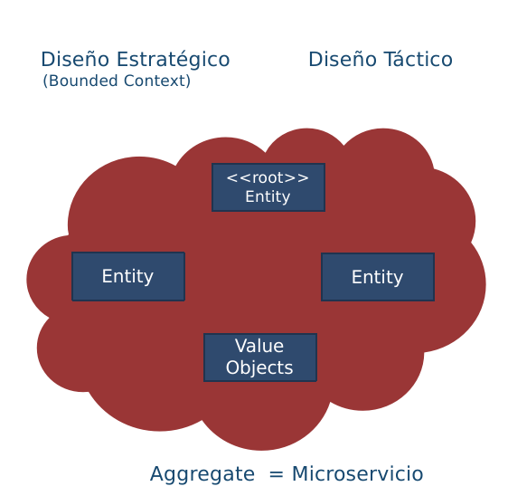

|Tema|Vigilancia Avances de Industria: **Lista tecnologías SOA afines al Fondo**
|------------|----------------------------------------------|
|Palabras clave|SOA, Tecnologías, Vigilancia, Avances|
|Autor||
|Fuente||
|Version|$COMMIT del $FECHA_COMPILACION|
|Vínculos|[N003a Vista Segmento SOA FNA](N03a%a20Vsta%20aSegenta%20SOA%20FNA.md)|

 

## Web Oriented Architectures (WOA)

El esquema SOA se ha venido combinando con esquemas más orientados al
uso de las tecnologías Web. A este cambio se le denomina el Web Oriented
Architectures (WOA), o arquitecturas de solución orientadas al uso de
tecnologías como Microservicios, API (API Economy), Arquitecturas
Orientadas a Eventos, y mecanismos alternativos para la orquestación y
comunicación asincrónica de microservicios (Service-Mesh).

### API / API Economy

En la actualidad las APIs han pasado de ser un mecanismo de integración,
a un elemento crítico tanto a nivel interno dentro de las
organizaciones, como mecanismo de interoperabilidad negocio clientes, y de automatización de operaciones.

#### Portafolios de APIs

Uno de los riesgos, sin embargo, que presenta esta estrategia de
integración, es la proliferación de APIs sin control, un bajo esquema de
gobierno que no controle la creación de dichas APIs, así como su
evolución y mantenimiento.

Un mecanismo para solucionar este riesgo, es diseñar un portafolio de
APIs, donde se mantenga una estructura clara y controlada de los
diferentes tipos de APIs con los que cuenta la organización. Este
portafolio debe ser diseñado con cuidado, buscando satisfacer atributos
de calidad, niveles de servicios, monitoreo en ejecución, documentación
y entrenamiento, así como control de costos y propiedad.

Actualmente las organizaciones hablan de un término denominado API
Economy, que tiene dos visiones. De una parte el negocio va hora en las
APIs de la organización, una nueva fuente de ingresos, como consecuencia
de la implementación de procesos con clientes y socios de negocio. De
otra parte, las áreas de tecnología de las organizaciones, ven en el uso
de las APIs, un mecanimo de comunicación y tercerización de sus tarea de
desarrollo de software con fábricas de software y desarrolladores.

#### Proceso de diseño de APIs

Usualmente la organización tiene muchas APIs que van surgiendo con el
paso del tiempo. Un portafolio de APIs es más que una colección
desordenada de APIs. El portafolio debe ser diseñado con cuidado, de
forma que todas las APIs del portafolio sean consistentes unas con
otras, reutilizables, descubribles y personalizables.

El Portafolio debe cumplir con requisitos funcionales y no funcionales
como: consistencia, reuso, personalización, descubrimiento y longevidad

Consistencia: Un cliente o una solución seguramente usarán varias APIs
del portafolio. Es deseable que la salida de una API pueda ser usada
como entrada en otra API. Si las entradas esperadas por una API son muy
difíciles de lograr a partir de las mismas salidas de otra API del
portafolio, se tendrá falta de consistencia. Una estrategia para
favorecer la consistencia es abstraer aspectos comunes y llevarlos a
otras APIs.

La URI de las APIs debe seguir una estructura común e intuitiva: Nombres
de campos y formatos deben ser consistentes a lo largo del portafolio.
Las validaciones a las entradas deben hacerse de forma similar en todo
el portafolio. Los mecanismos de seguridad deben ser los mismos en todo
el portafolio.

Reuso: De ser posible las APIs no debe ser construidas para un cliente
específico. Se espera que su diseño e implementación sirvan a múltiples
consumidores, al menos parcialmente.

-   Reuso de algunas características de las APIs
-   Reuso de APIs completas
-   Reuso de APIs propias
-   Reuso de APIs de terceros

Personalizable: Si bien las APIs no deberían ser diseñadas para un
cliente específicamente, si deben poder ser configurables y
personalizables para la necesidad particular un cliente o grupo de
clientes. Aspectos a personalizar: Formateo de datos, entrega de datos,
agrupamiento de datos

Descubrible: Debe ser fácil para un consumidor descubrir las APIs
ofrecidas en el portafolio. El portafolio debe ofrecer mecanismos de
consulta y descubrimiento de las APIs, de forma que para los
consumidores se fácil encontrar el API que buscan.

Longevidad: Se debe buscar que las APIs sean funcionales por la mayor
cantidad de tiempo posible. Esto usualmente ocurre cuando una API
refleja la propuesta de valor del cliente, dado que estas se mantienen
en el tiempo. Desde el punto de vista técnico, se espera que las APIs
evolucionen constantemente, pero las firmas de las operaciones deben
permanecer estables tanto como sea posible.

Gobernable: Se debe buscar un equilibrio entre un proceso de desarrollo
de APIs ágil que permita probar fácilmente nuevas iniciativas de
negocio. Reglas y políticas firmes para evitar el desorden en el
portafolio de APIs.

El proceso de desarrollo de APIs dentro de las organizaciones debe ser
institucionalizado y formalizado. Se debe buscar formalizar el diseño,
desarrollo y puesta en producción de las APIs de la organización. Como
mínimo los proyectos de diseño y desarrollo de APIs deberían contar con
actividades como análisis, desarrollo, operación y retiro.

##### Análisis

La fase de análisis debe buscar responder preguntas como:

-   ¿La organización requiere una API?
-   ¿Cuáles funciones cumpliría?
-   ¿Cuál es la propuesta de valor de esta API?
-   ¿La propuesta será algo fundamental para el negocio?
-   ¿Qué requiere el negocio para operar esta API?
-   ¿Cuáles métricas se deben cumplir?

El objetivo fundamental de la fase de análisis deberá ser la alineación
con las necesidades de negocio. Entendiendo que unidades de negocio
serán usuarias de la API y cuáles serán propietarias y financiadores de
las APIs. En este sentido es fundamental entender qué tipo de API se
desea desarrollar:

APIs Privadas: Usualmente buscan modernizar tecnología y procesos dentro
de la organización, optimizar la cadena de valor e integrar sistemas de
información legados al interior de la compañía.

APIs tipo consorcio: Buscan usualmente mejorar procesos operativos con
socios de negocio y proveedores de servicios. Buscan mejorar la gestión
administrativa entre socios y mejorar el relacionamiento y comunicación
externa con empresas del ecosistema de la organización. Responder a
regulaciones de industria y exponer información parcialmente pública.

APIs Públicas: Buscan automatizar procesos con clientes y potenciales
clientes, mejorar la experiencia de usuarios y público en general,
reducir tiempos de ingreso al mercado y proveer nuevas opciones de
integración e interoperabilidad.

##### Desarrollo

Se deben definir estándares de desarrollo, tecnologías aprobadas por la
organización para la implementación de APIs, tipos de APIs a
desarrollar, pero sobre todo, tener en cuenta los atributos de calidad
que debe exponer el API a desarrollar. Por ejemplo, a nivel de desempeño
determinar las cargas de trabajo, niveles de escalabilidad, tiempos de
respuesta y volúmenes de datos por unidad de tiempo que podrán ser
respondidos ante una consulta. Determinar la utilización de REST como
esquema de comunicación o la adopción de nuevas tecnologías como
GraphQL.

En este punto la organización debe tomar decisiones relacionadas con:

-   Librerías de bloques construcción reutilizables
-   Lenguajes de implementación de APIs
-   IDEs y depuradores
-   Lenguajes de diseño para APIs
-   Herramientas para diseño de interfaces para APIs
-   Herramientas para la generación de código y documentación

##### Operación / Plataforma de ejecución

La plataforma de ejecución se encarga de la puesta en producción,
despliegue y consumo de las APIs en operación. Esta plataforma se
encarga de responder a consultas hechas a las APIs, favoreciendo
atributos de calidad como la baja latencia y la escalabilidad.

La plataforma de ejecución se encarga de la ejecución de las APIs. Se
encarga de la recepción de peticiones desde los consumidores y de la
entrega de las respuestas. Esta plataforma también responsable del
cumplimiento de los atributos de calidad, como el desempeño, la
disponibilidad y la seguridad. Algunas tácticas de arquitectura que
ejecuta la plataforma de ejecución son: balanceo de carga, cache y pool
de conexiones. La plataforma ofrece también servicios de monitoreo, log,
análisis de cumplimientos de niveles de servicio.

La plataforma de ejecución es responsable igualmente por proveer
capacidades para facilitar el despliegue de nuevas APIs y el
mantenimiento de APIs existentes. Igualmente, esta plataforma se encarga
del manejo de credenciales y configuraciones de múltiples ambientes de
ejecución.

Dentro de las decisiones a tomar con la plataforma de ejecución, se
encuentra la configuración de múltiples ambientes de ejecución:

-   Desarrollo
-   Sandbox o simulación
-   Testing
-   Preproducción
-   Producción

 

##### Gestión

La plataforma de gestión es utilizada por los proveedores para
interactuar con su comunidad de consumidores. La plataforma le debe
ofrecer a los proveedores las capacidades de manejo y configuración de
APIs.

La plataforma de gestión debe ofrecer:

-   Manejo de API: Configuración y reconfiguración de APIs existentes
    sin necesidad de redespliegues
-   Descubrimiento de APIs: Mecanismos para que los clientes obtengan
    información de las APIs
-   Identificación de clientes (Manejo de llaves)
-   Información para la comunidad (foros, blogs, redes sociales, bases
    de conocimiento, etc.)

La plataforma de gestión ofrece adicionalmente documentación interactiva
generada a partir de la descripción del API, manejo de versiones, manejo
de los niveles de servicios y los cobros asociados

La plataforma de gestión les ofrece a los consumidores del API,
mecanismos para explorar y obtener información del Portafolio de APIs,
documentación del portafolio, manejo de credenciales y manejo de planes
de pago.

La plataforma de gestión deber centrarse en ofrecer servicios de:

-   Documentación del portafolio de APIs
-   Soluciones basadas en el portafolio de APIs
-   Posibilidad de usar el API interactivamente
-   Ejemplos de soluciones / código
-   Herramientas de apoyo a los usuarios de las APIs

### Microservicios
Una segunda tecnología que se muestra como el reemplazo del SOA
tradicional son los Microservicios, como componentes de software
independientes, que tienen como característica principal su capacidad de
despliegue autónomo, orientados a la nube y con mayor adaptación a
procesos de desarrollo de entrega continua y despliegue continuo.

La utilización de Microservicios en lugar de las aproximaciones basadas
en Servicios de alta granularidad, tipo SOA, sumado al uso de protocolos
de comunicación basados en la exposición de APIs tanto REST como
GraphQL, hacen que los tiempos de desarrollo y puesta en producción sean
menores. Principalmente, la característica de ser independientes en el
despliegue, facilita la modificación, cambio y evolución del software,
inclusive desarrollado en diferentes tecnologías o lenguajes de
programación.

#### Proceso de desarrollo
Uno de los elementos más críticos en las arquitecturas orientadas a
servicios y en los Microservicios como nuevo esquema de trabajo SOA, es
la identificación y diseño de los Microservicios. Las empresas
actualmente aplican diferentes estrategias para identificar los
servicios a desarrollar e implementar. Sin embargo, uno de los riesgos
más críticos tiene que ver con el crecimiento descontrolado de
Microservicios, que no tienen una alineación clara con el negocio.

En la actualidad el proceso de identificación y diseño de Microservicios
que se utiliza mayoritariamente, tiene que ver con el uso de
Domain-Driven Design (DDD) para la identificación de los Microservicios
y para la definición de los ecosistemas de servicios a desarrollar. A
nivel de diseño detallado de los Microservicios, se utiliza
principalmente la arquitectura hexagonal.

#### Domain Driven Design

El diseño orientado por dominio, busca que los servicios y
microservicios no necesariamente busquen maximizar su reutilización,
como se ha venido manteniendo en los últimos años. Por el contrario, en
el DDD es normal que los servicios no sean reutilizables entre unidades
de negocio, que manejan términos, conceptos y vocabularios
indepesndientes. En DDD, se busca tener servicios alineados con el
negocio, en lugar de reutilizar un mismo servicio en todas las unidades
de negocio, de esta forma se logra el desacoplamiento, un menor tiempo
de entrega y puesta en producción, así como el uso de técnicas de
integración y despliegue continuo.

{width="3.701388888888889in"
height="2.6326388888888888in"}

En DDD la alineación con el negocio es lo fundamental, por eso, los
subdominios de negocio o procesos de negocio se relacionan con las
unidades de diseño, llamadas contextos acotados o *bounded context*s.

{width="3.6875in"
height="3.0340277777777778in"}

Una unidad de negocio puede tener varios contextos acotados, de forma
que varios servicios son identificados para poblar el portafolio de
servicios.

{width="3.58125in"
height="3.033333333333333in"}

Finalmente, un contexto acotado, es a su vez, subdivido en agregados.
Los agregados tienen una estructura basada en entidades y objetos de
valor. Las entidades representan una operación de negocio indivisible.

{width="3.26875in" height="3.1875in"}

En este esquema de trabajo, usualmente un agregado es un microservicio.
Esta técnica de identificación es mucho más precisa, que simplemente el
proponer microservicios vistos como pequeñas unidades de software, que
técnicamente cumplen con tener un tamaño de líneas de código pequeño,
pero que no tienen en cuenta la alineación con el negocio.

Al interior de un agregado, se identifican los siguientes elementos:

{width="2.9784722222222224in"
height="2.6958333333333333in"}

#### Arquitectura Hexagonal

Una vez se tienen identificados los microservicios, y definida su
estructura interna, el siguiente paso es identificar, los puntos de
interacción con el ecosistemas de servicios. La arquitectura hexagonal
sirve para definir estos puntos y para diseñar los mecanismos de
comunicación de los microservicios, por ejemplo APIs o colas de
comandos, así como para determinar los eventos que escuchará el
microservicios, los mensajes a procesar, los eventos que emite el
microservicios y la estrategia de almacenamiento de datos del
microservicio.

{width="3.8020833333333335in"
height="3.3381944444444445in"}

### Buses de servicios (ESB)

Sin duda alguno los buses de servicio han sido la piedra angular en las
arquitecturas orientadas a servicios en los últimos años. La decisión de
arquitectura de orientarse a los servicios implica también que los
servicios deben poder ser localizados, que se debe poder intermediar la
comunicación e intercambio de datos entre ellos y que deben contar con
una infraestructura que les permita orquestar el llamado requerido entre
ellos para implementar lógica de negocio.

Los ESBs han sido fundamentales en la evolución de las arquitecturas
orientadas a servicios. Sin embargo, un reto crítico actualmente es la
decisión de cómo integrar los ESBs a las arquitecturas modernas, no
monolíticas y más basadas en tecnologías Web y microservicios.

{width="4.817361111111111in"
height="3.4625in"}

Fuente: https://www.crosser.io/blog/posts/why-the-next-generation-enterprise-service-bus-esb-needs-to-be-intelligent/.

 

En la anterior figura, se muestra la evolución que han tenido los ESBs.
La primera generación, caracterizada por ser infraestructura instalada
normalmente en el datacenter de las organizaciones. En esta generación
el apoyo a procesos ágiles de desarrollo y prácticas de DevOps era
prácticamente impensable.

 

La segunda generación se basa en infraestructura como servicio, buses
desplegados tanto en los datacenters locales como en la nube, con
capacidades de intercambio de datos en formato SOAP e integración batch.

La tercera generación de buses, se basa en el despliegue en nubes
híbridas, manejo de diferentes tipos de comunicación, ya sea punto a
punto, mensajes, o corrientes de datos (streams). Quizás lo más
importante a resaltar es el cambio de comunicaciones bloqueantes
sincrónicas a comunicaciones basadas en eventos, pero sin los limitantes
de latencia de las plataformas de mensajería antiguas. En este caso,
hablamos de mecanismos de comunicación orientados a eventos, con
capacidades de procesamiento muy altas y con muy baja latencia.

### Arquitecturas Orientadas a Eventos

Sin duda alguna el mecanismo de comunicación más utilizado en
arquitectura orientadas a componentes y servicios es el mecanismo
conocido como request-reply. Es decir, comunicaciones basadas en
transferencia sincrónica de información. Este mecanismo implica en
general, la comunicación entre un servicio consumidor y un servicio
proveedor. El servicio consumidor, debe inicialmente localizar al
servicio consumidor (posiblemente con ayuda de un ESB) y ejecutar una
petición al servicio proveedor. A través de protocolos como SOAP la
comunicación se establece y el intercambio de información comienza
(posiblemente en datos usando formatos en XML).

Este mecanismo de comunicación tiene ventajas, pero también presenta
desventajas. La principal ventaja es que se trata de una comunicación
sincrónica por lo que no es tan complicado seguir el flujo de control
entre los diferentes servicios. A este proceso se le conoce como
orquestación de servicios, es decir, el flujo de control iniciado por un
servicio cliente, que consume en un orden específico los servicios
proveedores. La desventaja de este esquema de comunicación es el manejo
del error y la disponibilidad. En caso de que un servicio proveedor no
esté disponible o falle en la mitad de una operación iniciada por un
consumidor, toda la transacción falla. En situaciones de negocio
críticas, este comportamiento es deseable, pero en otras ocasiones,
implica una falla en la disponibilidad de la solución.

Como medida de mitigación a la comunicación sincrónica basada en
comunicaciones tipo request-reply, surgen los mecanismos de
intermediación y comunicación basados en mensajes. Por su naturaleza,
estos mecanismos son esencialmente asíncronos.

En el esquema de comunicación basado en mensajes, tres conceptos son de
suma importancia: Eventos, Queries y Comandos.

Los eventos, en una Arquitectura orientada por eventos (EDA) representan
hechos cumplidos, que desean ser notificados de manera asíncrona a los
demás servicios participantes de una solución.

{width="3.466666666666667in"
height="2.8958333333333335in"}

Las consultas, representan peticiones a un servicio, que no tienen
efecto de borde.

{width="3.738888888888889in"
height="3.0625in"}

 

Los comandos, representan una intención de cambio en el estado de la
solución. Los comandos son solicitudes que pueden o no ejecutarse, no se
tiene certeza de su cumplimiento. En cualquier caso, el resultado de
ejecución de un comando, puede tener como resultado un evento
notificando a los interesados el resultado obtenido.

{width="4.132638888888889in" height="3.0131944444444443in"}

 

{width="2.9868055555555557in"
height="2.558333333333333in"}

 

A partir de estos tres conceptos, se
construyen soluciones desacopladas, que en su mayoría se comunican en
forma asíncrona. El concepto fundamental, es que no se tienen servicios
que realizan comunicaciones síncronas. Toda solicitud de realización de
un comando es transmitida como un mensaje mediante una cola de mensajes.
Los servicios proveedores reciben las peticiones, ejecutan los comandos
o consultas y emiten eventos como resultado. No se tiene ninguna
orquestación de servicios, solo coreografía de servicios desacoplado

 

La figura anterior, muestra el esquema de comunicación fundamental en
las arquitecturas orientadas a eventos. Para mejorar los tiempos de
respuesta, las aplicaciones suelen replicar parcialmente datos de otros
sistemas. Estos datos son utilizados solo para lectura. Debido al
retardo en la actualización de los datos, se habla de que existe
consistencia eventual entre los sistemas de información.

 

### Service Mesh

En los esquemas de comunicación sincrónica, donde los servicios
localizan otros servicios y envían peticiones sincrónicas (conteniendo
comandos o consultas). Uno de los problemas que pueden surgir, tienen
que ver con la necesidad de satisfacer diferentes requisitos de calidad,
como la seguridad, la disponibilidad y la escalabilidad. Varias de esos
requisitos se resuelven con diferentes componentes, como, por ejemplo,
los balanceadores de carga, herramientas de replicación y de
autorización y autenticación. Adicionalmente, cada servicio implementa
en su lógica, ciertas funcionalidades para manejar este tipo de
requisitos, haciendo la complejidad y el mantenimiento de las
aplicaciones más complejo. Este escenario se ilustra en la siguiente
figura.

{width="2.9808464566929134in"
height="1.3225918635170604in"}

Tomado de:
https://www.redhat.com/en/topics/microservices/what-is-a-service-mesh

En un esquema service mesh, cada servicio es acompañado de un proxy
(llamado sidecar), este proxy se encarga de gestionar toda la seguridad,
disponibilidad y escalabilidad, de forma que los servicios no tengan que
preocuparse por estos elementos. La siguiente figura ilustra esta idea.

{width="3.053390201224847in"
height="1.29834208223972in"}

Tomado de:
https://www.redhat.com/en/topics/microservices/what-is-a-service-mesh

La siguiente figura resume lo antes expuesto, donde además se ilustran
los dos elementos fundamentales de este esquema: data plane y control
plane.

El término data plane, se refiere a los proxies (sidecars) asociados a
cada microservicio. El control plane se encarga de gobernar los proxies
asociados a los microservicios.

{width="4.0495778652668415in"
height="1.748759842519685in"}

Tomado de:
https://www.techtarget.com/searchitoperations/definition/service-mesh

 

### Plataforma de Integración Híbrida (HIP)

Sin duda alguna tanto las tecnologías basadas en APIs y consumos de
servicios síncronos han sido y seguirán siendo pieza clave en las
arquitecturas de integración y orquestación de servicios. Las
organizaciones han realizado inversiones altas en la instalación y
mantenimiento de infraestructura como ESBs sin contar las múltiples
soluciones que hoy día se manejan basadas en este esquema de
comunicación.

De otra parte, los mecanismos de sincronización y comunicación
asíncronos, basados primordialmente en colas de mensajes, se vienen
posicionando como una alternativa cada vez más seria a los buses de
servicios tradicionales.

Las plataformas de integración híbridas (HIP) se posicionan cada vez más
como una forma de conciliar las estrategias de integración tradicionales
y las nuevas tendencias orientadas a eventos. Estas plataformas
propenden por la transferencia de estado entre sistema de información
utilizando las plataformas de mensajería y la consulta de información de
forma sincrónica sobre copias con ventanas de consistencia (consistencia
eventual)

{width="4.3313156167979in"
height="3.0198906386701663in"}

 

### Hub de Integración Digital (DIH)

Un DIH es un estilo de arquitectura que busca desacoplar sistemas de
información en un ecosistema de TI. No solo a nivel de flujo de control
sino también a nivel de datos, adicionando una capa de datos de muy baja
latencia. Adicionalmente se propone una mezcla de los tipos de
conectores expuestos anteriormente. En primer lugar, se cuenta con un
API de desacoplamiento. Los DIH permiten trabajar en esquemas híbridos,
con despliegues on-premises y despliegues en cloud.

{width="4.072457349081365in"
height="3.013879046369204in"}

Tomado de: https://www.gigaspaces.com/blog/digital-integration-hub-dih/

Esta arquitectura permite la práctica de técnicas DevOps, como la
integración y despliegue continuo. Adicionalmente, esta arquitectura se
enfoca en la recolección de datos desde múltiples fuentes de datos.

El término DIH fue propuesto por Gartner unos años atrás. En las
siguiente figuras, podemos apreciar la comparación realizada en el
informe original de Gartner, entre una arquitectura tradicional basada
en APIS en la primera figura y una arquitectura basada en DIH en la
segunda figura.

{width="3.864676290463692in"
height="2.424093394575678in"}

Tomado de:
https://mindovermessaging.com/2022/03/29/maximising-your-apis-with-a-digital-integration-hub/

{width="3.8965157480314963in"
height="2.9486122047244097in"}

Tomado de:
https://mindovermessaging.com/2022/03/29/maximising-your-apis-with-a-digital-integration-hub/

En el esquema basado en DIH la diferencia fundamental radica en una
nueva capa ubicada entre el API Gateway y los microservicios y la
plataforma híbrida de integración. Esta capa denominada High Performance
Data Store (HPDS). Esta capa se alimenta a partir de la plataforma de
integración, usualmente utilizando un esquema basado en eventos.
