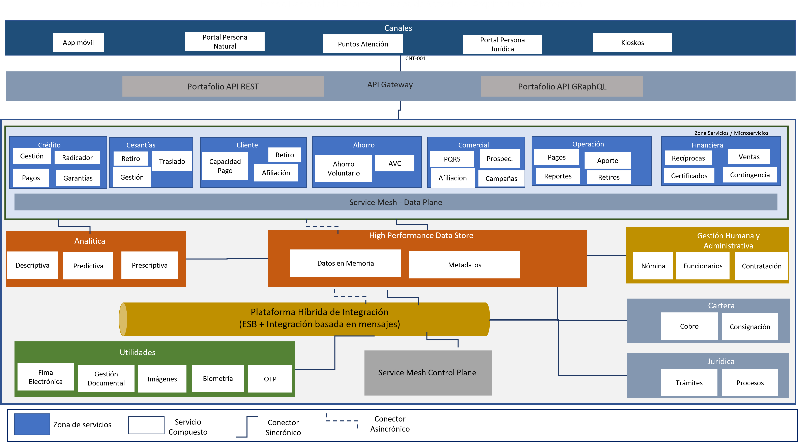

Fondo Nacional del Ahorro - Arquitectura de Referencia

Arquitectura de Referencia
Versión 2

Este documento presenta la visión general de la arquitectura de
referencia del FNA. Contiene propuestas a futuro sobre los cambios y
adiciones sugeridas con respecto a la arquitectura de referencia actual.

 

## Vista Funcional

### Blueprint General - ASIS
A continuación se presenta la arquitectura de referencia ASIS. El
propósito es recordar el esquema actual para poderlo comparar con la
arquitectura propuesta.

{width="13.146666666666667in"
height="7.32in"}

Fondo Nacional del Ahorro - Arquitectura de Referencia

 

### Blueprint General - TOBE
A continuación se presenta la arquitectura de referencia propuesta

**Nivel de detalle 1**
{width="13.210001093613299in"
height="7.323334426946632in"}

**Nivel de detalle 2**

{width="13.210001093613299in"
height="7.323334426946632in"}
