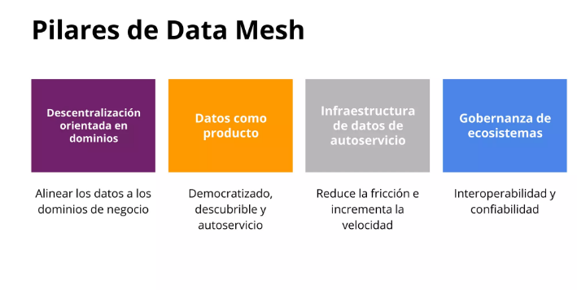

## Arquitectura de Datos Candidata FNA

Para la arquitectura SOA objetivo se propone un enfoque conocido como malla de
datos, este es un cambio de paradigma que permite pensar en los datos
como un producto. La malla de datos introduce cambios organizativos y de
procesos que las empresas necesitarán para gestionar los datos como un
activo de capital tangible del negocio.

Una malla de datos tiene como objetivo que los datos sean más accesibles
y estén disponibles para los usuarios, conectando directamente a
propietarios, los productores y los consumidores de datos. La malla de
datos tiene como objetivo mejorar los resultados empresariales de las
soluciones centradas en los datos, así como impulsar la adopción de
arquitecturas de datos modernas.

### Pilares de la malla de datos (Data Mesh)

{width="6.1375in"
height="3.0819444444444444in"}

### Arquitectura To Be

{width="6.1375in"
height="3.5520833333333335in"}

### Principales Características

**Propiedad impulsada por el dominio**: el primer principio de un data
mesh es transferir el poder de los datos y la propiedad a las manos de
los equipos de dominio (es decir departamentos, unidades de negocio,
etc.). Ellos serán los dueños de los datos de un extremo a otro, y
podrán asegurarse de tener desde las fuentes correctas hasta los
procesamientos necesarios y la entrega de los datos para que otros
equipos de dominio los aprovechen como productos

**Datos como producto:** los equipos de dominio son responsables de los
datos y también de los productos de datos resultantes. El objetivo es
lograr que cada "producto de datos" sea descubierto y utilizable por los
consumidores y otros equipos de dominio, y el propietario del dominio es
responsable de mantener y actualizar (o desaprobar) estos productos para
garantizar la calidad y la precisión.

**Infraestructura de autoservicio**: que todo sea "autoservicio" hace
que nos olvidemos para siempre de las tecnologías complejas y las
habilidades de nicho. El Data mesh se basa, por principio, en una
gestión de datos mediante una plataforma común y un conjunto de
herramientas que cualquier equipo de dominio pueda aprovechar.

**Gobernanza federada**: si de verdad queremos eliminar controles de
acceso necesitamos un equilibrio entre las políticas y controles de
gobernanza global y la posibilidad de dominio y creación de productos.
Esto es lo que llamamos gobernanza federada y en la práctica es
fundamental para garantizar la privacidad, el cumplimiento y la
posibilidad de escalar.
