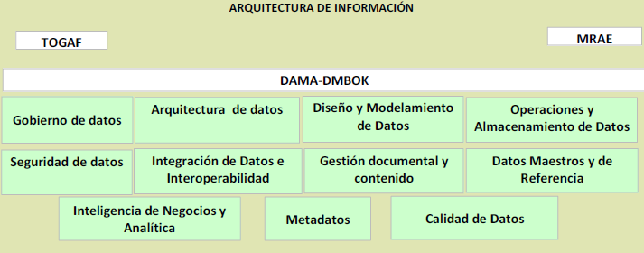
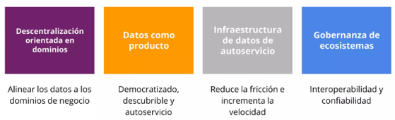

| Tema           | Arquitectura SOA Candidata para FNA: **Arquitectura de Datos Candidata FNA** |
|----------------|---------------------------------------------------|
| Palabras clave | SOA, Tecnologías, Arquitectura de referencia, Candidata, Hoja de ruta |
| Autor          |                                                   |
| Fuente         |                                                   |
| Version        | **$COMMIT** del $FECHA_COMPILACION                    |
| Vínculos       | [N003a Vista Segmento SOA FNA](N03a%a20Vsta%20aSegenta%20SOA%20FNA.md)|

 

# Arquitectura Candidata (To -- Be) Dominio de datos

El desarrollo de la arquitectura candidata de información integrará los
marcos de referencia TOGAF, el marco de referencia DAMA y las
disposiciones de la política de gobierno digital, en particular las
especificadas por el Marco de Referencia de Arquitectura Empresarial
para entidades del Estado Colombiano - MRAE para orientar la evaluación
del estado actual y la definición del estado deseado integrando
capacidades para el gobierno de datos, arquitectura de datos, diseño y
modelamiento de datos, operaciones y almacenamiento de datos, seguridad
de datos, interoperabilidad e integración de datos, gestión documental y
contenido, datos maestros y de referencia, inteligencia de negocios y
analítica, metadatos y calidad de datos.

La Ilustración a continuación muestra los marcos de referencia
aplicables al dominio de Información:

{width="6.1375in"
height="2.410416666666667in"}

Ilustración 1 Marcos de referencia aplicables a la arquitectura de
información

# Pasos para construir la arquitectura candidata

Para la generación de la arquitectura de información candidata que
consolida las necesidades en términos de datos del Fondo Nacional del
Ahorro, como consecuencia de ello y siguiendo los marcos de referencia
mencionados anteriormente, se parte del análisis del estado actual
denominado en términos técnicos Arquitectura Base o AS-IS y concluye en
una proyección de un estado futuro llamado Arquitectura candidata o
TO-BE para los elementos clave de Información. la visión de la
arquitectura de información, con enfoque de arquitectura empresarial se
construye a partir de modelar el hoy de las soluciones, información y
tecnología que soportan al Fondo Nacional del Ahorro y su estado
objetivo en un alto nivel caracterizando los elementos de arquitectura.
En general los pasos clave para construir las arquitecturas para cada
uno de los dominios deben considerar:

• **Identificación de la Arquitectura base (AS-IS):** describe la
arquitectura actual del dominio en términos de los elementos de la
arquitectura de referencia definidos y sus alineamientos.

• **Definición de la Arquitectura objetivo (TO-BE):** describe la
arquitectura objetivo del dominio en términos de los elementos de la
arquitectura de referencia definidos y sus alineamientos.

• **Diseño de Vistas:** describe las vistas de alto nivel y los reportes
requeridos para describir vistas clave de la arquitectura.

• **Análisis de Brechas:** consolida las brechas principales asociadas
al dominio. Las brechas pueden ser de alineamiento o de estado frente a
TO-BE.

{width="4.520833333333333in"
height="2.9895833333333335in"}

Ilustración 2 Componentes de Arquitectura de Información

#  {#section .unnumbered}

# Desafíos del Dominio de Datos

Teniendo en cuenta las necesidades de información resultantes del
análisis del estado actual donde se evidencio:

• Si bien existen modelos de datos y diccionarios de las bases de datos
más importantes como, por ejemplo: COBIS, no se encontró un modelo de
datos canónico que permita un lenguaje común en todos los modelos de
datos, un entendimiento a toda la organización (técnico y funcional) y
facilite la explotación y toma de decisiones a partir de los datos.

• Se evidencia que existe cierta desactualización en los artefactos que
conforman la arquitectura de datos. (Modelo de datos empresarial,
diccionario de datos, catálogos, matrices y diagramas).

• Existen diccionarios de datos particulares para algunas bases de
datos, aunque se requiere un diccionario de datos de forma
estandarizada, que permita facilitar el entendimiento de éstos y sus
relaciones. Así como diccionarios de otro tipo de datos: maestros y
referencias, analíticos, transaccionales y de metadatos.

• Aunque existen algunas actividades realizadas en torno al gobierno de
datos, que incluso fue propuesto como iniciativa en el PETI con fecha a
2022, es necesario retomar este proyecto que permita al FNA tener una
gestión de los datos más apropiada mediante la incorporación de
lineamientos, directrices, indicadores en torno al gobierno de los datos

• Se tienen identificados los dominios de información, aunque es
importante aterrizar cuales de estos son datos maestros y referencias
mediante un levantamiento tanto funcional como técnico de estos. Y que
permitan a través de una estrategia, tener una vista unificada de los
datos que conlleven a la democratización y uso correcto de estos.

• Aunque se tienen desarrollos in house y el FNA es dueño de estos
procesos, se presentan algunas necesidades en torno al ciclo de vida de
los datos donde se ve la obligación de recurrir a los proveedores.
Anterior, genera una alta dependencia para el desarrollo de actividades
operativas (inclusión de campos, reglas de negocio, generación de
indicadores, entre otras).

Agrupando estas necesidades se evidencia en la diversidad de fuentes y
formatos de datos que están dentro de los repositorios del FNA; lo que
genera que la gestión y administración de esta información presenta
algunas complicaciones, especialmente cuando se pone énfasis en la
calidad y disponibilidad de los datos:

-   **Acceso deficiente:** debido a la masiva cantidad de datos que se
    almacenan historicamente, las plataformas de consumo de los datos
    disminuyen si rendimiento con toda la información que deben manejar
    y no pueden ponerla a disposición de forma sencilla.

-   **Datos no confiables:** debido a la disminucún del rendimiento, los
    equipos no pueden hacer un seguimiento de lo que está actualizado y
    lo que no. Los conjuntos de datos estáticos pueden desviarse con el
    tiempo y volverse inutilizables.

-   **Los datos se centran en los técnicos analíticos:**los datos se
    organizan en función de los técnicos de datos y no de los usuarios
    estrategicos o los equipos de negocio. Dada la organización
    preestablecida, a estos últimos se les dificulta muchísimo encontrar
    y utilizar los datos que necesitan.

Lo anterior es generado o es consecuencia de las siguientes
problematicas:

## Arquitectura Monolitica

> Las arquitecturas de plataformas empresariales tienden a ser
> monolíticas y están altamente vinculadas con muchas dependencias, en
> términos de tecnología y personas.
>
> Esta realidad crea ciertos problemas:

-   **Mayor espera:** el equipo central de datos se convierte en un
    cuello de botella. Los equipos de negocio deben esperar por las
    respuestas que necesitan.

-   **Interrupciones no planificadas:** dado que los usuarios de negocio
    no pueden acceder a los por sí mismos (o verificar su
    confiabilidad), demandan constantemente el apoyo del equipo central
    de datos, el cual se verá relegado a tareas básicas y no podrá
    realizar ningún trabajo profundo.

-   **Falta de escalabilidad:** debido a que la plataforma está
    estrechamente acoplada, no puede cambiar ni escalar al ritmo
    requerido para el análisis de datos avanzado.

## Tecnología Desconectada del Negocio

> Desafortunadamente se videncia que no hay un puente directo entre las
> personas que gestionan los datos y las que los utilizan.
>
> Los que genera los siguientes inconvenientes:

-   **Datos fragmentados:** Dado que las empresas suelen desarrollar
    datos a partir de proyectos aislados, estos se encuentran
    segmentados y, por lo tanto, no pueden ser consumidos amplia y
    transversalmente.

-   **Procesamiento de datos limitado:** El procesamiento de datos
    tradicional se pensó para una limitada gama de casos de uso; este
    atributo restringe el acceso masivo a los datos. Actualmente, los
    casos de uso modernos están requiriendo nuevas capacidades, por
    ejemplo, la transmisión de datos en tiempo real.

-   **Separación de los objetivos misionales y/o comerciales:** los
    técnicos de datos no se vinculan con las áreas de negocio; por lo
    tanto, sus iniciativas no suelen responder a las preguntas y dolores
    comerciales de la empresa.

> En resumen, el fracaso de los proyectos analíticos se debe a pequeños
> y grandes problemas: cuellos de botella, demoras, desconexiones,
> malentendidos, poca alineación con el negocio, escasa capacidad de
> respuesta, entre otros.

Con base a los anteriores desafios en torno a la gestión y gobierno de
los datos, se plantea un nuevo paradigma orientad a aruitecturas
modernas conocido como: Data Mes, que surge como un factor clave para
darle vuelta a las tendencias negativas de los proyectosque buscan la
democratización y toma de descgiones basadas en datos.

# Data Mesh (Malla de Datos)

El concepto de Data Mesh, surgió alrededor de 2019 de la mano de Zhamak
Dehghani, a quien se puede identificar como la fundadora de Data Mesh

La idea de este concepto es, de alguna manera, eliminar, o al menos
minimizar, las limitaciones de los enfoques monolíticos y centralizados
que se han utilizado en las Arquitecturas de Plataformas de Datos, en la
Gestión de Datos y en los equipos de datos, es decir, los Data
Warehouses y Data Lakes gestionados por un equipo central. Data Mesh
propone la adopción de un modelo descentralizado basado en una
arquitectura distribuida y en la responsabilidad de las áreas de negocio
(dominios) sobre sus datos (descentralización de los roles de gobierno).
Esencialmente, se refiere al concepto de descomponer los Data Lakes y
los almacenes de datos en partes más pequeñas y descentralizadas.

Si tenemos que definir Data Mesh en forma simple, deberíamos decir que
es la construcción de una infraestructura de autoservicio que permite a
los equipos utilizar recursos y herramientas bajo demanda, para acceder
a los datos correctos, procesarlos, prepararlos y analizarlos.

En términos generales, podemos definir el Data Mesh como un enfoque
descentralizado que admite el acceso democratizado y de autoservicio a
los datos de una organización; estos permanecen ordenados por dominio
comercial y no por etapa de canalización.

Los modelos de Data Mesh ayudan a las organizaciones a obtener
resultados positivos cuando se trata de:

-   Garantizar la propiedad de los datos y dejar que sean administrados
    por los usuarios que los entienden.

-   Poner los datos correctos en manos de los usuarios que los
    necesitan.

-   Proveer una mayor agilidad a toda la organización, en virtud de la
    autonomía que gana cada equipo en un modelo de gobierno de datos de
    autoservicio.

Zhamak Dehgani explica: "Las empresas deben estar abiertas a la
posibilidad de ir más allá de los lagos de datos monolíticos y
centralizados; es decir, buscar la construcción de una arquitectura de
Data Mesh que adopte la realidad de los datos y lo que se espera de
ellos (máxima disponibilidad y buena distribución)".

## 4.1 Características del Data Mesh {#características-del-data-mesh .unnumbered}

Tradicionalmente, se ha usado un patrón centralizado en el que los
ingenieros de datos agregan los activos de datos y crean un producto
para que pueda ser usado por varios consumidores, como un Data Lake, sin
conocer el contexto antes de tiempo. Los lagos de datos, data warehouses
y data lake houses van a seguir existiendo con este enfoque.

Aunque eso conlleva a los desafíos anteriormente expuestos. Por los
tanto se propone una estrategia basada en el Data Mesh que facilita el
acceso a los datos entre organizaciones y departamentos, ya que el dato
se trata y se publica como un producto. Es una aproximación mucho más
sencilla a la tradicional, en la que cuando alguien quiere acceder a
datos de otra unidad o de otro dominio debe iniciar un proceso de
descubrimiento para determinar con quién debe hablar, solicitar los
permisos de acceso, etc.

Además de la creación del producto, también cambia los roles
involucrados en torno a los datos. Introduce roles de consumidores de
datos y propietario de dominio y de productos de datos, que también
definen el gobierno del producto:

{width="6.239583333333333in"
height="3.4479166666666665in"}

Ilustración 3 Componentes del Data Mesh

Teniendo en cuenta los anterior, se detallan 6 características
principales del Data Mesh:

1.  **Áreas temáticas vs. Dominios.**

La descomposición de problemas generales en modelos más pequeños no es
una idea nueva en la ingeniería de datos.

Es frecuente que las empresas opten por la descomposición de datos
complejos por área temática; por ejemplo, 'acuerdo', 'evento' o
'producto'. Si bien este enfoque puede simplificar la reutilización de
datos, en la mayoría de los casos origina largas discusiones para
determinar los «elementos comunes» que engloben los datos que se van a
compartir y usar.

Por lo tanto, puede ser más efectivo descomponer los datos en dominios
que estén alineados con los procesos misionales o comerciales de la
empresa; de esta manera, cada dominio podría implementar las áreas
temáticas aplicables a sus propias actividades.

2.  **Separar los esquemas por dominio para proporcionar agilidad.**

Una de las principales ventajas de adoptar el diseño domain-driven es la
agilidad.

Para la implementación de arquitecturas basadas en Data Mesh, los
especialistas recomiendan crear esquemas separados para cada dominio. La
responsabilidad de la administración de los datos y su modelado recae en
los usuarios de negocio; ellos se encargarán de cada dominio específico
en construcción.

Los esquemas domain-driven, por su parte, proporcionan una colección de
productos de datos alineados con las áreas de negocio.

3.  **Integración entre dominios.**

Los datos de negocio se pueden optimizar en el contexto de un solo
dominio. Sin embargo, muchas oportunidades de optimización de procesos
comerciales requieren que los datos se combinen a través de límites
geográficos y funcionales. No obstante, para que estos procesos se hagan
realidad, las organizaciones deben tener una estrategia explícita que
canalice el intercambio entre dominios.

4.  **Soporte para productos de datos empresariales**

Los productos de datos empresariales presentan una vista multidominio.
Este atributo contribuye con la optimización de los procesos misionales
de extremo a extremo. Estos productos de datos suelen ser
multifuncionales; requieren la adición de múltiples fuentes de datos y,
a menudo, tienen valor en múltiples casos de uso y aplicaciones.

Por lo tanto, son propicios para ser reutilizados con frecuencia en
varios dominios.

5.  **Supertipos y subtipos**

Para entregar productos de datos empresariales exitosos, es necesario
que los equipos de dominio involucrados puedan combinar y agregar datos
de manera confiable en múltiples dominios. Un enfoque para lograr esto
sería crear un producto de datos empresariales de cuenta «Supertype» que
se complete a través de todos los dominios. Este producto de datos
contendría atributos comunes en todos los dominios. Luego, cada dominio
administraría su propio producto de datos de cuenta de subtipo con
atributos adicionales específicos.

Este enfoque impulsa un grado importante de consistencia entre los
dominios, ya que se aplican claves que respalden la unión a la tabla de
supertipos; asimismo, se asegura de ser lo suficientemente flexible para
que los dominios de áreas comerciales amplíen sus productos de datos de
subtipos, según sea necesario.

6.  **Buen gobierno y uso de estándares correctos.**

La transformación digital y las iniciativas de la estraegías de datos
modernas están incrementando la necesidad de más integraciones entre
dominios.

Desarrollar una visión interfuncional coherente de las operaciones
requiere que los datos estén conectados tanto técnica como
semánticamente. La consistencia en la implementación, a través de los
dominios, no se da espontáneamente; requiere de un enfoque coordinado
por el negocio, de cara al gobierno de datos.

Asimismo, se requiere de experiencia técnica para aprovechar con éxito
las herramientas de gestión de datos e implementar, de manera efectiva,
la gobernanza de datos entre dominios.

Cada dominio necesitará soporte para desarrollar procesos de calidad,
diseño de estructuras y reconciliación de datos, sumados a otros
elementos de la arquitectura.

## 4.2 Pilares del Data Mesh {#pilares-del-data-mesh .unnumbered}

La estrategia del Data Mesh se centra en 4 pilares los cuales se
describen a continuación:

-   **Propiedad impulsada por el dominio**: el primer principio de un
    data mesh es transferir el poder de los datos y la propiedad a las
    manos de los equipos de dominio (es decir departamentos, unidades de
    negocio, etc.). Ellos serán los dueños de los datos de un extremo a
    otro, y podrán asegurarse de tener desde las fuentes correctas hasta
    los procesamientos necesarios y la entrega de los datos para que
    otros equipos de dominio los aprovechen como productos

-   **Datos como producto:** los equipos de dominio son responsables de
    los datos y también de los productos de datos resultantes. El
    objetivo es lograr que cada "producto de datos" sea descubierto y
    utilizable por los consumidores y otros equipos de dominio, y el
    propietario del dominio es responsable de mantener y actualizar (o
    desaprobar) estos productos para garantizar la calidad y la
    precisión.

-   **Infraestructura de autoservicio**: que todo sea "autoservicio"
    hace que nos olvidemos para siempre de las tecnologías complejas y
    las habilidades de nicho. El Data mesh se basa, por principio, en
    una gestión de datos mediante una plataforma común y un conjunto de
    herramientas que cualquier equipo de dominio pueda aprovechar.

-   **Gobernanza federada**: si de verdad queremos eliminar controles de
    acceso necesitamos un equilibrio entre las políticas y controles de
    gobernanza global y la posibilidad de dominio y creación de
    productos. Esto es lo que llamamos gobernanza federada y en la
    práctica es fundamental para garantizar la privacidad, el
    cumplimiento y la posibilidad de escalar.

{width="6.037095363079615in"
height="1.8359678477690289in"}

Ilustración 4 Pilares del Data Mesh

## 4.3 Arquitectura Candidata basada en Data Mesh {#arquitectura-candidata-basada-en-data-mesh .unnumbered}

La vista de arquitectura propuesta para el FNA basada en Data Mesh
ilustra los siguientes componentes:

1.  **Dominios de Negocios:** Son las unidades de negocio basada en la
    definición de datos maestros del Fondo Nacional del Ahorro. Teniendo
    en cuenta la arquitectura de negocio definida en el presente
    documento se plantean los siguientes dominios: Crédito, cesantías,
    cliente, ahorro, comercial, operación, financiera

2.  **Consumidores de Datos:** Definidos como los roles que necesitan
    tomar decisiones sobre los datos. Los consumidores son roles
    estratégicos que necesitar hacer uso delos productos de datos
    generados por el Data Mesh.

3.  **Capacidad de Inteligencia de Negocios y Ciencia de datos:**
    Estrategia de inteligencia de negocios se encuentra implementada,
    permitiendo generar reportes, alertas y tableros de control donde se
    puedan apreciar diferentes indicadores que permiten medir la gestión
    y control; Por otro lado, la estrategia de ciencia de datos provee
    la metodología para el diseño, desarrollo, implementación y
    mantenimiento de modelos descriptivos, predictivos, cognitivos y de
    analítica avanzada.

4.  **Arquitectura Data Mesh:** Está compuesta por tres capas. Los
    almacenes de datos (data store, productos de datos), integración de
    datos e interoperabilidad y las fuentes de datos:

-   Almacenes de datos: Repositorios de datos estructurados,
    semiestructurados y no estructurados, donde se persisten los
    diferentes productos de datos. Estos productos pueden ser tableros
    de control de un dominio en específico, modelos analíticos,
    reportes, e incluso archivo que permitan a toma de decisiones basada
    en datos o incluso la monetización de los mismos.

-   Integración e interoperabilidad: Mecanismos que permiten el
    intercambio de datos entre las capas de la arquitectura. Estas
    pueden ser en batch o cercanas al tiempo real (Near Real Time)
    dependiente de los requerimientos no funcionales del producto de
    datos. Basicamente me permiten construir los flujos de datos desde o
    hacia los repositorios y almacenes de datos.

-   Fuentes de Datos: Conformado por las diferentes fuentes de
    información que son el insumo principal para la generación de los
    productos de datos. Estas fuentes están conformadas por ejemplo por
    bases de datos de sistemas misionales como Cobis, la bodega
    corporativa o incluso el datalake. Y es de esta forma que se integra
    la estrategia de gestión de datos actual del FNA con la propuesta
    del Data Mesh. Donde la arquitectura de datos actual se usa como
    fuente de información de la malla de datos.

5.  Por medio de una correcta **gestión de los datos** en el ecosistema
    del FNA, se propone unas capacidades para la gestión de datos la
    cual le permitirá soportar los procesos organizacionales y cumplir
    con los objetivos desarrollados en el gobierno de datos para
    controlar, proteger y optimizar el valor de los activos de datos.
    Dentro de estas capacidades se encuentran calidad de datos,
    seguridad y gestión de datos maestros y referencia. A continuación,
    se detallan las capacidades propuestas:

-   **Calidad de Datos:** Por medio de la calidad de la información se
    puede gestionar y entender cada una de las características de los
    datos para su correcta utilización y a su vez el cumplimiento de los
    objetivos o necesidades del usuario frente al dato. Respecto a la
    reutilización de datos en el ecosistema del FNA, esta reutiliza sus
    propios datos para compartírselos a todas las áreas que la
    requieran.

> Por lo anterior, gestionar la calidad de los datos permite evitar las
> inconsistencias de estos, problemas de calidad y brechas que conducen
> a decisiones incorrectas o a oportunidades perdidas e incluso a
> impactos reputacionales y sanciones normativas.
>
> Respecto al ciclo de vida del dato, las capacidades propuestas
> permiten toda la trazabilidad del transcurso de vida de dato desde su
> creación, adquisición, almacenamiento, gestión, mantenimiento hasta su
> destrucción, borrado o no utilización.

-   **Estrategia de datos maestros y referencia:** La implementación de
    esta estrategia permitirá:

> Cumplir con los requisitos de datos del ecosistema, el cual, facilita
> tener acceso a los mismos conjuntos de datos, con la confianza de que
> los conjuntos de datos sean completos, actuales y consistentes.
>
> Gestionar los costos de integración de datos: El costo de integrar
> nuevas fuentes de datos en un entorno ya complejo es mayor en ausencia
> de Datos Maestros, lo que reduce la variación en cómo las entidades
> críticas son definidas e identificadas.
>
> Reducir el riesgo: Los Datos Maestros pueden permitir la
> simplificación de la arquitectura de intercambio de datos para reducir
> costos y riesgos asociados con un entorno complejo.

-   **Seguridad:** Esta capacidad se encuentra alineada al domino de
    seguridad de la arquitectura empresarial del FNA. En esta se deben
    abordar capacidades de datos enfocados a la seguridad, protección y
    respaldo. En el dominio de seguridad se abordan la protección de
    datos personales, anonimización, cifrado, backup y registros de
    auditoría en la capa de base de datos.

La ilustración a continuación nos permite apreciar la arquitectura de
datos candidata propuesta para el Fondo nacional del ahorro enmarcado en
el proyecto de Arquitectura SOA:

{width="6.4944444444444445in"
height="3.4952832458442695in"}

Ilustración 5 Arquitectura Candidata

## 4.4 Pasos para implementar una estrategia de datos basada en Data Mesh {#pasos-para-implementar-una-estrategia-de-datos-basada-en-data-mesh .unnumbered}

Si observamos algunas de las implementaciones de Data Mesh en el
mercado, veremos que sus soluciones difieren mucho unas de otras. Esto
se debe a que partimos únicamente de unos principios definidos a alto
nivel y cada compañía los interpreta e implementa según su
infraestructura y sus necesidades. Por ello, no existe una metodología
específica para construir un Data Mesh, aunque sí podemos seguir estos
pasos en la aplicación de los principios:

{width="6.869705818022747in"
height="1.3245034995625546in"}

Ilustración 6 Pasos para implementar un Data Mesh

1.  **Definir el estado Data Mesh «Ready**»: el paradigma Data Mesh
    impacta principalmente en la forma de organizarse dentro de una
    plataforma de datos. El primer paso será mapear los procesos AS IS /
    TO BE de nuestro ecosistema para eliminar las limitaciones técnicas
    que se puedan encontrar a la hora de empezar a aplicar los
    principios. El TO BE deberá contemplar las capacidades que permitan
    aplicar el principio de plataforma como autoservicio. Este estado de
    «Ready» permitirá iniciar un proceso de transición en cualquier
    momento sin necesidad de grandes cambios.

2.  **Definir los dominios de producto:** Una buena forma de comenzar es
    ir introduciendo el principio del dominio de datos, seleccionando
    aquellos dominios con casos de uso cercanos a los orígenes donde sus
    datos son producidos (cesantías, clientes, créditos, ahorro, etc.).
    A continuación, liberar estos casos de uso proporcionándoles una
    dirección y un directorio que permita su descubrimiento. No importa
    que haya datos duplicados en diferentes zonas de la plataforma, lo
    importante es la definición de los datos en su dominio.

3.  **Migrar la responsabilidad:** Luego de definir los dominios se
    empieza a descentralizar la plataforma, cuyo objetivo es asegurarse
    de que la propiedad de los datos sea transferida a los dominios.
    Esto se puede conseguir aplicando metodologías product thinking a
    los procesos y migrando parte de los equipos de infraestructura o
    del servicio que genera los datos a un nuevo equipo transversal y
    funcional, responsable del dominio.

4.  **Gobernar la descentralización:** En este paso es muy importante
    asegurar la calidad de los datos a través de los dominios y permitir
    que los propios dominios sean autodescriptivos e interoperables. De
    esta manera, los dominios compartirán una sintaxis y un control de
    acceso y serán gobernados por unos estándares globales.

En este paso se debe recordar que los responsables de los diferentes
dominios de la plataforma forman parte de la visión federada y, en
definitiva, de su gobierno.

## 4.5 Principales retos de la implantación de Data Mesh {#principales-retos-de-la-implantación-de-data-mesh .unnumbered}

Tener una estrategia de datos implica la definición de cómo aprovechar
los datos utilizando los principios FAIR (encontrabilidad,
accesibilidad, interoperabilidad y reutilización) para defender que los
Productos de Datos sean utilizables, comprensibles, accesibles e
interoperables con otros Productos de Datos. Al final, los productos de
datos aportan valor a la empresa y son una forma de monetizar los datos.

Para lograr lo anterior, se deben tener en cuenta los siguientes
desafíos:

-   **El ajuste tecnológico** es una de las principales consideraciones
    para los esfuerzos de cualquier organización por adoptar e
    implementar una estrategia basada en Data Mesh para la gestión de
    datos. Para poder implantar con éxito la arquitectura Data Mesh, el
    FNA debe reestructurar sus plataformas de datos, redefinir las
    funciones de los propietarios de los dominios de datos y revisar las
    estructuras para hacer viable la propiedad de los productos de datos
    y la transición para desarrollar sus datos analíticos como un
    producto.

-   **La implantación de un modelo de Gobierno del Dato Federado:** La
    interoperabilidad y estandarización de las comunicaciones,
    gobernadas globalmente, es uno de los pilares fundamentales para
    construir sistemas distribuidos. Una parte crucial para avanzar
    hacia una arquitectura de datos descentralizada es entender que la
    federación tiene que ver con la propiedad descentralizada, que
    requiere disciplinas bien entendidas.

-   **Equipos interfuncionales de datos de dominio:** Los dominios que
    proporcionan datos como productos necesitan ser aumentados con
    nuevos conjuntos de habilidades: (a) el propietario del producto de
    datos y (b) los ingenieros de datos. Es importante que estos roles
    incorporen data skills en todos los dominios para construir y operar
    los pipelines de datos internos de los dominios.

-   **Construir un diseño** convergente de plataforma de datos y
    autoservicio que soporte y proporcione la tecnología necesaria que
    los dominios necesitan para capturar, procesar, almacenar y servir
    sus productos de datos. Esta plataforma debe ocultar toda la
    complejidad subyacente y proporcionar los componentes de la
    infraestructura de datos en régimen de autoservicio.

-   **Un nivel significativo de gestión del cambio:** Para adaptarse a
    las operaciones de datos descentralizadas de Data Mesh, es necesario
    un importante esfuerzo de cambio.

-   **Análisis de dominios cruzados**: Es un reto garantizar todas las
    normas y/ o lineamientos que permitan los procesos de gestión de
    datos de dominios cruzados. Este cambio hacia la propiedad
    distribuida de los datos sólo funciona si aplicamos una amplia gama
    de normas a nuestros productos de datos. Sin normas empresariales,
    lineamientos, reglas de distribución y conectividad, se crea un
    ecosistema de caos, desorganización e incompatibilidad y las
    iniciativas de dominio cruzado son imposibles.

# Referencias Bibliográficas

-   The Enterprise Data Model: a framework for enterprise data
    architecture, 2nd Edition. (2012, mayo 7). Andy Graham.

-   DAMA-DMBOK: Data Management Body of Knowledge, 2nd Edition. (2017,
    Julio 5). Dama International.
