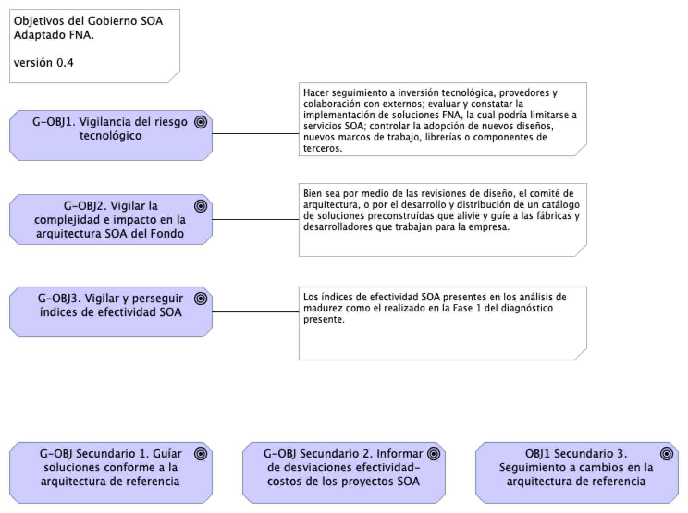
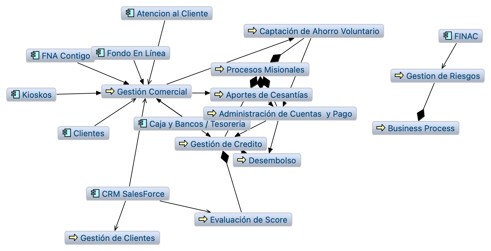
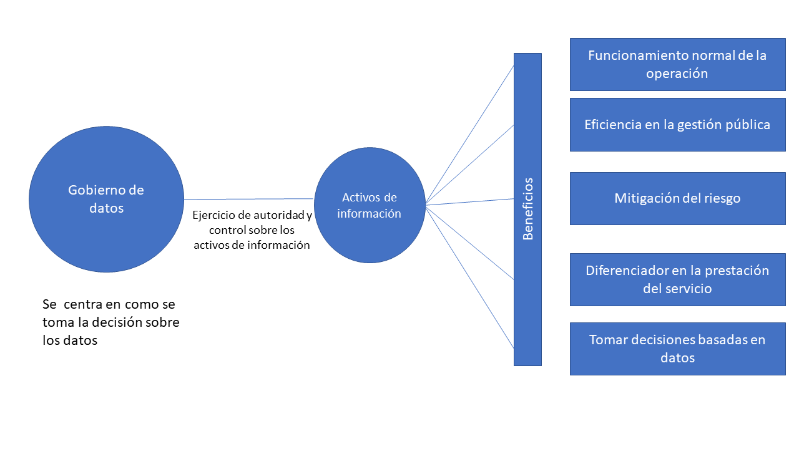
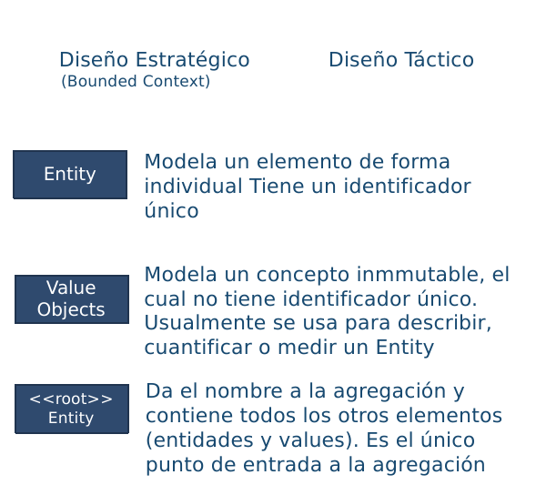
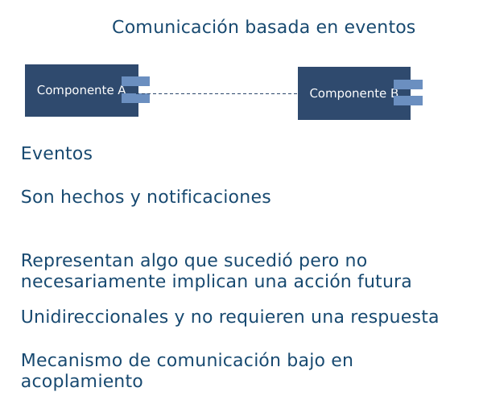
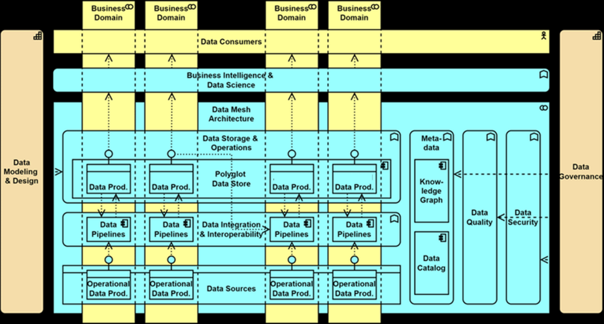

---
title: Diagnóstico SOA Actual FNA
keywords:
- SOA
- madurez
- gobierno
lang: en-US
date-meta: '2023-02-10'
author-meta:
- Harry Wong, ing.
- Eddie Hernandez, ing.
- Federico Suárez, ing.
- Darío Correal, ing.
header-includes: |
  <!--
  Manubot generated metadata rendered from header-includes-template.html.
  Suggest improvements at https://github.com/manubot/manubot/blob/main/manubot/process/header-includes-template.html
  -->
  <meta name="dc.format" content="text/html" />
  <meta property="og:type" content="article" />
  <meta name="dc.title" content="Diagnóstico SOA Actual FNA" />
  <meta name="citation_title" content="Diagnóstico SOA Actual FNA" />
  <meta property="og:title" content="Diagnóstico SOA Actual FNA" />
  <meta property="twitter:title" content="Diagnóstico SOA Actual FNA" />
  <meta name="dc.date" content="2023-02-10" />
  <meta name="citation_publication_date" content="2023-02-10" />
  <meta property="article:published_time" content="2023-02-10" />
  <meta name="dc.modified" content="2023-02-10T18:27:39+00:00" />
  <meta property="article:modified_time" content="2023-02-10T18:27:39+00:00" />
  <meta name="dc.language" content="en-US" />
  <meta name="citation_language" content="en-US" />
  <meta name="dc.relation.ispartof" content="Manubot" />
  <meta name="dc.publisher" content="Manubot" />
  <meta name="citation_journal_title" content="Manubot" />
  <meta name="citation_technical_report_institution" content="Manubot" />
  <meta name="citation_author" content="Harry Wong, ing." />
  <meta name="citation_author_institution" content="Arquitecto SOA, Stefanini" />
  <meta name="citation_author" content="Eddie Hernandez, ing." />
  <meta name="citation_author_institution" content="Datos, Stefanini" />
  <meta name="citation_author" content="Federico Suárez, ing." />
  <meta name="citation_author_institution" content="Infraestructura, Stefanini" />
  <meta name="citation_author" content="Darío Correal, ing." />
  <meta name="citation_author_institution" content="Arquitecto TI, Stefanini" />
  <link rel="canonical" href="https://hwong23.github.io/fna-devdocs-f2/" />
  <meta property="og:url" content="https://hwong23.github.io/fna-devdocs-f2/" />
  <meta property="twitter:url" content="https://hwong23.github.io/fna-devdocs-f2/" />
  <meta name="citation_fulltext_html_url" content="https://hwong23.github.io/fna-devdocs-f2/" />
  <meta name="citation_pdf_url" content="https://hwong23.github.io/fna-devdocs-f2/manuscript.pdf" />
  <link rel="alternate" type="application/pdf" href="https://hwong23.github.io/fna-devdocs-f2/manuscript.pdf" />
  <link rel="alternate" type="text/html" href="https://hwong23.github.io/fna-devdocs-f2/v/32783d5726a2472ce383df361e1af1ec8c5a5902/" />
  <meta name="manubot_html_url_versioned" content="https://hwong23.github.io/fna-devdocs-f2/v/32783d5726a2472ce383df361e1af1ec8c5a5902/" />
  <meta name="manubot_pdf_url_versioned" content="https://hwong23.github.io/fna-devdocs-f2/v/32783d5726a2472ce383df361e1af1ec8c5a5902/manuscript.pdf" />
  <meta property="og:type" content="article" />
  <meta property="twitter:card" content="summary_large_image" />
  <link rel="icon" type="image/png" sizes="192x192" href="https://manubot.org/favicon-192x192.png" />
  <link rel="mask-icon" href="https://manubot.org/safari-pinned-tab.svg" color="#ad1457" />
  <meta name="theme-color" content="#ad1457" />
  <!-- end Manubot generated metadata -->
bibliography:
- content/manual-references.json
manubot-output-bibliography: output/references.json
manubot-output-citekeys: output/citations.tsv
manubot-requests-cache-path: ci/cache/requests-cache
manubot-clear-requests-cache: false
...


Documentación del proyecto 181-2020, E-Service, 
([permalink](https://hwong23.github.io/fna-devdocs-f2/v/32783d5726a2472ce383df361e1af1ec8c5a5902/))
versión indicada a continuación, se encuentra en 
****
[32783d5](https://github.com/hwong23/fna-devdocs-f2/tree/32783d5726a2472ce383df361e1af1ec8c5a5902)
de February 10, 2023.


## Grupo E-Service


+ **Harry Wong, ing.**
  <br>
    · {.inline_icon width=16 height=16}
    [e_hwong](https://github.com/e_hwong)
    <br>
  <small>
     Arquitecto SOA, Stefanini
  </small>

+ **Eddie Hernandez, ing.**
  <br>
    · {.inline_icon width=16 height=16}
    [e_ehernandez](https://github.com/e_ehernandez)
    <br>
  <small>
     Datos, Stefanini
  </small>

+ **Federico Suárez, ing.**
  <br>
    · {.inline_icon width=16 height=16}
    [e_fsuarez](https://github.com/e_fsuarez)
    <br>
  <small>
     Infraestructura, Stefanini
  </small>

+ **Darío Correal, ing.**
  <br>
    · {.inline_icon width=16 height=16}
    [e_dcorreal](https://github.com/e_dcorreal)
    <br>
  <small>
     Arquitecto TI, Stefanini
  </small>


***


# Fase 2: SOA Objetivo FNA
# Contenido de los Productos Contractuales, 181-2020

<br>

# Producto 5: PR5. Comparativa de la industria y el FNA
Describir y comparar con el Fondo la manera cómo las empresas del segmento y de otros sectores de la industria enfrentan los retos de flexibilidad de negocio, independencia de proveedor tecnológico, y fortaleza SOA.

**Nota**: los análisis de este producto provienen únicamente de los objetivos del proyecto SOA: dependencia de proveedor (OBJ1), fortaleza SOA de las aplicaciones (OBJ2), y el tiempo de mercado (OBJ3).

<br>

## Justificación
La comparativa SOA de la industria proveerá al Fondo de hallazgos aplicables a sus procesos y productos. A la vez, esta información de guía puede ser traducida en futuras iniciativas pertenecientes a la hoja de ruta de mejora, tanto del gobierno como de los procesos SOA del Fondo.

## Contenidos
1. Arquitectura SOA
1. Portafolio de servicios
1. Gobierno SOA
1. Versionamiento de servicios
1. Monitoreo y operación SOA
1. Mantenimiento y evolución de servicios
1. Nuevas tecnologías

<br>

## Criterios de Aceptación

* Lista de oportunidades e iniciativas ralizables por el FNA
* Mejoras visibles para las capacidades de la arquitectura SOA del Fondo

*** 


| Tema           | Comparativa de la industria y el FNA: **Comparación SOA FNA - Sector** |
|----------------|---------------------------------------------------|
|Palabras clave|SOA, Situación actual, Comparativa, Industria financiera |
|Autor           |                                                       |
|Fuente          |                                                       |
|Version|32783d5 del 10 Feb 2023                                  |
|Vínculos|[N003a Vista Segmento SOA FNA](N03a%a20Vsta%20aSegenta%20SOA%20FNA.md)|

<br>

# Comparación SOA FNA - Sector
Para presentar este análisis comparativo hemos selecionado algunas dimensiones que facilitan la presentación de la comparación en categorías. 

Los aspectos a tener en cuenta en la comparativa son:

1. Arquitectura SOA
1. Portafolio de Servicios
1. Gobierno SOA
1. Estrategia de Versionamiento 
1. Monitoreo y Operación
1. Mantenimiento y Evolución
1. Nuevas tecnologías

<br>

Presentaremos cada uno de estos aspectos desde el sector financiero en general y; posteriormente serán aplicados al FNA.

<br>

## Arquitectura SOA

### Descripción
En esta categoría comparativa establecemos como criterios las prácticas asociadas al manejo de los modelos de arquitectura SOA. En este se encuentran consideraciones como si se cuenta con un depósito de arquitectura formal y un grupo de gobierno y desarrollo de la Arquitectura SOA dentro de la organización. Esto último incluye a los cargos y el nivel de formalismo en  realizar y mantener las arquitectura SOA en el Fondo.


### Prácticas del Sector Financiero

Depoósito de arquitectura
Análisis de modelos de arquitectura
Herramientas de modelado de arquitecturas de servicios

### Comparativa FNA

|**Práctica**|**Estado FNA**|**Estado Entidad Bancaria líder en Hispanomericana (BBVA)**|**Estado Entidad Bancaria líder mundial (Capital One)**|
| ------------ | ------------ | ------------ | ------------ |
| Depósito de arquitectura  |Mega y Archimate  |  | - Herramientas de AE como habilitadores, sin embargo documentando lo necesario bajo  enfoques de tipo: MVA (Minimum Viable Architecture) y JITA (Just In Time Architecture) -GitHub |
| Análisis de modelos de arquitectura  |  |   - Optimización de recursos - Buscar funcionalidades comunes - Elasticidad - Gestión de recursos y seguridad - Prescripción de modelos con base en casuistíca | Enfoque interno donde hay un enfoque donde se promueve el reuso por capacidades comunes: sistemas compartidos, componentes compartidos, plataformas compartidas, codigo compartido  |
| Herramientas de modelado de arquitecturas de servicios| Integration Designer IBM, Archimate| | Utilización de lenguajes estandarizados, sin atarse a una herramienta especifica |


<br>

## Portafolio de Servicios

### Descripción
Esta categoría busca establecer un comparativo entre el las prácticas del FNA y de la industria relacionadas con el manejo de los servicios y el manejo de su portafolio.  Herramientas relacionadas para su gestión, registro, búsqueda y documentación.

### Prácticas del Sector Financiero
Herramientas para el manejo del portafolio de servicios
Gobierno del portafolio de servicios

### Comparativa FNA

|**Práctica**|**Estado FNA**|**Estado Entidad Bancaria líder en Hispanomericana (BBVA)**|**Estado Entidad Bancaria líder mundial (Capital One)**|
| ------------ | ------------ | ------------ | ------------ |
| Herramientas para el manejo del portafolio de servicios | Archimate | - API Market - APIGateway| API Gateway|
| Gobierno del portafolio de servicios | Arquitectura de aplicaciones oficina de informática fondo nacional del ahorro | | Definición de practicas internas basadas en microservicios: - Principio de una sola responsabilidad - Tener un repositorio de datos para cada microservicio - Utilizar la comunicación asíncrona para lograr un acoplamiento flexible - Fallos rápidos mediante un disyuntor para lograr tolerancia a fallos -  Proxy de las solicitudes de microservicios a través de una pasarela API - Asegurar que los cambios en la API son compatibles con versiones anteriores - Versionar  microservicios para cambios disruptivos - Disponer de una infraestructura dedicada para alojar su microservicio - Crear un "tren de liberación" independiente - Crear eficacia organizativa |

<br>

## Gobierno SOA

### Descripción
Esta categoría busca comparar las mejores prácticas de gobierno SOA en el sector y en el FNA. Este item se relaciona de forma directa con el punto de portafolio de servicios pero va mas allá.  En esta categoría se establecen criterios como políticas, guías y procedimientos asociados a la dirección de la arquitectura de servicios de la organización.

### Mejores prácticas en el sector
Comité de arquitectura
Políticas y lineamientos
Arquitectura de referencia
Toma de decisión 
Priorización de servicios

### Comparativa FNA
|**Práctica**|**Estado FNA**|**Estado Entidad Bancaria líder en Hispanomericana (BBVA)**|**Estado Entidad Bancaria líder mundial (Capital One)**|
| ------------ | ------------ | ------------ | ------------ |
| Comité de arquitectura | No existe formalmente | | Comité conformado donde se involucran todos los especialistas, con  un enfoque de la "solución" es lo primordial.|
| Políticas y lineamientos | Arquitectura de aplicaciones oficina de informática fondo nacional del ahorro | Orentación a procesos y automatización | Claramente establecidos, de conocimiento publico y en constante evolución. - Innersource: "Desarrollo de aplicaciones empresariales con prácticas de código abierto"|
| Arquitectura de referencia |  - Bus de servicios de Entidad (ESB). - Arquitectura de referencia SOA |  - Service mesh - Domain driven Design - REST - GraphQL - Cloud computing | Uso de arquitecturas de referencia con un enfoque proactivo más que reactivo. Donde se busca que la mejor documentación se encuentre en el futuro propuesto. - Cloud Computing - Microservicios - Arquitectura orientada a eventos - Event-Driven Architectures (EDA) - Serverless - Service mesh |
| Toma de decisión | Fragmentados en silos |  metodología SGMM (SOA Governance and Management Method) | Decisiones de arquitectura basadas al tener en cuenta diferentes perspectivas pasando desde el negocio a lo técnico. |
| Priorización de servicios | Orientado por necesidades de área de negocio | | Enfoque desde el punto de vista de minimizar los "Riesgos para el negocio" |

<br>

## Estrategia de Versionamiento 

### Descripción
Esta categoría busca establecer los mecanismos, herramientas y mejores prácticas relacionadas con el manejo de las versiones de los servicios.  

<br>

### Prácticas del Sector Financiero

Manejo de la gestión del cambio
Herramientas para documentación y gestión de las versiones de servicios
Documentación de los servicios y sus versiones

<br>

### Comparativa FNA
|**Práctica**|**Estado FNA**|**Estado Entidad Bancaria líder en Hispanomericana (BBVA)**|**Estado Entidad Bancaria líder mundial (Capital One)**|
| ------------ | ------------ | ------------ | ------------ |
| Manejo de la gestión del cambio | Definida al interior de la organización | | API Gateway, con versiones para cada cambio |
|Herramientas para documentación y gestión de las versiones de servicios | | | Swagger, MadCap Flare |
| Documentación de los servicios y sus versiones | Definida al interior de la organización. No centralizada, ni alineada a un gobierno | | OpenAPI, Swagger|

<br>

## Monitoreo y Operación

### Descripción
Esta categoría analiza las diferentes herramientas, mecanismos y mejores prácticas relacionadas con el monitoreo y operación de los servicios en operación.  

### Prácticas del Sector Financiero
Herramientas utilizadas para gestionar el despliegue y operación de los servicios
Herramientas para monitoreo de la operación, gestión de alarmas y notificaciones

### Comparativa FNA
|**Práctica**|**Estado FNA**|**Estado Entidad Bancaria líder en Hispanomericana (BBVA)**|**Estado Entidad Bancaria líder mundial (Capital One)**|
| ------------ | ------------ | ------------ | ------------ |
| Herramientas utilizadas para gestionar el despliegue y operación de los servicios | IBM Jazz | GitLAB CI | Jenkins,  herramientas del proveedor de nube, kubernetes|
|Herramientas para monitoreo de la operación, gestión de alarmas y notificaciones | Herramientas para monitoreo a nivel de Infraestructura |New Relic |herramientas del proveedor de nube|

<br>

## Mantenimiento y Evolución

### Descripción
Esta categoría analiza las estrategias recomendadas para favorecer el mantenimiento y evolución de los servicios.  Es decir la capacidad de la organizacón de poder mantener, mejorar, corregir y evolucionar los servicios de la organización.

### Prácticas del Sector Financiero
Gestión del cambio
Manejo de solicitudes de cambio
Gestión de prioridades para los cambios
Gestión de inconformidades y defectos 

### Comparativa FNA
|**Práctica**|**Estado FNA**|**Estado Entidad Bancaria líder en Hispanomericana (BBVA)**|**Estado Entidad Bancaria líder mundial (Capital One)**|
| ------------ | ------------ | ------------ | ------------ |
| Gestión del cambio | Comité de cambios | PI Planning , Oficina Agile | Enfoque en "reducción del riesgo" |
| Manejo de solicitudes de cambio | Procedimiento interno | | Implementación de microservicios con separación de lógica y responsabilidades |
| Gestión de prioridades para los cambios | Comité de cambios | | Service Design: diseñar la experiencia orquestada de todos los puntos de contacto del servicio. |
| Gestión de inconformidades y defectos  | Procedimiento interno | | El principio de "sala blanca"(clean room) se centra en la prevención de defectos  |

<br>

## Nuevas tecnologías

### Descripción
En esta categoria se analizan las prácticas del FNA comparadas con la industria  en temas relacionados con la vigilancia de nuevas tecnologías asociadas a servicios, así como las políticas de renovación y adopción de dichas tecnologías.

### Prácticas del Sector Financiero

Políticas de vigilancia
Laboratorios para experimentación de nuevas tecnologías
Capacitación y entrenamiento
Plan programado de adopción y migracións

### Comparativa FNA
|**Práctica**|**Estado FNA**|**Estado Entidad Bancaria líder en Hispanomericana (BBVA)**|**Estado Entidad Bancaria líder mundial (Capital One)**|
| ------------ | ------------ | ------------ | ------------ |
| Políticas de vigilancia | No existe formalmente |  'Reinventar la empresa en la era digital' | Observación del mercado, revisión interna y constante experimentación |
| Laboratorios para experimentación de nuevas tecnologías | | BBVA Next Technologies | Equipo interno con orientación centrada al cliente, API abierta a integración con terceros, hackatons, iteraciones y prototipados agiles |
| Capacitación y entrenamiento | | Política de certificación con aliados claves de tecnología | Presupuesto interno para estimular el crecimiento academico, adicional hay enfoque en proyectos personales |
| Plan programado de adopción y migraciones | || Politica de salida a producción completamente automatizada, bajo el principio de "Sala blanca", donde el proceso garantiza que no hay dudas sobre lo que sale a producción|


# Fase 2: SOA Objetivo FNA
# Contenido de los Productos Contractuales, 181-2020

# Producto 6: PR6. Gobierno SOA
El gobierno SOA es el encargado de vigilar las relaciones entre las áreas de negocio incluidas en el segmento FNA del presente diagnóstico (la vicepresidencia de operaciones y la vicepresidencia de crédito del FNA) y la implementación y diseño de soluciones SOA. El modelo de gobierno SOA para el Fondo debe asistir en la aplicación y ejecución de un régimen (estándar) de implementación, observación y puesta en marcha de soluciones SOA.

**Nota**: los análisis de este producto están dirigidos a cumplir los objetivos del proyecto SOA: dependencia de proveedor (OBJ1), fortaleza SOA de las aplicaciones (OBJ2), y tiempo de mercado (OBJ3).

<br>

## Justificación
El cierre de brechas de alineación negocio FNA-SOA (Ver PR9. Portafolio de inciativas y brechas) es una de las principales razones por las que implementar el modelo de gobierno SOA. Pero no es la única. El gobierno también debe demostrar los beneficios de aumentar el nivel de eficacia (madurez) SOA, tanto en el segmento FNA seleccionado por este diagnóstico como a todo el Fondo. Por último, el gobierno SOA funciona como una disciplina para hacer frente a los retos futuros con una mirada en la inversión de tecnología, los riesgos operativos y en la alineación con el negocio del FNA.

## Contenidos
1. Definición de objetivos y capacidades del gobierno SOA
1. Equilibrio arquitectura y procesos SOA
1. Supervisión de efectividad y factibilidad SOA
1. Mejora de los índices de efectividad (madurez) SOA
1. Consideraciones para la puesta en marcha del gobierno SOA en el FNA

<br>

## Criterios de Aceptación

* Objetivos y capacidades del gobierno SOA para el Fondo
* Índices de efectividad (madurez) SOA 1

*** 


|Tema            |Gobierno SOA: **Definición de objetivos del gobierno SOA** |
|----------------|---------------------------------------------------|
|Palabras clave|SOA, Situación actual, Capacidades de negocio|
|Autor||
|Fuente||
|Version|**32783d5** del 10 Feb 2023|
|Vínculos|[Fase 2 PR6 Gobierno SOA](N03a%a20Vsta%20aSegenta%20SOA%20FNA.md)|

<br>| Tema           | Arquitectura SOA Candidata para FNA: **Arquitectura de Referencia. Versión 2.0** |
|----------------|---------------------------------------------------|


## Definición de objetivos del gobierno SOA
Dado los niveles de complejidad que el FNA ha alcanzado y por los riesgos tecnológico que contraen las partes analizadas en la Fase 1 de este diagnóstico (ver [04b.Resumen Fase 1](N03a%a20Vsta%20aSegenta%20SOA%20FNA.md)), esto es, aplicaciones, servicios, procesos, infraestructura, entre otros, la figura de gobierno SOA es de carácter obligatorio en el Fondo. Esta sirve además para  complementar los procedimientos de TI del Fondo (ver anexo 1, [06n. Anexos](N03a%a20Vsta%20aSegenta%20SOA%20FNA.md)).

De las problemáticas encontradas en la Fase 1 del presente diagnóstico, nos estamos refiriendo explícitamente a las que incrementan la complejidad de las herramientas de software y soluciones tecnológicas del FNA, _como lo es el manejo de dependencias de los servicios SOA del Fondo_. Es muy conocido, y demostrado, que solo esta condición es la causa de la mayoría de los sobreesfuerzos en los cambios y de la dificultades a la hora de predecir su impacto.

Junto a esta complicación, que de por sí hace obligatoria la introdución de la figura del gobierno SOA en el Fondo, y que organizaciones como el OpenGroup señalan que se dan por la falta de Arquitectura Empresarial, y por consiguiente, por un débil gobierno, se encuentran otras que fueron levantadas en la Fase 1 del presente diagnóstico: agilidad limitada, complejidad e imprecisión en la trazabilidad, ocultamiento de funcionalidades (ver [04b.Resumen Fase 1](N03a%a20Vsta%20aSegenta%20SOA%20FNA.md)).

<br>

### Objetivos Principales del Gobierno SOA del FNA
Una vez identificadas estas problemáticas de orden mayor existentes en la empresa y que podemos resumir en tres: riesgo tecnológico, complejidad y nivel de adopción SOA presente en los desarrollos e implementaciones del FNA, el gobierno SOA propuesto para el Fondo debe incluir entre sus objetivos, como mínimo, los siguientes

{width="12in" height="7in"}
[Imagen.]() Objetivos principales del gobierno SOA del FNA.

_Fuente: elaboración propia._

<br>

1. Vigilancia del riesgo tecnológico en tres vías. Primero, hacer seguimiento a la inversión tecnológica, el cual involucra a los provedores del FNA y colaboración con externos; segundo, evaluar y constatar la implementación de herramientas de software, la cual podría limitarse a servicios SOA; y finalmente, controlar la adopción de nuevos diseños, nuevos marcos de trabajo, librerías o componentes de terceros.
1. Del objetivo anterior (Vigilancia del riesgo tecnológico) se desprende este para enfatizar el control sobre la inversión de TI: vigilar la efectividad y factibilidad de los proyectos SOA de la organización en términos del área de efectividad del costo y factibilidad SOA. Ambos conceptos explicados en [Supervisión de efectividad y factibilidad SOA](N03a%a20Vsta%20aSegenta%20SOA%20FNA.md).
1. Vigilar el crecimiento de la complejidad y el impacto de los nuevos cambios en la arquitectura de referencia SOA del Fondo, bien sea por medio de las revisiones de diseño, el comité de arquitectura, o por el desarrollo y distribución de un catálogo de soluciones preconstruídas que alivie y guíe a las fábricas y desarrolladores que trabajan para la empresa.
1. Vigilar y perseguir el aumento de los índices de adopción, adaptación y efectividad SOA presentes en los análisis de madurez como el realizado en la Fase 1 del diagnóstico presente (ver [02.Fase 2 PR2 Estudio Madurez SOA FNA](N03a%a20Vsta%20aSegenta%20SOA%20FNA.md)).
1. Poner el marcha el proceso de gobierno SOA del FNA descrito más adelante en este ejercicio (181-2020). Adaptar y monitorear los índices de rendimiento (KPI) del proceso.

<br>

### Otros Objetivos del Gobierno SOA
Para complementar la lista de objetivos del gobierno SOA recomendados por este diagnóstico al Fondo, la lista siguiente expone objetivos que pueden ser conseguidos de forma indirecta, o con la mediación de proyectos transformadores, como la Arquitectura Empresarial, transformación digital, arquitectura de negocio, entre otros.

1. Desde el área, o rol, de gobierno SOA del FNA, servir de guía en la entrega de soluciones de software conforme a la arquitectura de referencia estregada por esta consultoría.
1. Informar de desviaciones en la relación de efectividad de costos de los proyectos SOA del FNA (en términos del área de inefectividad de costo e infactibilidad SOA.
1. Hacer el seguimiento de las implementaciones de los cambios en la arquitectura de referencia: phase G, Implementation Governance, TOGAF ADM.

<br>

{width="12in" height="7in"}
[Imagen.]() Objetivos secundarios del gobierno SOA del FNA.

_Fuente: elaboración propia._


|Tema            |Gobierno SOA: **Riesgos tecnológicos del FNA** |
|----------------|---------------------------------------------------|
|Palabras clave|SOA, Gobierno, Riesgo, Objetivos de negocio|
|Autor||
|Fuente||
|Version|**32783d5** del 10 Feb 2023|
|Vínculos|[Fase 2 PR6 Gobierno SOA](N03a%a20Vsta%20aSegenta%20SOA%20FNA.md)|

<br>

## Riesgos Tecnológicos del FNA
Los riesgos tecnológicos encontrados en el diagnóstco SOA de Fase 1 (ver [03.Fase 1 PR3 Resultado Diagnóstico Situación Actual](N03a%a20Vsta%20aSegenta%20SOA%20FNA.md)), y que describimos abajo, están incorporados a las vigilancias del gobierno SOA propuesto. A la vez, estos mismos riesgos descritos a continuación deben ser agregados a la matriz de gestión actual del Fondo, y gestionados por los métodos propios con los que ya cuenta el FNA.

<br>

### Gobierno SOA y Riesgos Tecnológicos del FNA
El gobierno SOA del FNA debe buscar la capacidad para medir y gestionar (agregar a la lista de riesgos de la empresa) los riesgos que lo están afectando.

* R1. Riesgo de agilidad limitada (ver imagen 1)
* R2. Riesgo de baja orquestación SOA (ver imagen 2a y 2b)
* R3. Riesgo de crecimiento de dependencias entre servicios SOA
* R4. Riesgo de crecimiento de adaptadores particulares --opuesto al estándar-- (ver imagen 3)
* R5. Riesgo de baja reutilización de servicios SOA
* R6. Riesgo de permanencia de aplicaciones silos
* R7. Riesgo de falta de trazabilidad para la evolución e implementación de los servicios SOA

<br>


[Imagen 1.]() Riesgo no. 1 y 2. Agilidad limitada por el proliferación de la copmlejidad en los servicios SOA del Fondo.

_Fuente: elaboración propia, ae_fna_as_is.archimate._

<br>


[Imagen 2a.]() Riesgo no. 2. En el modelo "ae_fna_as_is.archimate" de situación actual del FNA no aparecen relaciones de este con los procesos de negocio. La principal utilización del bus (ESB-IBM, en la imagen) está destinada a la integración de aplicaciones. 

_Fuente: ae_fna_as_is.archimate._

<br>



[Imagen 2b.]() En el modelo "ae_fna_as_is.archimate" no es posible encontrar relaciones del bus con los procesos.

_Fuente: ae_fna_as_is.archimate._

<br>


[Imagen 3.]() Riesgo no. 4 y 5. Caso de CRM del FNA. Le afecta el riesgo de estándarización en la interoperabilidad, aumenta la cantidad de adaptadores particulares.

_Fuente: ae_fna_as_is.archimate._


|Tema            |Gobierno SOA: **Capacidades FNA por Desarrollar para el Gobierno SOA** |
|----------------|---------------------------------------------------|
|Palabras clave|SOA, Situación actual, Capacidades de negocio|
|Autor||
|Fuente||
|Version|**32783d5** del 10 Feb 2023|
|Vínculos|[Fase 2 PR6 Gobierno SOA](N03a%a20Vsta%20aSegenta%20SOA%20FNA.md)|

<br>

### Capacidades FNA por Desarrollar para el Gobierno SOA
Las capacidades requeridas por el gobierno SOA del Fondo, que a la vez soportan a la matriz de roles y responsabilidades (RACI) futuras del equipo de gobierno SOA o del Comité de arquitectura del Fondo están relacionados directamente con los objeitvos del gobierno SOA y con los riesgos tecnológicos encontrados en la Fase 1 (ver [06a.Objetivos gobierno](N03a%a20Vsta%20aSegenta%20SOA%20FNA.md), y [06c.Riesgos tecnológicos SOA](N03a%a20Vsta%20aSegenta%20SOA%20FNA.md)).

<br>

>**Nota**: no es del alcance de esta consultoría, E-Service (contrato 181-2020), desarrollar estas capacidades. Esto requeriría de la ejecución de otro(s) proyecto. El Fondo podría desarrollar estas capacidades indicadas por este diagnóstico de forma interna, o contratar proyectos para la creación y gestión de estas capacidades.

<br>


[Imagen 1.]() TOGAF 9, Fase G, Implementation governance para la implementación de las capacidades de ejecución de hojas de ruta del FNA.

_Fuente: elaboración propia._

<br>

1. CAP1. Realizar e implementar estrategias y entregables para planear y analizar la arquitectura de referencia SOA del Fondo (resultado Fase 2 de este diagnóstico).
1. CAP2. Relacionar elementos de la arquitectura de referencia SOA (181-2020), esto es, procesos de negocio, servicios, datos, aplicaciones, componentes, tecnologías, etc., y vincular distintas perspetivas a una vertical de negocio del  Fondo, como, Gestión Comercial, Cesantías, Ahorro Voluntario para desarrollar modelos consistentes y desarrollar la oportunidad de dirigir cambios y atacar los problemas de integralidad de las pruebas.
1. CAP3. Realizar y gestionar la puesta en marcha de hojas de ruta para cerrar brechas y alcanzar estados futuros de la arquitectura (TOGAF 9, Fase G, Implementation governance). Ver anexo 1.
1. CAP4. Ejercitar la trazabilidad de los activos y productos de TI con los productos y decisiones de negocio de las áreas del FNA, como la vicepresidencia de Crédito y la de Operaciones ante la llegada de impactos, cambios, reformas y bajas tecnológicas.
1. CAP5. Realizar análisis de impacto, riesgos, costo beneficio, capacidad usada, y gestión de demanda ante la evaluación de cambios a la arquitectura de referencia SOA y activos de TI, cuando lo amerite.
1. CAP6. Emitir y gestionar los contenidos de documentación técnica, como principios, restricciones tecnológicas, marcos de trabajo, normas, diseños, y estándares para el uso de los proveedores, servicios de fábricas del FNA, planta interna, Comunicación y Planeación.
1. CAP7. Emitir y actualzar el marco de trabajo de gobierno SOA que complemente el de TI del Fondo y que enuncie los procesos, procedimientos y responsabilidades de este con el fin de generar la autoridad y asistir en la toma de deciones internas (áreas de TI y Planeación del Fondo) y externas (proveedores del Fondo)

<br>

### Anexo 1. Proceso de Arquitectura Empresarial


[Imagen 2.]() TOGAF 9, Fase G, Implementation governance para la implementación de las capacidades de ejecución de hojas de ruta del FNA.

_Fuente: www.opengroup.org/soa/source-book/togaf._


# Contenido

[2 Tabla de Ilustraciones
[1](#tabla-de-ilustraciones)](#tabla-de-ilustraciones)

[3 Introducción [2](#introducción)](#introducción)

[4 Alcance [3](#alcance)](#alcance)

[5 Antecedentes Política Pública y Normativa
[3](#antecedentes-política-pública-y-normativa)](#antecedentes-política-pública-y-normativa)

[6 Marco teórico [6](#marco-teórico)](#marco-teórico)

[6.1 Definición de Gobierno de Datos
[6](#definición-de-gobierno-de-datos)](#definición-de-gobierno-de-datos)

[6.2 Marco de Trabajo de Gobierno de Datos
[7](#_Toc110853530)](#_Toc110853530)

[7 Modelo de Gobierno
[9](#modelo-de-gobierno-propuesto)](#modelo-de-gobierno-propuesto)

[7.1 Articulación [10](#articulación)](#articulación)

[7.1.1 Horizontal [10](#horizontal)](#horizontal)

[7.1.2 Centrado en la persona
[10](#centrado-en-la-persona)](#centrado-en-la-persona)

[7.1.3 Vertical [11](#vertical)](#vertical)

[7.2 Política [11](#política)](#política)

[7.3 Ejes [12](#ejes)](#ejes)

[7.4 Componentes [12](#componentes)](#componentes)

[7.5 Modelo Operativo [13](#modelo-operativo)](#modelo-operativo)

[7.6 Comité Gobierno de datos
[14](#comité-gobierno-de-datos)](#comité-gobierno-de-datos)

[7.7 Roles y Funciones [16](#roles-y-funciones)](#roles-y-funciones)

[8 Referencias [19](#_Toc110853542)](#_Toc110853542)

# Tabla de Ilustraciones

[Ilustración 1 Política Pública y Normativa
[3](#_Toc110619194)](#_Toc110619194)

[Ilustración 2: Definición y Beneficios del Gobierno de Datos
[7](#_Toc110619195)](file:///C:/Users/ASUS/Downloads/5_Modelo_Gobierno_DatosV2.docx#_Toc110619195)

[Ilustración 3: Pilares de un Marco de Trabajo para el Gobierno de Datos
[8](#_Toc110619196)](file:///C:/Users/ASUS/Downloads/5_Modelo_Gobierno_DatosV2.docx#_Toc110619196)

[Ilustración 4: Modelo de Gobierno de Datos
[9](#_Toc110619197)](#_Toc110619197)

[Ilustración 5 Estructura Federada de Gobierno de Datos
[14](#_Toc110619198)](file:///C:/Users/ASUS/Downloads/5_Modelo_Gobierno_DatosV2.docx#_Toc110619198)

[Ilustración 6 Comité Gobierno de Datos
[15](#_Toc110619199)](#_Toc110619199)

[Ilustración 7: Roles de gobierno de datos
[18](#_Toc82980949)](#_Toc82980949)

# Introducción

El Gobierno nacional aprobó el documento CONPES 3920 de 2018 que define
la política de explotación de datos (Big Data) para el Estado
colombiano. Con este documento, el país asume el liderazgo regional al
ser el primero en Latinoamérica, y octavo en el mundo, con una política
pública integral que habilita el aprovechamiento de los datos para
generar desarrollo social y económico. \[1\]

El gobierno de datos es necesario para la explotación de datos teniendo
en cuenta la arquitectura del modelo de explotación de datos; este
instrumento permite identificar en las entidades las capacidades
organizacionales y en **recurso humano, tecnológico y financiero** que
deben desarrollar para mejorar el aprovechamiento de datos y, a su vez,
visibilizar el efecto que tiene la explotación y la analítica de datos
para generar valor público a partir de la optimización en la prestación
de bienes y servicios a los ciudadanos, mejorar la eficiencia en la
gestión pública, y diseñar políticas públicas basadas en evidencia.
\[2\]

La elaboración de este documento se realizó mediante el análisis de los
principales marcos de trabajo para la gestión de datos (MINTIC, DAMA,
IBM) que existen en la actualidad, por parte de los integrantes del
equipo del Fondo Nacional del Ahorro se tuvieron en cuenta los
siguientes factores representativos de la entidad: su estructura
organizativa, cultura, nivel de madurez en el gobierno de datos, apoyo
del nivel directivo, entre otros.

Los lineamientos y definiciones propuestos en este documento se basan en
la política pública, la normativa que hasta la fecha se ha expedido y la
guía del Ministerio De Tecnología de la Información y las Comunicaciones
(en adelante MINTIC) "G.INF.06 Guía Técnica de Información - Gobierno
del dato", la cual contempla los datos desde la perspectiva de
componentes de información (CI).

# Alcance

Definir un modelo de gobierno de datos de alto nivel que sirva de guía a
las demás funciones de gestión de datos, para mejorar los procesos de
toma de decisiones al momento de priorizar las inversiones, asignar
recursos, medir los resultados y conocer cómo los datos se gestionan y
despliegan de forma adecuada, para el apoyo continúo a las necesidades
de la ciudadanía y para aportar al cumplimiento de los objetivos de cada
una de las dependencias, departamentos y gerencias del Fondo Nacional
del Ahorro.

# Antecedentes Política Pública y Normativa

{width="6.004166666666666in"
height="3.0909722222222222in"}

[]{#_Toc110619194 .anchor}Ilustración 1 Política Pública y Normativa

El documento CONPES 3920 de 2018 "Política Nacional De Explotación De
Datos (Big Data)" estableció la necesidad de diseñar e implementar la
infraestructura de datos, al ser los datos activos que generan valor
económico y social, que requieren su definición, implementación,
mantenimiento y explotación a partir de la infraestructura de datos.

El Documento CONPES 3975 de 2019, \"Política Nacional para la
Transformación Digital e Inteligencia Artificial", establece que
Colombia debe seguir desarrollando una infraestructura de datos completa
y que permita el diseño e implementación de sistemas de IA en el país,
priorizando la creación e identificación de bases de datos masivos que
sean interoperables y contengan información estructurada, así como
disminuyendo barreras innecesarias e injustificadas al acceso a datos,
para los desarrolladores de esta tecnología.

El Documento CONPES 3995 de 2020, "Política Nacional de Confianza Y
Seguridad Digital", señala como un objetivo establecer medidas para
desarrollar la confianza digital a través de la mejora en la seguridad
digital de manera que Colombia sea una sociedad incluyente y competitiva
en el futuro digital mediante el fortalecimiento de capacidades y la
actualización del marco de gobernanza en seguridad digital, así como con
la adopción de modelos con énfasis en nuevas tecnologías.

"Finalmente, en respuesta al CONPES 3920 -2018 se incorpora en la
Política de Gobierno Digital uno de los componentes esenciales para
asegurar la transformación digital del Estado denominado como el Modelo
de implementación de Explotación de Datos que permite que las entidades
evalúen sus capacidades organizacionales y en recurso humano,
tecnológico y financiero para la explotación de datos. A la vez que
proporciona insumos para construir una hoja de ruta para mejorar
estas capacidades. ​

Una mayor madurez de las capacidades para la explotación de datos de la
entidad permitirá que se implementen procesos de analítica de datos y
bigdata, como base para la implementación de iniciativas basadas en
tecnologías emergentes"

El documento CONPES 4023 de 2021, "Política para la Reactivación, la
Repotenciación y el Crecimiento Sostenible e Incluyente: Nuevo
Compromiso por el Futuro de Colombia", establece que la consolidación de
la infraestructura de datos en el país carece de un marco de gobernanza
que articule las políticas, normativas y lineamientos para
la disponibilidad, intercambio y reutilización de datos y que permita su
sostenibilidad en el largo plazo.

​

El Ministerio de Tecnologías de la Información y las Comunicaciones
(MinTIC) para el presente año (2022) ha expedido normativa:

La Resolución 460 de 2022, Plan Nacional de Infraestructura de Datos
(PNID) y su Hoja de Ruta, con el fin de impulsar la transformación
digital del Estado y el desarrollo de una economía basada en los datos.

El Decreto 767 de 2022 - El numeral 4 del artículo 2.2.9.1.2.1 Decreto
1078 de 2015, Decreto Único Reglamentario del Sector de Tecnologías
de la Información y las Comunicaciones, establece como uno de los
elementos que componen la estructura de la Política de Gobierno Digital,
la línea de acción denominada "Decisiones basadas en datos", la
cual busca promover el desarrollo económico y social del país impulsado
por datos, entendiéndolos como infraestructura y activos estratégicos, a
través de mecanismos de gobernanza para el acceso, intercambio,
reutilización y explotación de los datos, que den cumplimiento a las
normas de protección y tratamiento de datos personales y permitan
mejorar la toma de decisiones y la prestación de servicios de los
sujetos obligados.

Para explotar el potencial que tienen los datos de transformar el actuar
del sector público, resulta fundamental establecer reglas y principios
claros y comunes a todos los actores que intervienen en las etapas
relevantes del ciclo de vida de los datos, desde entidades públicas,
funcionarios públicos, usuarios, sector privado, academia, y demás
actores.

El Decreto 1389 de 2022 que establece los lineamientos generales para la
gobernanza en la infraestructura de datos y se crea el Modelo de
gobernanza de la infraestructura de datos (Componentes, niveles,
instancias, roles y otras disposiciones), Este decreto se articula con
el [Plan Nacional de Infraestructura de
Datos](https://www.mintic.gov.co/portal/inicio/Sala-de-prensa/Noticias/198952:MinTIC-expide-el-Plan-Nacional-de-Infraestructura-de-Datos-que-impulsara-la-transformacion-digital-del-Estado),
establecido a través de la Resolución 460 de 2022 y con la [Política de
Gobierno
Digital](https://mintic.gov.co/portal/inicio/Sala-de-prensa/Noticias/210461:Ministerio-TIC-expide-el-Decreto-767-del-2022-la-actualizacion-Politica-Colombiana-de-Gobierno-Digital) actualizada
desde el pasado 16 de mayo con el Decreto 767 de 2022.

 

# Marco teórico

## Definición de Gobierno de Datos

El gobierno de los datos (Data Governance) es la estrategia corporativa
que define la política, los procedimientos, los procesos, las normas,
los responsables y la tecnología que ha de gobernar o regir la
utilización de los datos corporativos para una eficaz gestión de la
información en una organización o empresa. \[3\]

El objetivo principal en el gobierno de datos es ayudar a maximizar el
valor de los datos dentro de una organización, es decir, obtener el
máximo rendimiento de los datos como un activo primordial de la empresa.
Hoy en día, existen numerosas definiciones de Data Governance \[3\], a
continuación, se exponen algunas de ellas:

-   DAMA (Data Management Association) propone que "el gobierno de datos
    es el ejercicio de autoridad y el control (la planificación, el
    seguimiento y la aplicación) a través de la gestión de activos de
    datos". \[4\]

-   El Instituto Data Governance (DGI) afirma que \"el gobierno de datos
    es un sistema de derechos de decisión y rendición de cuentas para
    los procesos relacionados con la información, ejecutado según
    acuerdos de modelos que describen quién puede tomar las acciones con
    que información, cuándo, en qué circunstancias, y con qué métodos\".
    \[5\]

-   IBM señala que "Data Governance se refiere a cómo una organización
    utiliza los datos para beneficiar y proteger a sí mismo." \[6\]

Para el Fondo Nacional del Ahorro la definición entregada por el DAMA
supone la que más se ajusta a la estrategia y realidad institucional,
por lo tanto, es de esta forma que se abordara siempre el concepto de
Gobierno de Datos.

> {width="7.0in" height="3.9375in"}

## Marco de Trabajo de Gobierno de Datos

Un marco de trabajo de gobierno de datos es un conjunto estandarizado de
conceptos, prácticas y criterios, que permite a las organizaciones
administrar los datos de manera organizada y eficiente, esta ayuda se
traduce entre otras en facilitar que todos los actores de la
organización compartan la forma de pensar y comunicarse acerca de
conceptos complicados o ambiguos. Nicola Askham refiere que "No hay un
enfoque único para todos (los marcos de trabajo). Para que funcione,
debe ajustarse a la cultura, estructura y prácticas de la organización.
Una vez dicho esto, los componentes básicos de las políticas, procesos,
roles y responsabilidades se encontrarán en todos los marcos". \[7\]

Se destaca en un marco de trabajo de gobierno de datos la comprensión de
los elementos fundamentales:

-   **Política:** Tener una política que establezca la institución
    \"hará\" que la gestión de datos sea una parte clave del marco. Sin
    este, no habrá autoridad para cambiar la forma en que la
    organización piensa y maneja los datos. En algunas instancias, se
    puede avanzar sin una política cuando la gobernanza de datos es un
    enfoque clave, sin embargo, como las prioridades comerciales futuras
    cambian, es probable que la iniciativa disminuya o, en el peor de
    los casos, se abandone. Tener una política como parte del enfoque de
    gestión de datos otorga autoridad, a las partes interesadas.

-   **Ejes:** Concentrar los esfuerzos en un ámbito específico para
    seguir, crear los lineamientos, directrices, guías y procedimientos
    definidos y documentados permitiendo tener un enfoque consistente y
    repetible para gestionar los datos en toda la organización.

-   **Modelo Operativo:** Conjunto de elementos que hace posible
    materializar el modelo en la entidad.

-   **Roles y responsabilidades:** El tercer componente vital es definir
    quiénes son los responsables de los datos y el alcance de las
    responsabilidades.

> Sobre este último ítem es importante destacar que la gestión de los
> datos es una responsabilidad compartida, entre los profesionales de la
> gestión de datos (administradores y custodios) dentro de las
> organizaciones (TI) y los **propietarios** de datos del negocio
> (responsables), que representan los intereses colectivos de los
> productores de datos y los consumidores de información.

{width="4.40625in"
height="3.522222222222222in"}

# Modelo de Gobierno Propuesto

El Fondo nacional del Ahorro es una entidad comprometida con el
mejoramiento de su desempeño y la atención al ciudadano, para lo cual
requiere tomar decisiones y empoderar a la ciudadanía a través de sus
datos e información. Para lograr lo anterior, se prioriza la
administración, mejora y aprovechamiento de datos que se encuentran en
diferentes sistemas de información que apoyan los procesos de las
dependencias direccionamiento estratégico (misionales, apoyo, evaluación
y mejora), todo articulado por medio de la definición de un Sistema
Integrado de Planeación y Gestión (MIPG), con apoyo del direccionamiento
estratégico, las políticas de transparencia y acceso a la información
pública, lucha contra el fraude y la gestión documental.

{width="7.121360454943132in"
height="4.1841940069991255in"}

[]{#_Toc110619197 .anchor}Ilustración 4: Modelo de Gobierno de Datos

##  Articulación 

### Horizontal 

El propósito de esta dimensión es permitirle a la entidad realizar las
actividades que la conduzcan a lograr los resultados propuestos y a
materializar las decisiones plasmadas en su planeación institucional, en
el marco de los valores del servicio público.

El modelo definido también se articula con los niveles *estratégico,
misional, apoyo y de evaluación y mejora continua* del modelo de
operación por procesos, con el fin de aprovechar los procesos existentes
en la entidad y facilitar la implementación al tener previamente mapeado
los responsables, actividades, entradas, salidas, herramientas y otros
insumos necesarios para la implementación del modelo de gobierno.

###  Centrado en la persona

Integrar las personas para que en el horizonte tiempo permanezca la
cultura del dato en la entidad buscando de manera continua el
fortaleciendo de las competencias en las diferentes dimensiones:
saberes, saber ser, saber hacer; mediante la oferta de formación y
capacitación de acuerdo con las temáticas definidas por el plan nacional
de formación adoptado por el plan municipal de capacitación, priorizando
los ejes: **Transformación Digital** enmarcado en el CONPES 3975
(Departamento Nacional de Planeación, 2019) y la **gestión del
conocimiento y la innovación** en todos sus ejes:

-   Generación y producción del conocimiento.

-   Herramientas para uso y apropiación.

-   Cultura de compartir y difundir.

-   Analítica institucional para la toma de decisiones.

La Analítica institucional para la toma de decisiones tiene especial
relevancia ya que se enfoca en el análisis de información e indicadores,
visualización de datos y decisiones basadas en evidencia; tomar
decisiones basadas en datos aporta a que se incentive en la entidad la
cultura del dato, permitiendo que esta se afiance y una vez implementada
perdure a través del tiempo.

### Vertical 

Lograr la coordinación y compromiso de todos los niveles de la entidad,
desde la cabeza principal y los directivos hasta los funcionarios que
desempeñan labores operativas específicas, pasando por equipos tácticos
y contratistas.

Los niveles definidos son \[8\]:

{width="6.251375765529309in"
height="2.2761198600174977in"}

Ilustración 5 Niveles Entidad

## Política

El Fondo Nacional del Ahorro establece como activo los datos, la
información y el conocimiento para la toma de decisiones y el logro de
la misión estratégica de la entidad, incrementando la confianza de los
grupos de valor, los grupos de interés y contribuyendo a la innovación
pública y social.

## Ejes 

Se integran 5 ejes donde se concentran los esfuerzos: *Estrategia del
negocio, cumplimiento normativo, seguridad y privacidad del dato*, los
cuales se toman de las definiciones del DAMA ya que se acoplan
funcionalmente con las condiciones propias de la entidad; además, se
*adiciona el ciclo de vida del dato y gestión continua* lo que
posibilita tener una visión holística del dato y evaluar el uso,
aplicación y posibles ampliaciones del modelo a través de las instancias
previstas para ello.

-   **Estrategia del negocio**: Con el apoyo las áreas que conforman el
    direccionamiento estratégico de la entidad se define un mecanismo
    que permita la identificación la cadena de valor que permite tomar
    buenas decisiones y resolver de forma óptima casos de uso del
    negocio para cada uno de los interesados, con el fin de tener una
    visión global que asegure las sinergias entre todas las fuentes de
    información.

-   **Cumplimiento normativo**: Con el apoyo del área jurídica definir
    los mecanismos que permitan de manera proactiva hacer el seguimiento
    y el acatamiento de reglas y normativa del dato en la entidad. por
    medio de los responsables de las políticas que permitan garantizar
    que los datos sean usados de acuerdo con las regulaciones y normas
    vigentes.

-   **Seguridad y Privacidad del dato**: Coordinar con el responsable de
    la política que permite velar por la protección de los datos que ya
    fueron o van a ser procesados, almacenados o trasmitidos, es decir,
    durante todo su ciclo de vida.

-   **Ciclo de Vida del dato**: Visión global del dato, es el ámbito
    enfocado en asegurar el cubrimiento del enmascaramiento, reducción y
    archivado de los datos en la institución, soportando el nivel de
    autoservicio comprometido.

-   **Gestión Continua**: Evaluar el uso, aplicación y posibles mejoras
    a los procesos y procedimientos relacionados con el Gobierno del
    Dato, así como la actualización del presente modelo en las
    instancias definidas.

## Componentes

Se centra en tres elementos:

-   ***El patrocinio***: Se materializa con el líder de datos que hace
    parte del nivel estratégico.

-   ***La propiedad:*** Es responsabilidad de cada área funcional con
    los roles administrador y custodio.

-   ***La administración:*** facilita la construcción de servicios de
    gestión de datos al realizar las actividades específicas de los
    siguientes enfoques \[9\] :

```{=html}
<!-- -->
```
-   [Arquitectura del dato:]{.underline} Es el componente del dominio de
    información asociado con la coordinación de la estructura,
    semántica, y calidad del dato desde el origen, así mismo,
    participando en el diseño de los modelos y flujos de datos de las
    aplicaciones.

-   [Administración de datos Maestros:]{.underline} Es la combinación de
    procesos, gobernabilidad, políticas, estándares y herramientas que
    se integran para ofrecer un único punto de referencia. Este se
    enfoca en la necesidad de entender y derivar una visión interna de
    la función pública y una eficiencia operacional a través de la
    integración de vistas de productos, clientes, proveedores, activos,
    ubicaciones, y otros elementos de la institución que existen dentro
    de unidades diversas. Esta administración se asocia con los datos
    mantenidos por los usuarios en áreas de la función pública y
    expertos en la materia, no por los expertos de sistemas.

-   [Calidad del dato:]{.underline} Es el componente del dominio de
    información asociado con procesos de ajuste y depuración de datos
    masivos, y definición, medición y mejora continua de los indicadores
    de calidad del dato.

-   [Aprovisionamiento:]{.underline} Es el componente del dominio de
    información asociado con el movimiento de datos, tanto en línea como
    en diferido, entre aplicativos operacionales y/o informacionales,
    incrementando niveles de competencia y reutilizando componentes.

-   [Gestión de la demanda:]{.underline} Es el componente del dominio de
    información asociado con la administración centralizada de la
    demanda de datos de las áreas de funcionales del sector público.

-   [Custodia del dato:]{.underline} Es el componente del dominio de
    información asociado con la identificación y definición clara del
    custodio y consumidor del dato.

## Modelo Operativo

MINTIC propone que las entidades públicas adopten el gobierno del dato
desde la perspectiva del Modelo Federado, el cual es detallado en la
guía "G.INF.06 Guía Técnica de Información - Gobierno del dato", según
este modelo operativo la responsabilidad de los datos se delega en cada
área funcional, se coordina con las áreas de TI y se da gran relevancia
a que exista en cada una de estas áreas funcionales los roles de gestor
y administrador del dato; al momento de realizar la implementación las
actividades se enfocan en: Administración del dato maestro, Arquitectura
del dato, Custodia del dato, Calidad del dato, Gestión de la demanda y
Aprovisionamiento. En paralelo el flujo bidireccional de la
administración de los datos y el servicio de gestión de datos
interactuara con los diferentes niveles y responsables establecidos.

A partir de la siguiente Ilustración, se muestra el Modelo Federado /
Orquestado para Gobierno del Dato, sus principales características son:

-   Delega en cada área funcional involucrada en el sector público, la
    responsabilidad de sus dominios de datos maestros.

-   Coordina con las diferentes áreas de TI existentes, los mecanismos
    implicados en el buen Gobierno de Datos.

-   Cada área funcional de la institución debe existir gestores y
    administradores del dato, responsables del buen gobierno de los
    datos maestros.

{width="4.833333333333333in"
height="3.611111111111111in"}

## Comité Gobierno de datos 

La óptima gestión de datos requiere de un marco que acoja un gobierno de
datos, entendido como el ejercicio de diseñar, controlar y monitorizar
todo lo relativo a los datos desde un enfoque holístico, en el que
participen los implicados, desde el gobierno y el departamento de TI
hasta un consejo de gestión de datos que representa las partes
interesadas \[10\]

Se hace entonces necesario crear una máxima instancia de coordinación
institucional con el propósito Impulsar la política de uso y
aprovechamiento de datos en la entidad, y la orientación de acciones
tendientes a fortalecer la gobernanza, circulación y reutilización de
datos. \[8\]

{width="6.6009492563429575in"
height="3.279861111111111in"}

[]{#_Toc110619199 .anchor}Ilustración 7 Comité Gobierno de Datos

**Mesa Administrativa**

Espacio de toma de decisiones donde participan los encargados de
identificar los datos de acuerdo con los objetivos estratégicos y
funciones de la dependencia, así como velar por su actualización. 

[Asistentes]{.underline}:    Enlaces Funcionales designados por las
dependencias.

[Frecuencia]{.underline}: Trimestral

**Mesa Operativa**

Espacio de coordinar la ejecución y plantear alternativas donde
participan los encargados de orquestar las necesidades y las acciones
técnicas.

[Asistentes]{.underline}:    Enlaces Técnicos designados por las
dependencias.

[Frecuencia]{.underline}: 2 Veces previa a la Mesa administrativa. (1
sesión Por sectores, 1 sesión General)

**Grupo Trabajo**

Según se requiera se realizarán para tratar un tema u obtener un
entregable especifico y dichos resultados se trasladan a la mesa
operativa.

## Roles y Funciones 

Por parte del MINTIC se definen como necesarios para la implementación y
operación del modelo de Gobierno en el Fondo Nacional del Ahorro los
siguientes roles \[9\]:

-   **Gestor del dato:** Es el encargado del direccionamiento
    estratégico para gobernar el valor y uso del dato, y de definir las
    reglas de consolidación y coordinación con los administradores de
    unos datos en sus respectivos dominios. A veces, se encarga de la
    corrección manual de la información en caso de que las reglas
    generales no sean válidas para algún caso concreto.

-   **Custodio del dato:** Es el responsable por la existencia de unos
    datos en la función del sector público, por lo que cualquier acción
    correctiva o nuevo requisito que precise su información, debe ser
    consensuado con él. Igualmente es el responsable de que el dato esté
    disponible y con atributos de calidad. Adicionalmente, este actúa
    como patrocinador de calidad y control sobre estos datos, y es
    considerado experto en conocimiento sobre el dato que es custodio.

-   **Administrador del dato:** Es el encargado de orquestar las
    necesidades y las acciones técnicas, así como mediar en los posibles
    conflictos que puedan surgir entre roles consumidores y productores.
    Para esto, crea estándares y buenas prácticas, habilita metadatos
    técnicos, operacionales y funcionales, audita la calidad de los
    datos y las medidas de gobernanza, y define políticas de respaldo de
    la información (backups), seguridad, flujos de datos, etc.

Una vez analizadas las condiciones de estructura organizacional, cultura
y necesidades propias del Fondo Nacional del Ahorro, se opta por
establecer los siguientes roles necesarios para la correcta
implementación del modelo de Gobierno de Datos definido:

+-------------+--------------------------------------------------------+
| Líder de    | Patrocinador ejecutivo del gobierno de datos que se    |
| datos       | asegure de que las iniciativas y proyectos con datos   |
|             | tengan suficientes recursos y se entienda la visión y  |
|             | objetivos estratégicos de la entidad.                  |
|             |                                                        |
|             | -   Definir la estrategia de datos.                    |
|             |                                                        |
|             | -   Vigilar y aplicar la ética de los datos.           |
|             |                                                        |
|             | -   Direccionar la creación de estándares, políticas y |
|             |     procesos que determinen el uso, desarrollo y       |
|             |     gestión de los datos a nivel de la entidad.        |
+=============+========================================================+
| Comité de   | Trabaja como Gestor del dato al supervisar y hacer     |
| Gobierno de | cumplir las políticas, procedimientos y estándares     |
| Datos       | sobre gobierno de datos (Designados dependencias +     |
|             | Innovación Digital)                                    |
+-------------+--------------------------------------------------------+
| Ad          | Son los encargados de orquestar las necesidades y las  |
| ministrador | acciones técnicas, así como mediar en los posibles     |
|             | conflictos que puedan surgir entre roles consumidores  |
|             | y productores. Para esto, crea estándares y buenas     |
|             | prácticas, habilita metadatos técnicos, operacionales  |
|             | y funcionales, audita la calidad de los datos y las    |
|             | medidas de gobernanza y define políticas de respaldo   |
|             | de la información (backups), seguridad, flujos de      |
|             | datos, etc. Son los servidores adscritos a la          |
|             | Secretaría de Innovación Digital encargados de         |
|             | proteger los datos entregados por los custodios para   |
|             | su disposición ***[en cada uno de los repositorios     |
|             | oficiales]{.underline}*** disponibles (lago de datos,  |
|             | NAS, entre otros).                                     |
|             |                                                        |
|             | -   Apoyar la revisión de la arquitectura.             |
|             |                                                        |
|             | -   Apoyar en el entrenamiento y trasmisión            |
|             |     del conocimiento.                                  |
|             |                                                        |
|             | -   Apoyar células temáticas requeridas.               |
|             |                                                        |
|             | -   Monitorear el cumplimiento de las políticas.       |
|             |                                                        |
|             | -   Monitorear la calidad de los datos.                |
|             |                                                        |
|             | -   Monitorear las iniciativas                         |
|             |                                                        |
|             | -   Generar buenas Prácticas.                          |
|             |                                                        |
|             | -   Identificar datos Maestros y Metadatos.            |
|             |                                                        |
|             | -   Establecer flujos de datos.                        |
+-------------+--------------------------------------------------------+
| Custodio    | Encargados de generar los datos, también pueden        |
|             | denominarse dueños de los datos, son el actor más      |
|             | importante dado que tiene la responsabilidad de        |
|             | mantener actualizados los datos y proponer la          |
|             | identificación de estos, de acuerdo con la misión,     |
|             | visión y funciones que prestan (Dependencias del nivel |
|             | central y conglomerado).                               |
|             |                                                        |
|             | -   Crear la visión del gobierno de datos.             |
|             |                                                        |
|             | -   Definir los principios                             |
|             |                                                        |
|             | -   Asignar los roles y responsabilidades.             |
|             |                                                        |
|             | -   Actualizar y hacer seguimiento a la política.      |
|             |                                                        |
|             | -   Establecer reglas para el gobierno externo de los  |
|             |     datos                                              |
|             |                                                        |
|             | -   Buscar oportunidades de datos.                     |
|             |                                                        |
|             | -   Fomentar la Comunicación Institucional             |
+-------------+--------------------------------------------------------+

[]{#_Toc82980949 .anchor}

Ilustración 8: Roles de gobierno de datos

# Referencias

  -----------------------------------------------------------------------------------------------------------------------------------------------------------------------------
  \[1\]    DNP, «https://www.dnp.gov.co/,» \[En línea\]. Available:
           https://www.dnp.gov.co/Paginas/Colombia-primer-pa%C3%ADs-en-Latinoam%C3%A9rica-con-una-pol%C3%ADtica-p%C3%BAblica-para-la-explotaci%C3%B3n-de-datos-Big-Data.aspx.
  -------- --------------------------------------------------------------------------------------------------------------------------------------------------------------------
  \[2\]    DNP, «MODELO DE EXPLOTACIÓN DE DATOS PARA ENTIDADES PÚBLICAS,» 2020.

  \[3\]    Logicalis, «Logicalis,» 2 febrero 2014. \[En línea\]. Available:
           https://blog.es.logicalis.com/analytics/bid/370961/c-mo-definir-las-pol-ticas-del-gobierno-de-los-datos-data-governance.

  \[4\]    A. Data Management, DMBOK, New Jersey: Technics Publications, LLC, 2010.

  \[5\]    Data Goverment Institute, «How to use de DGI Data Governance Freamework to Configure Your Program,» \[En línea\]. Available: www.DataGovernance.com. \[Último
           acceso: 07 2021\].

  \[6\]    S. Sunil, The IBM Data Governance Unified Process: Driving Business Value with IBM Software and Best Practices, MC Press, 2010.

  \[7\]    N. Askham, «Squaring the circle : using a Data Governance Framework to support Data Quality,» *Experian Whitepaper,* p. 9, 2014.

  \[8\]    DAPRE, «DECRETO 1389 DEL 28 DE JULIO DE 2022,» \[En línea\]. Available:
           https://dapre.presidencia.gov.co/normativa/normativa/DECRETO%201389%20DEL%2028%20DE%20JULIO%20DE%202022.pdf.

  \[9\]    MINTIC, «mintic.gov.co,» Octubre 2019. \[En línea\]. Available: https://mintic.gov.co/arquitecturati/630/articles-9258_recurso_pdf.pdf. \[Último acceso: 05 10
           2021\].

  \[10\]   MINTIC, «Documento técnico y hoja de ruta PNID,» \[En línea\]. Available: https://www.mintic.gov.co/portal/715/articles-179710_recurso_2.pdf.
  -----------------------------------------------------------------------------------------------------------------------------------------------------------------------------


|Tema            |Gobierno SOA: **Mejora de los indicadores de efectividad (madurez) SOA** |
|----------------|---------------------------------------------------|
|Palabras clave|SOA, Inversión TI, Eficacia, KPI, Proceso SOA|
|Autor||
|Fuente||
|Version|**32783d5** del 10 Feb 2023|
|Vínculos|[Fase 2 PR6 Gobierno SOA](N03a%a20Vsta%20aSegenta%20SOA%20FNA.md)|

<br>

## Indicadores de Efectividad del Gobierno SOA
Más allá de los índices propuestos por el análisis de madurez SOA desarrollado en la Fase 1 de este diagnóstico, _para el FNA es clave mantener activo el vínculo de sus activos tanto de infraestructura como los activos SOA (y de todos, aunque se escapen del alcance de este ejercicio) con el contexto de negocio de las vicepresidencias de Operaciones y de Crédito_. Esto es, el principal indicador del gobierno SOA es la existencia y actualidad de los vínculos entre los contextos de negocio y la arquitectura de referencia SOA FNA, y su tecnología.

Este solo indicador del gobierno SOA, el del vínculo de los contextos negocio-tecnología SOA, que es útil también para otras disciplinas de gestión TI, _identifica y justifica los costos de un cambio en relación al Valor de negocio que pueda traer_. Sirve de base para los procesos de obsolutamente todas las decisiones de cambio, mejora, inversión, recorte, y otras propias de la gestión de la tecnología SOA.
Sirve además para medir la confiabilidad de los análisis que sobre los modelos se realicen. _Es por estas razones que para el Fondo este es el principal indicador de gobierno SOA a desarrollar_.

De todos, el indicador de Vínculo Contexto Negocio-SOA es el más importante para el FNA. Para mantener el puntaje de este indicador alto debe recurrir a la actualización y mantenimiento del repositorio de arquitectura. En la medida en que este repositorio capture la mayor cantidad de información de los contextos referidos, el indicador aumentará, a la vez que el repositorio será un activo clave para todas las opeaciones de gestión de TI del FNA.


[Imagen 1.]() Indicador principal del gobierno SOA: KPI de Vínculo Contexto Negocio-SOA. Identifica y justifica los cambios SOA en relación al Valor de negocio.

_Fuente: elaboración propia._

<br>


## Indicadores Complementarios del Gobierno SOA
Los siguientes indicadores han sido escogidos para atacar los problemas en la gestión de SOA encontrados en la Fase 1 del presente diagnóstico (ver [04b.Resumen Fase 1](N03a%a20Vsta%20aSegenta%20SOA%20FNA.md)). sirven de base de pirámide para el indicador principal. 
 
1. Índice de alineación de la arquitectura de referencia SOA con las capacidades de negocio
1. Índice de conformidad de los servicios SOA a los estándares de diseño orientados a servicio 
1. Índice de reutilización y composición de los servicios SOA del portafolio FNA

<br>

Cada uno de estos indicadores debe ser soportados con fuentes de información existentes o por desarrollar, que aparecen en la imagen como _Objeto de información_.


[Imagen 1.]() Indicador principal del gobierno SOA: KPI de Vínculo Contexto Negocio-SOA. Identifica y justifica los cambios SOA en relación al Valor de negocio.

_Fuente: elaboración propia._

<br>

Algunas fuentes u objetos de información sugeridas y ya existentes en el FNA son, por ejemplo, el número y tipo de requerimientos registrados en las herramienta de gestión, como Clear Case (IBM); los resultados de las evaluaciones de calidad de las implementaciones de los proveedores del Fondo; o el número de casos correctivos en un período contenidos en el Service Manager, entre otros.

<br>

## Indicadores de Eficiencia SOA
Además de los indicadores del proceso de gobierno SOA enunciados arriba, el FNA debe ejercer el gobierno SOA sobre los siguientes indicadores de eficiencia de la arquitectura de referencia.

### Del Análisis de Madurez SOA del FNA (Fase 1)
La dimensión que tuvo puntajes meritorios fue la de Negocio que alcanzó el segundo percentil de eficacia: 37 / 100. Este índice sintetiza el hecho de que operativamente SOA responde a las exigencias de negocio del FNA, pero con esfuerzos altos que seguramente afectan el retorno de inversión SOA. 

Según los resultados internos del diagnóstico, los problemas del alto esfuerzo en la eficacia de la dimensión de negocio es causado por las dificultades siguientes: 
1. El bajo grado de independencia de proveedor: (ver imagen abajo) _38 puntos / 100 puntos_
1. Muy baja flexbilidad y tiempos de entrega (time-to-market): _20 / 100 puntos_. 


[Imagen. ]() Resultados Según los resultados internos del diagnóstico. Dimensión de Negocio.

_Fuente: herramienta de diagnóstico de madurez SOA. Elaboración propia_.

<br>


|Tema            |Gobierno SOA: **Consideraciones para la puesta en marcha del gobierno SOA en el FNA** |
|----------------|---------------------------------------------------|
|Palabras clave|SOA, Inversión TI, Eficacia, KPI, Proceso SOA|
|Autor          ||
|Fuente         ||
|Version        |**32783d5** del 10 Feb 2023|
|Vínculos       |[Fase 2 PR6 Gobierno SOA](N03a%a20Vsta%20aSegenta%20SOA%20FNA.md)|

<br>

## Consideraciones para Implementación del Gobierno SOA en FNA


### Marco de Trabajo para Implementar Gobierno SOA en FNA
Un Marco de trabajo adaptado para la organización que responde y gestiona los cambios evolutivos de la arquitectura de referencia SOA instalada en el Fondo. Esta versión del marco de gobierno, que necesariamente es una versión inicial para el FNA dado el resultado del análisis de madurez de la Fase 1, procura únicamente la gestión de cambios de la arquitectura. Versiones posteriores de este modelo puede y deberá abordar problemáticas señaladas por nuevos análisis.


[Imagen 1.]() Actores del FNA necesarios para el Gobierno SOA.

_Fuente: elaboración propia._

<br>

### Equpo de Trabajo para el Gobierno SOA del FNA
El equipo de trabajo requerido conforme el modelo de gobierno SOA presentado aquí se compone del capital humano en los roles de gestión de la tecnología y arquitectura en los ámbitos de diseño de servicios y componentes, infraestructura tecnológica y redes, aplicaciones de solución y herramientas de software y del especialista de las estructuras de negocio e información. Estos recursos deben ser preferiblemente internos a la organización debido a la gestión de conocimiento del _activo más importante del gobierno SOA, la arquitectura de referencia y los vínculos de esta con los contextos de negocio y TI_.


[Imagen 2.]() Roles y Grupos de trabajo del gobierno SOA del FNA.

_Fuente: elaboración propia._

<br>

### Proceso de Gobierno SOA para el FNA
Por último, el proceso de gobierno SOA es la conjugación de las dos condiciones aquí presentadas, el marco de trabajo (acciones y herramientas) y el equipo de trabajo, que son los recursos de capital humano y sus intereacciones. Este proceso adaptado al FNA busca alcanzar los objetivos SOA determinados por este diagnóstico. (ver imagen abajo)


[Imagen 3.]() Actividades y relaciones del proceso principal de gobierno SOA para el FNA. Relación con capacidades y objetivos SOA necesarios para el FNA.

_Fuente: elaboración propia._

<br>

El proceso de gobierno SOA está en línea y apoya a las capacidades SOA que el FNA debe implementar. De esa manera, las capacidades SOA relacionadas con este proceso buscan lograr los objetivos SOA establecidos por esta consultoría y que el FNA debe perseguir.


## Anexos 

## 1. Procedimiento del Área TI del FNA
Anexo en línea. 
[Procedimientos TI del Fondo](https://stefaninilatam.sharepoint.com/:f:/r/sites/PROYECTOARQUITECTURAE-SERVICEFNA/Documentos%20compartidos/General/Repositorio%20SOA/Procesos/181-2020.%20E-SERV.%20Fase%202.%20docx/Procedimientos%20TI?csf=1&web=1&e=JtH2vm).

Fuente: _Fondo Nacional del Ahorro_.

<br>

## 2. Niveles de Inversión TI del FNA

| Rubro                                            | Nivel / Procentaje | Destino                                                                                                                                                                                                                                                                                              |
|--------------------------------------------------|:------------------:|------------------------------------------------------------------------------------------------------------------------------------------------------------------------------------------------------------------------------------------------------------------------------------------------------|
| Equipos / Infraestructura técnica/arrendamientos | 30%                | Hardware IBM, hosting/nube sap, equipos ofimaticos, impresoras, facilites, red wan, red lan, cintas medios magneticos, grabacion de llamadas, kioskos, planta electricas, bolsa monitores, canales y buckup, inversiones (balanceadores, swithes)                                                    |
| Servicios externos                               | 26%                | Fábricas,  boton de pagos, biometria, mesa de servicios, certificados digitales, admon bda, admon soa, admon itom, 2FA, Cape, Soc, platafomas a las ventas, custodia de medios, validacion de identidad, factura electronica                                                                         |
| Productos                                        | 23%                | CRM, Adminfo, Cobis, SAP -ERP, Workmanger, RPA, Credito constuctor                                                                                                                                                                                                                                   |
| Mantenimiento Licencias/suscripcion              | 19%                | Software IBM, Oracle, Cisco, itom, elearning, kactus, isolucion, microsoft, motores bases de datos, megahopex, adobe cloud, Vmware, red hat, sistema de turnos, bizagi, DLP, logica, ciberseguridad, herramientas ciberdefensa, qualitty, pam, antimalware, goanywere, Microfocus fortify - idm, dam |
| Soporte/admon de softw.                          | 2%                 | DLP, herramientas ciberdefensa, qualitty, pam, antimalware, goanywere, Microofus fortify - idms, dam, elearning, kactus, isolucion, servicios cartelera digital                                                                                                                                      |

Fuente: _Fondo Nacional del Ahorro_.


***


# Fase 2: SOA Objetivo FNA
# Contenido de los Productos Contractuales, 181-2020

# Producto 7: PR7. Vigilancia Tecnológica SOA
Describir y justificar la selección de tecnologías y las técnicas de diseño, implementación y gestión de servicios SOA aplicables al Fondo Nacional del Ahorro (FNA).

**Nota**: los análisis de este producto están dirigidos a cumplir los objetivos del proyecto SOA: dependencia de proveedor (OBJ1), fortaleza SOA de las aplicaciones (OBJ2), y tiempo de mercado (OBJ3).

<br>

## Justificación
Identificar los avances en el desarrollo SOA que impulsen a las iniciativas y propuestas de solución SOA para el FNA.

## Contenidos
1. Lista tecnologías SOA afines al Fondo
1. Lista de beneficios al FNA por las tecnologías seleccionadas
1. Implicaciones para la adquisición y adopción tecnológica

<br>

## Criterios de Aceptación

* Evaluación e Identificación de la tecnología SOA en alineación con los objetivos del proyecto
* Presentación de una arquitectura SOA candidata versión 1.1


*** 


|Tema|Vigilancia Avances de Industria: **Consideraciones tecnolóogicas para el FNA**
|------------|----------------------------------------------|
|Palabras clave|SOA, Tecnologías, Vigilancia, Avances|
|Autor||
|Fuente||
|Version|32783d5 del 10 Feb 2023|
|Vínculos|[N003a Vista Segmento SOA FNA](N03a%a20Vsta%20aSegenta%20SOA%20FNA.md)|

<br>

## Arquitecturas Orientadas a Servicios (SOA)
SOA como estilo de arquitectura, representó un cambio fundamental en los
procesos de desarrollo de soluciones informáticas, así como de procesos
de negocio, en los últimos años. Como estilo de arquitectura, el uso de
SOA pretendía favorecer la reutilización de código con la promesa de
construir piezas de software que pudieran ser localizadas y consumidas
por demanda.

<br>

En la actualidad, vemos que varias de las premisas se cumplieron, pero
otras no han podido realmente implementarse. En primer lugar, la
construcción de servicios ha presentado un reto en cuanto al diseño y
granularidad de los servicios, los mecanismos de despliegue y
comunicación de servicios y su relación con las arquitecturas
monolíticas y la evolución y mantenimiento de los servicios. Otro
aspecto que hace complejo el uso de los servicios, es el costeo de los
servicios y la demostración del retorno de inversión de los mismos.

<br>

## Diseño y granularidad de los servicios
En buena medida la justificación de reutilización de los servicios ha
ido implicando que se implementen modificaciones y extensiones al
software para cubrir diferentes funcionalidades de negocio dentro de la
organización. Lo anterior implica que para poder reutilizar un servicio,
usualmente se adicionan a su implementación funcionalidades nuevas
específicas para una unidad de negocio. Lo anterior genera un aumento en
el tamaño del código y la complejidad de los servicios. Finalmente, esto
redunda en un decremento de la disponibilidad de los servicios, aumento
de las fallas en producción y aumento en los costos de mantenimiento y
modificación de cada servicio.

<br>

## Mecanismos de Comunicación
SOA como toda tecnología ha venido evolucionando. En temas de
comunicación, los inicios de SOA impusieron SOPA y WS-\* como mecanismos
de intercambio de información y flujo de lógica de negocio. Sin embargo,
la complejidad de SOAP sigue siendo un limitante en la utilización de
SOA. La utilización reciente de mecanismos más ligeros como REST y JSON
han facilitado el uso de los servicios, principalmente intermediados por
APIs.

El esquema de trabajo actual ha permitido el uso de servicios aunque la
realidad es que las aplicaciones actuales tienen una mezcla de servicios
legados utilizando SOAP con nuevos servicios utilizando REST. Esto lleva
a introducir nuevos elementos en la arquitectura, como conectores y
adaptadores, complicando un poco más el ecosistema de servicios de una
solución.

<br>

## Arquitecturas Monolíticas y Servicios
Uno de los principales retos desde el punto de vista de arquitectura y
el uso de los servicios es poder mantener una consistencia de la oferta
de servicios con las aplicaciones legadas de la organización. Muchas de
las implementaciones de servicios, proponen un nivel intermedio que
oculta o encapsula la funcionalidad de aplicaciones legadas. En este
sentido los servicios son ofrecidos como puntos de contacto con los
consumidores de la lógica de negocio. Estos servicios realizan labores
de transformación y adaptación para poder llamar lógica de negocio de
sistema legados.

Esta estrategia ha funcionado en buena medida, pues aplicaciones que no
habían sido pensadas para interoperar en esquemas heterogéneos de
soluciones, ahora pueden ser incluidas en este tipo de orquestaciones
mediante los servicios que las representan. Sin embargo, aun cuando se
tiene un nuevo nivel de servicios, las aplicaciones siguen siendo
monolíticas y por lo tanto, su migración, reutilización, modificación y
adaptación, conlleva grandes tiempos y esfuerzos. SOA en este sentido se
ha visto como una opción válida para la exposición de capacidades
expuestas por aplicativos legados, sin embargo, también implica tiempos
de entrada en producción altos y costos considerables.

El uso de SOA no facilita la incorporación de prácticas como la
integración continua y el despliegue continuo, requeridas actualmente en
los procesos de desarrollo modernos y en organizaciones más ágiles.

<br>

## Localización y Orquestación

Otro aspecto a considerar es el uso de tecnologías para la localización y orquestación de servicios. En los períodos de auge de SOA, e incluso en el período post SOA, el bus de servicios (ESB) era una parte fundamental de los ecosistemas de tecnología de las organizaciones, principalmente en esquemas de despliegue on-premises. Los ESB se convirtieron la pieza clave para la orquestación de servicios y para la construcción de soluciones basadas en llamados sincrónicos entre servicios. Este esquema funciona, cuando en general todas las aplicaciones involucradas se encuentran desplegadas en un mismo ambiente (por ejemplo: on-premises). Sin embargo, con la propuesta de computación en la nube y el despliegue de soluciones en este ambiente, los ESB no encajan perfectamente, ni tampoco ofrecen soluciones claras para arquitecturas no monolíticas y heterogéneas.

<br>

## Conclusiones

SOA todavía constituye una alternativa viable y vigente para la
construcción de soluciones basadas en servicios, su utilización y
evolución a futuro deja muchas inquietudes e interrogantes. Las
arquitecturas actuales, _se han convertido en algo más híbrido_, con el
uso de soluciones on-premises mediadas por buses de servicios, y
soluciones desplegadas en la nube, orientadas a eventos y coreografía de
servicios en lugar de los esquemas tradicionales de orquestación.

Si bien, los activos desarrollados en esquemas tradicionales de SOA y
ESB siguen siendo utilizados y la inversión realizada en estas
soluciones debe seguir siendo recuperada, _es importante incluir en el portafolio de iniciativas los proyectos de migración a soluciones basadas en eventos, colas de
mensajes y esquemas de comunicación más orientados a la nube, como los
service-mesh_.


|Tema|Vigilancia Avances de Industria: **Lista tecnologías SOA afines al Fondo**
|------------|----------------------------------------------|
|Palabras clave|SOA, Tecnologías, Vigilancia, Avances|
|Autor||
|Fuente||
|Version|32783d5 del 10 Feb 2023|
|Vínculos|[N003a Vista Segmento SOA FNA](N03a%a20Vsta%20aSegenta%20SOA%20FNA.md)|

<br>

## Web Oriented Architectures (WOA)

El esquema SOA se ha venido combinando con esquemas más orientados al
uso de las tecnologías Web. A este cambio se le denomina el Web Oriented
Architectures (WOA), o arquitecturas de solución orientadas al uso de
tecnologías como Microservicios, API (API Economy), Arquitecturas
Orientadas a Eventos, y mecanismos alternativos para la orquestación y
comunicación asincrónica de microservicios (Service-Mesh).

### API / API Economy

En la actualidad las APIs han pasado de ser un mecanismo de integración,
a un elemento crítico tanto a nivel interno dentro de las
organizaciones, como mecanismo de interoperabilidad negocio clientes, y de automatización de operaciones.

#### Portafolios de APIs

Uno de los riesgos, sin embargo, que presenta esta estrategia de
integración, es la proliferación de APIs sin control, un bajo esquema de
gobierno que no controle la creación de dichas APIs, así como su
evolución y mantenimiento.

Un mecanismo para solucionar este riesgo, es diseñar un portafolio de
APIs, donde se mantenga una estructura clara y controlada de los
diferentes tipos de APIs con los que cuenta la organización. Este
portafolio debe ser diseñado con cuidado, buscando satisfacer atributos
de calidad, niveles de servicios, monitoreo en ejecución, documentación
y entrenamiento, así como control de costos y propiedad.

Actualmente las organizaciones hablan de un término denominado API
Economy, que tiene dos visiones. De una parte el negocio va hora en las
APIs de la organización, una nueva fuente de ingresos, como consecuencia
de la implementación de procesos con clientes y socios de negocio. De
otra parte, las áreas de tecnología de las organizaciones, ven en el uso
de las APIs, un mecanimo de comunicación y tercerización de sus tarea de
desarrollo de software con fábricas de software y desarrolladores.

#### Proceso de diseño de APIs

Usualmente la organización tiene muchas APIs que van surgiendo con el
paso del tiempo. Un portafolio de APIs es más que una colección
desordenada de APIs. El portafolio debe ser diseñado con cuidado, de
forma que todas las APIs del portafolio sean consistentes unas con
otras, reutilizables, descubribles y personalizables.

El Portafolio debe cumplir con requisitos funcionales y no funcionales
como: consistencia, reuso, personalización, descubrimiento y longevidad

Consistencia: Un cliente o una solución seguramente usarán varias APIs
del portafolio. Es deseable que la salida de una API pueda ser usada
como entrada en otra API. Si las entradas esperadas por una API son muy
difíciles de lograr a partir de las mismas salidas de otra API del
portafolio, se tendrá falta de consistencia. Una estrategia para
favorecer la consistencia es abstraer aspectos comunes y llevarlos a
otras APIs.

La URI de las APIs debe seguir una estructura común e intuitiva: Nombres
de campos y formatos deben ser consistentes a lo largo del portafolio.
Las validaciones a las entradas deben hacerse de forma similar en todo
el portafolio. Los mecanismos de seguridad deben ser los mismos en todo
el portafolio.

Reuso: De ser posible las APIs no debe ser construidas para un cliente
específico. Se espera que su diseño e implementación sirvan a múltiples
consumidores, al menos parcialmente.

-   Reuso de algunas características de las APIs
-   Reuso de APIs completas
-   Reuso de APIs propias
-   Reuso de APIs de terceros

Personalizable: Si bien las APIs no deberían ser diseñadas para un
cliente específicamente, si deben poder ser configurables y
personalizables para la necesidad particular un cliente o grupo de
clientes. Aspectos a personalizar: Formateo de datos, entrega de datos,
agrupamiento de datos

Descubrible: Debe ser fácil para un consumidor descubrir las APIs
ofrecidas en el portafolio. El portafolio debe ofrecer mecanismos de
consulta y descubrimiento de las APIs, de forma que para los
consumidores se fácil encontrar el API que buscan.

Longevidad: Se debe buscar que las APIs sean funcionales por la mayor
cantidad de tiempo posible. Esto usualmente ocurre cuando una API
refleja la propuesta de valor del cliente, dado que estas se mantienen
en el tiempo. Desde el punto de vista técnico, se espera que las APIs
evolucionen constantemente, pero las firmas de las operaciones deben
permanecer estables tanto como sea posible.

Gobernable: Se debe buscar un equilibrio entre un proceso de desarrollo
de APIs ágil que permita probar fácilmente nuevas iniciativas de
negocio. Reglas y políticas firmes para evitar el desorden en el
portafolio de APIs.

El proceso de desarrollo de APIs dentro de las organizaciones debe ser
institucionalizado y formalizado. Se debe buscar formalizar el diseño,
desarrollo y puesta en producción de las APIs de la organización. Como
mínimo los proyectos de diseño y desarrollo de APIs deberían contar con
actividades como análisis, desarrollo, operación y retiro.

##### Análisis

La fase de análisis debe buscar responder preguntas como:

-   ¿La organización requiere una API?
-   ¿Cuáles funciones cumpliría?
-   ¿Cuál es la propuesta de valor de esta API?
-   ¿La propuesta será algo fundamental para el negocio?
-   ¿Qué requiere el negocio para operar esta API?
-   ¿Cuáles métricas se deben cumplir?

El objetivo fundamental de la fase de análisis deberá ser la alineación
con las necesidades de negocio. Entendiendo que unidades de negocio
serán usuarias de la API y cuáles serán propietarias y financiadores de
las APIs. En este sentido es fundamental entender qué tipo de API se
desea desarrollar:

APIs Privadas: Usualmente buscan modernizar tecnología y procesos dentro
de la organización, optimizar la cadena de valor e integrar sistemas de
información legados al interior de la compañía.

APIs tipo consorcio: Buscan usualmente mejorar procesos operativos con
socios de negocio y proveedores de servicios. Buscan mejorar la gestión
administrativa entre socios y mejorar el relacionamiento y comunicación
externa con empresas del ecosistema de la organización. Responder a
regulaciones de industria y exponer información parcialmente pública.

APIs Públicas: Buscan automatizar procesos con clientes y potenciales
clientes, mejorar la experiencia de usuarios y público en general,
reducir tiempos de ingreso al mercado y proveer nuevas opciones de
integración e interoperabilidad.

##### Desarrollo

Se deben definir estándares de desarrollo, tecnologías aprobadas por la
organización para la implementación de APIs, tipos de APIs a
desarrollar, pero sobre todo, tener en cuenta los atributos de calidad
que debe exponer el API a desarrollar. Por ejemplo, a nivel de desempeño
determinar las cargas de trabajo, niveles de escalabilidad, tiempos de
respuesta y volúmenes de datos por unidad de tiempo que podrán ser
respondidos ante una consulta. Determinar la utilización de REST como
esquema de comunicación o la adopción de nuevas tecnologías como
GraphQL.

En este punto la organización debe tomar decisiones relacionadas con:

-   Librerías de bloques construcción reutilizables
-   Lenguajes de implementación de APIs
-   IDEs y depuradores
-   Lenguajes de diseño para APIs
-   Herramientas para diseño de interfaces para APIs
-   Herramientas para la generación de código y documentación

##### Operación / Plataforma de ejecución

La plataforma de ejecución se encarga de la puesta en producción,
despliegue y consumo de las APIs en operación. Esta plataforma se
encarga de responder a consultas hechas a las APIs, favoreciendo
atributos de calidad como la baja latencia y la escalabilidad.

La plataforma de ejecución se encarga de la ejecución de las APIs. Se
encarga de la recepción de peticiones desde los consumidores y de la
entrega de las respuestas. Esta plataforma también responsable del
cumplimiento de los atributos de calidad, como el desempeño, la
disponibilidad y la seguridad. Algunas tácticas de arquitectura que
ejecuta la plataforma de ejecución son: balanceo de carga, cache y pool
de conexiones. La plataforma ofrece también servicios de monitoreo, log,
análisis de cumplimientos de niveles de servicio.

La plataforma de ejecución es responsable igualmente por proveer
capacidades para facilitar el despliegue de nuevas APIs y el
mantenimiento de APIs existentes. Igualmente, esta plataforma se encarga
del manejo de credenciales y configuraciones de múltiples ambientes de
ejecución.

Dentro de las decisiones a tomar con la plataforma de ejecución, se
encuentra la configuración de múltiples ambientes de ejecución:

-   Desarrollo
-   Sandbox o simulación
-   Testing
-   Preproducción
-   Producción

<br>

##### Gestión

La plataforma de gestión es utilizada por los proveedores para
interactuar con su comunidad de consumidores. La plataforma le debe
ofrecer a los proveedores las capacidades de manejo y configuración de
APIs.

La plataforma de gestión debe ofrecer:

-   Manejo de API: Configuración y reconfiguración de APIs existentes
    sin necesidad de redespliegues
-   Descubrimiento de APIs: Mecanismos para que los clientes obtengan
    información de las APIs
-   Identificación de clientes (Manejo de llaves)
-   Información para la comunidad (foros, blogs, redes sociales, bases
    de conocimiento, etc.)

La plataforma de gestión ofrece adicionalmente documentación interactiva
generada a partir de la descripción del API, manejo de versiones, manejo
de los niveles de servicios y los cobros asociados

La plataforma de gestión les ofrece a los consumidores del API,
mecanismos para explorar y obtener información del Portafolio de APIs,
documentación del portafolio, manejo de credenciales y manejo de planes
de pago.

La plataforma de gestión deber centrarse en ofrecer servicios de:

-   Documentación del portafolio de APIs
-   Soluciones basadas en el portafolio de APIs
-   Posibilidad de usar el API interactivamente
-   Ejemplos de soluciones / código
-   Herramientas de apoyo a los usuarios de las APIs

### Microservicios

Una segunda tecnología que se muestra como el reemplazo del SOA
tradicional son los Microservicios, como componentes de software
independientes, que tienen como característica principal su capacidad de
despliegue autónomo, orientados a la nube y con mayor adaptación a
procesos de desarrollo de entrega continua y despliegue continuo.

La utilización de Microservicios en lugar de las aproximaciones basadas
en Servicios de alta granularidad, tipo SOA, sumado al uso de protocolos
de comunicación basados en la exposición de APIs tanto REST como
GraphQL, hacen que los tiempos de desarrollo y puesta en producción sean
menores. Principalmente, la característica de ser independientes en el
despliegue, facilita la modificación, cambio y evolución del software,
inclusive desarrollado en diferentes tecnologías o lenguajes de
programación.

#### Proceso de desarrollo

Uno de los elementos más críticos en las arquitecturas orientadas a
servicios y en los Microservicios como nuevo esquema de trabajo SOA, es
la identificación y diseño de los Microservicios. Las empresas
actualmente aplican diferentes estrategias para identificar los
servicios a desarrollar e implementar. Sin embargo, uno de los riesgos
más críticos tiene que ver con el crecimiento descontrolado de
Microservicios, que no tienen una alineación clara con el negocio.

En la actualidad el proceso de identificación y diseño de Microservicios
que se utiliza mayoritariamente, tiene que ver con el uso de
Domain-Driven Design (DDD) para la identificación de los Microservicios
y para la definición de los ecosistemas de servicios a desarrollar. A
nivel de diseño detallado de los Microservicios, se utiliza
principalmente la arquitectura hexagonal.

#### Domain Driven Design

El diseño orientado por dominio, busca que los servicios y
microservicios no necesariamente busquen maximizar su reutilización,
como se ha venido manteniendo en los últimos años. Por el contrario, en
el DDD es normal que los servicios no sean reutilizables entre unidades
de negocio, que manejan términos, conceptos y vocabularios
indepesndientes. En DDD, se busca tener servicios alineados con el
negocio, en lugar de reutilizar un mismo servicio en todas las unidades
de negocio, de esta forma se logra el desacoplamiento, un menor tiempo
de entrega y puesta en producción, así como el uso de técnicas de
integración y despliegue continuo.

{width="3.701388888888889in"
height="2.6326388888888888in"}

En DDD la alineación con el negocio es lo fundamental, por eso, los
subdominios de negocio o procesos de negocio se relacionan con las
unidades de diseño, llamadas contextos acotados o *bounded context*s.

{width="3.6875in"
height="3.0340277777777778in"}

Una unidad de negocio puede tener varios contextos acotados, de forma
que varios servicios son identificados para poblar el portafolio de
servicios.

{width="3.58125in"
height="3.033333333333333in"}

Finalmente, un contexto acotado, es a su vez, subdivido en agregados.
Los agregados tienen una estructura basada en entidades y objetos de
valor. Las entidades representan una operación de negocio indivisible.

{width="3.26875in" height="3.1875in"}

En este esquema de trabajo, usualmente un agregado es un microservicio.
Esta técnica de identificación es mucho más precisa, que simplemente el
proponer microservicios vistos como pequeñas unidades de software, que
técnicamente cumplen con tener un tamaño de líneas de código pequeño,
pero que no tienen en cuenta la alineación con el negocio.

Al interior de un agregado, se identifican los siguientes elementos:

{width="2.9784722222222224in"
height="2.6958333333333333in"}

#### Arquitectura Hexagonal

Una vez se tienen identificados los microservicios, y definida su
estructura interna, el siguiente paso es identificar, los puntos de
interacción con el ecosistemas de servicios. La arquitectura hexagonal
sirve para definir estos puntos y para diseñar los mecanismos de
comunicación de los microservicios, por ejemplo APIs o colas de
comandos, así como para determinar los eventos que escuchará el
microservicios, los mensajes a procesar, los eventos que emite el
microservicios y la estrategia de almacenamiento de datos del
microservicio.

{width="3.8020833333333335in"
height="3.3381944444444445in"}

### Buses de servicios (ESB)

Sin duda alguno los buses de servicio han sido la piedra angular en las
arquitecturas orientadas a servicios en los últimos años. La decisión de
arquitectura de orientarse a los servicios implica también que los
servicios deben poder ser localizados, que se debe poder intermediar la
comunicación e intercambio de datos entre ellos y que deben contar con
una infraestructura que les permita orquestar el llamado requerido entre
ellos para implementar lógica de negocio.

Los ESBs han sido fundamentales en la evolución de las arquitecturas
orientadas a servicios. Sin embargo, un reto crítico actualmente es la
decisión de cómo integrar los ESBs a las arquitecturas modernas, no
monolíticas y más basadas en tecnologías Web y microservicios.

{width="4.817361111111111in"
height="3.4625in"}

Fuente: https://www.crosser.io/blog/posts/why-the-next-generation-enterprise-service-bus-esb-needs-to-be-intelligent/.

<br>

En la anterior figura, se muestra la evolución que han tenido los ESBs.
La primera generación, caracterizada por ser infraestructura instalada
normalmente en el datacenter de las organizaciones. En esta generación
el apoyo a procesos ágiles de desarrollo y prácticas de DevOps era
prácticamente impensable.

<br>

La segunda generación se basa en infraestructura como servicio, buses
desplegados tanto en los datacenters locales como en la nube, con
capacidades de intercambio de datos en formato SOAP e integración batch.

La tercera generación de buses, se basa en el despliegue en nubes
híbridas, manejo de diferentes tipos de comunicación, ya sea punto a
punto, mensajes, o corrientes de datos (streams). Quizás lo más
importante a resaltar es el cambio de comunicaciones bloqueantes
sincrónicas a comunicaciones basadas en eventos, pero sin los limitantes
de latencia de las plataformas de mensajería antiguas. En este caso,
hablamos de mecanismos de comunicación orientados a eventos, con
capacidades de procesamiento muy altas y con muy baja latencia.

### Arquitecturas Orientadas a Eventos

Sin duda alguna el mecanismo de comunicación más utilizado en
arquitectura orientadas a componentes y servicios es el mecanismo
conocido como request-reply. Es decir, comunicaciones basadas en
transferencia sincrónica de información. Este mecanismo implica en
general, la comunicación entre un servicio consumidor y un servicio
proveedor. El servicio consumidor, debe inicialmente localizar al
servicio consumidor (posiblemente con ayuda de un ESB) y ejecutar una
petición al servicio proveedor. A través de protocolos como SOAP la
comunicación se establece y el intercambio de información comienza
(posiblemente en datos usando formatos en XML).

Este mecanismo de comunicación tiene ventajas, pero también presenta
desventajas. La principal ventaja es que se trata de una comunicación
sincrónica por lo que no es tan complicado seguir el flujo de control
entre los diferentes servicios. A este proceso se le conoce como
orquestación de servicios, es decir, el flujo de control iniciado por un
servicio cliente, que consume en un orden específico los servicios
proveedores. La desventaja de este esquema de comunicación es el manejo
del error y la disponibilidad. En caso de que un servicio proveedor no
esté disponible o falle en la mitad de una operación iniciada por un
consumidor, toda la transacción falla. En situaciones de negocio
críticas, este comportamiento es deseable, pero en otras ocasiones,
implica una falla en la disponibilidad de la solución.

Como medida de mitigación a la comunicación sincrónica basada en
comunicaciones tipo request-reply, surgen los mecanismos de
intermediación y comunicación basados en mensajes. Por su naturaleza,
estos mecanismos son esencialmente asíncronos.

En el esquema de comunicación basado en mensajes, tres conceptos son de
suma importancia: Eventos, Queries y Comandos.

Los eventos, en una Arquitectura orientada por eventos (EDA) representan
hechos cumplidos, que desean ser notificados de manera asíncrona a los
demás servicios participantes de una solución.

{width="3.466666666666667in"
height="2.8958333333333335in"}

Las consultas, representan peticiones a un servicio, que no tienen
efecto de borde.

{width="3.738888888888889in"
height="3.0625in"}

<br>

Los comandos, representan una intención de cambio en el estado de la
solución. Los comandos son solicitudes que pueden o no ejecutarse, no se
tiene certeza de su cumplimiento. En cualquier caso, el resultado de
ejecución de un comando, puede tener como resultado un evento
notificando a los interesados el resultado obtenido.

{width="4.132638888888889in" height="3.0131944444444443in"}

<br>

{width="2.9868055555555557in"
height="2.558333333333333in"}

<br>

A partir de estos tres conceptos, se
construyen soluciones desacopladas, que en su mayoría se comunican en
forma asíncrona. El concepto fundamental, es que no se tienen servicios
que realizan comunicaciones síncronas. Toda solicitud de realización de
un comando es transmitida como un mensaje mediante una cola de mensajes.
Los servicios proveedores reciben las peticiones, ejecutan los comandos
o consultas y emiten eventos como resultado. No se tiene ninguna
orquestación de servicios, solo coreografía de servicios desacoplado

<br>

La figura anterior, muestra el esquema de comunicación fundamental en
las arquitecturas orientadas a eventos. Para mejorar los tiempos de
respuesta, las aplicaciones suelen replicar parcialmente datos de otros
sistemas. Estos datos son utilizados solo para lectura. Debido al
retardo en la actualización de los datos, se habla de que existe
consistencia eventual entre los sistemas de información.

<br>

### Service Mesh

En los esquemas de comunicación sincrónica, donde los servicios
localizan otros servicios y envían peticiones sincrónicas (conteniendo
comandos o consultas). Uno de los problemas que pueden surgir, tienen
que ver con la necesidad de satisfacer diferentes requisitos de calidad,
como la seguridad, la disponibilidad y la escalabilidad. Varias de esos
requisitos se resuelven con diferentes componentes, como, por ejemplo,
los balanceadores de carga, herramientas de replicación y de
autorización y autenticación. Adicionalmente, cada servicio implementa
en su lógica, ciertas funcionalidades para manejar este tipo de
requisitos, haciendo la complejidad y el mantenimiento de las
aplicaciones más complejo. Este escenario se ilustra en la siguiente
figura.

{width="2.9808464566929134in"
height="1.3225918635170604in"}

Tomado de:
https://www.redhat.com/en/topics/microservices/what-is-a-service-mesh

En un esquema service mesh, cada servicio es acompañado de un proxy
(llamado sidecar), este proxy se encarga de gestionar toda la seguridad,
disponibilidad y escalabilidad, de forma que los servicios no tengan que
preocuparse por estos elementos. La siguiente figura ilustra esta idea.

{width="3.053390201224847in"
height="1.29834208223972in"}

Tomado de:
https://www.redhat.com/en/topics/microservices/what-is-a-service-mesh

La siguiente figura resume lo antes expuesto, donde además se ilustran
los dos elementos fundamentales de este esquema: data plane y control
plane.

El término data plane, se refiere a los proxies (sidecars) asociados a
cada microservicio. El control plane se encarga de gobernar los proxies
asociados a los microservicios.

{width="4.0495778652668415in"
height="1.748759842519685in"}

Tomado de:
https://www.techtarget.com/searchitoperations/definition/service-mesh

<br>

### Plataforma de Integración Híbrida (HIP)

Sin duda alguna tanto las tecnologías basadas en APIs y consumos de
servicios síncronos han sido y seguirán siendo pieza clave en las
arquitecturas de integración y orquestación de servicios. Las
organizaciones han realizado inversiones altas en la instalación y
mantenimiento de infraestructura como ESBs sin contar las múltiples
soluciones que hoy día se manejan basadas en este esquema de
comunicación.

De otra parte, los mecanismos de sincronización y comunicación
asíncronos, basados primordialmente en colas de mensajes, se vienen
posicionando como una alternativa cada vez más seria a los buses de
servicios tradicionales.

Las plataformas de integración híbridas (HIP) se posicionan cada vez más
como una forma de conciliar las estrategias de integración tradicionales
y las nuevas tendencias orientadas a eventos. Estas plataformas
propenden por la transferencia de estado entre sistema de información
utilizando las plataformas de mensajería y la consulta de información de
forma sincrónica sobre copias con ventanas de consistencia (consistencia
eventual)

{width="4.3313156167979in"
height="3.0198906386701663in"}

<br>

### Hub de Integración Digital (DIH)

Un DIH es un estilo de arquitectura que busca desacoplar sistemas de
información en un ecosistema de TI. No solo a nivel de flujo de control
sino también a nivel de datos, adicionando una capa de datos de muy baja
latencia. Adicionalmente se propone una mezcla de los tipos de
conectores expuestos anteriormente. En primer lugar, se cuenta con un
API de desacoplamiento. Los DIH permiten trabajar en esquemas híbridos,
con despliegues on-premises y despliegues en cloud.

{width="4.072457349081365in"
height="3.013879046369204in"}

Tomado de: https://www.gigaspaces.com/blog/digital-integration-hub-dih/

Esta arquitectura permite la práctica de técnicas DevOps, como la
integración y despliegue continuo. Adicionalmente, esta arquitectura se
enfoca en la recolección de datos desde múltiples fuentes de datos.

El término DIH fue propuesto por Gartner unos años atrás. En las
siguiente figuras, podemos apreciar la comparación realizada en el
informe original de Gartner, entre una arquitectura tradicional basada
en APIS en la primera figura y una arquitectura basada en DIH en la
segunda figura.

{width="3.864676290463692in"
height="2.424093394575678in"}

Tomado de:
https://mindovermessaging.com/2022/03/29/maximising-your-apis-with-a-digital-integration-hub/

{width="3.8965157480314963in"
height="2.9486122047244097in"}

Tomado de:
https://mindovermessaging.com/2022/03/29/maximising-your-apis-with-a-digital-integration-hub/

En el esquema basado en DIH la diferencia fundamental radica en una
nueva capa ubicada entre el API Gateway y los microservicios y la
plataforma híbrida de integración. Esta capa denominada High Performance
Data Store (HPDS). Esta capa se alimenta a partir de la plataforma de
integración, usualmente utilizando un esquema basado en eventos.


# Fase 2: SOA Objetivo
# Contenido de los Productos Contractuales, 181-2020

# Producto 8: PR8. Arquitectura SOA Candidata para FNA
La arquitectura SOA candidata para el FNA es la continuación de la referencia SOA desarrollada en la Fase 1 del presente diagnóstico. Esta nueva edición de la arquitectura es la base para planear el fortalecimiento SOA y de las capacidades de negocio del segmento de la empresa FNA. La arquitectura candidata recoge principalmente los análisis previos de situación actual SOA del Fondo, análisis de madurez SOA, el análisis de vigilancia tecnológica y estilos SOA, y el de la comparativa con el sector de la industria. 

**Nota**: los análisis de este producto están dirigidos a cumplir los objetivos del proyecto SOA: dependencia de proveedor (OBJ1), fortaleza SOA de las aplicaciones (OBJ2), y tiempo de mercado (OBJ3).

<br>

## Justificación
La arquitectura SOA candidata del FNA sirve de base para la planeación de cambios de cierre de brecha de la situación actual SOA del Fondo (ver Fase 1).

## Contenidos
1. Arquitectura de referencia SOA FNA, versión 2.0
1. Consideraciones para gobierno y adaptabilidad de la arquitectura 2.0
1. Administración de requerimientos de arquitectura para evolución y mantenimiento
1. Procedimientos de evaluación de la arquitectura candidata FNA (req. no funcionales)

<br>

## Criterios de Aceptación

* Arquitectura de referencia SOA FNA, versión 2.0
* Articulación con gobierno SOA del FNA

*** 


| Tema           | Arquitectura SOA Candidata para FNA: **Arquitectura de Referencia. Versión 2.0** |
|----------------|---------------------------------------------------|
| Palabras clave | SOA, Tecnologías, Arquitectura de referencia, Candidata, Hoja de ruta |
| Autor          |                                                   |
| Fuente         |                                                   |
| Version        | **32783d5** del 10 Feb 2023                    |
| Vínculos       | [N003a Vista Segmento SOA FNA](N03a%a20Vsta%20aSegenta%20SOA%20FNA.md)|

<br>

## Arquitectura de Referencia. Versión 2

Este documento presenta la visión general de la arquitectura de
referencia del FNA. Contiene propuestas a futuro sobre los cambios y
adiciones sugeridas con respecto a la arquitectura de referencia actual.

<br>

## Vista Funcional

### Blueprint General - ASIS
A continuación se presenta la arquitectura de referencia ASIS. El
propósito es recordar el esquema actual para poderlo comparar con la
arquitectura propuesta.

{width="12in"
height="7in"}

Fondo Nacional del Ahorro - Arquitectura de Referencia

<br>


### Blueprint General - TOBE
A continuación se presenta la arquitectura de referencia propuesta

**Nivel de detalle 1**

{width="13in"
height="7in"}

<br>
**Nivel de detalle 2**

{width="13in"
height="7in"}


| Tema           | Arquitectura SOA Candidata para FNA: **Arquitectura de Datos Candidata FNA** |
|----------------|---------------------------------------------------|
| Palabras clave | SOA, Tecnologías, Arquitectura de referencia, Candidata, Hoja de ruta |
| Autor          |                                                   |
| Fuente         |                                                   |
| Version        | **32783d5** del 10 Feb 2023                    |
| Vínculos       | [N003a Vista Segmento SOA FNA](N03a%a20Vsta%20aSegenta%20SOA%20FNA.md)|

<br>

## Arquitectura de Datos Candidata FNA

Para la arquitectura SOA objetivo se propone un enfoque conocido como malla de
datos, este es un cambio de paradigma que permite pensar en los datos
como un producto. La malla de datos introduce cambios organizativos y de
procesos que las empresas necesitarán para gestionar los datos como un
activo de capital tangible del negocio.

Una malla de datos tiene como objetivo que los datos sean más accesibles
y estén disponibles para los usuarios, conectando directamente a
propietarios, los productores y los consumidores de datos. La malla de
datos tiene como objetivo mejorar los resultados empresariales de las
soluciones centradas en los datos, así como impulsar la adopción de
arquitecturas de datos modernas.

### Pilares de la malla de datos (Data Mesh)

{width="6.1375in"
height="3.0819444444444444in"}

### Arquitectura To Be

{width="6.1375in"
height="3.5520833333333335in"}

### Principales Características

**Propiedad impulsada por el dominio**: el primer principio de un data
mesh es transferir el poder de los datos y la propiedad a las manos de
los equipos de dominio (es decir departamentos, unidades de negocio,
etc.). Ellos serán los dueños de los datos de un extremo a otro, y
podrán asegurarse de tener desde las fuentes correctas hasta los
procesamientos necesarios y la entrega de los datos para que otros
equipos de dominio los aprovechen como productos

**Datos como producto:** los equipos de dominio son responsables de los
datos y también de los productos de datos resultantes. El objetivo es
lograr que cada "producto de datos" sea descubierto y utilizable por los
consumidores y otros equipos de dominio, y el propietario del dominio es
responsable de mantener y actualizar (o desaprobar) estos productos para
garantizar la calidad y la precisión.

**Infraestructura de autoservicio**: que todo sea "autoservicio" hace
que nos olvidemos para siempre de las tecnologías complejas y las
habilidades de nicho. El Data mesh se basa, por principio, en una
gestión de datos mediante una plataforma común y un conjunto de
herramientas que cualquier equipo de dominio pueda aprovechar.

**Gobernanza federada**: si de verdad queremos eliminar controles de
acceso necesitamos un equilibrio entre las políticas y controles de
gobernanza global y la posibilidad de dominio y creación de productos.
Esto es lo que llamamos gobernanza federada y en la práctica es
fundamental para garantizar la privacidad, el cumplimiento y la
posibilidad de escalar.


| Tema           | Arquitectura SOA Candidata para FNA: **Arquitectura de Datos Candidata FNA** |
|----------------|---------------------------------------------------|
| Palabras clave | SOA, Tecnologías, Arquitectura de referencia, Candidata, Hoja de ruta |
| Autor          |                                                   |
| Fuente         |                                                   |
| Version        | **32783d5** del 10 Feb 2023                    |
| Vínculos       | [N003a Vista Segmento SOA FNA](N03a%a20Vsta%20aSegenta%20SOA%20FNA.md)|

<br>

# Arquitectura Candidata (To -- Be) Dominio de datos

El desarrollo de la arquitectura candidata de información integrará los
marcos de referencia TOGAF, el marco de referencia DAMA y las
disposiciones de la política de gobierno digital, en particular las
especificadas por el Marco de Referencia de Arquitectura Empresarial
para entidades del Estado Colombiano - MRAE para orientar la evaluación
del estado actual y la definición del estado deseado integrando
capacidades para el gobierno de datos, arquitectura de datos, diseño y
modelamiento de datos, operaciones y almacenamiento de datos, seguridad
de datos, interoperabilidad e integración de datos, gestión documental y
contenido, datos maestros y de referencia, inteligencia de negocios y
analítica, metadatos y calidad de datos.

La Ilustración a continuación muestra los marcos de referencia
aplicables al dominio de Información:

{width="6.1375in"
height="2.410416666666667in"}

Ilustración 1 Marcos de referencia aplicables a la arquitectura de
información

# Pasos para construir la arquitectura candidata

Para la generación de la arquitectura de información candidata que
consolida las necesidades en términos de datos del Fondo Nacional del
Ahorro, como consecuencia de ello y siguiendo los marcos de referencia
mencionados anteriormente, se parte del análisis del estado actual
denominado en términos técnicos Arquitectura Base o AS-IS y concluye en
una proyección de un estado futuro llamado Arquitectura candidata o
TO-BE para los elementos clave de Información. la visión de la
arquitectura de información, con enfoque de arquitectura empresarial se
construye a partir de modelar el hoy de las soluciones, información y
tecnología que soportan al Fondo Nacional del Ahorro y su estado
objetivo en un alto nivel caracterizando los elementos de arquitectura.
En general los pasos clave para construir las arquitecturas para cada
uno de los dominios deben considerar:

• **Identificación de la Arquitectura base (AS-IS):** describe la
arquitectura actual del dominio en términos de los elementos de la
arquitectura de referencia definidos y sus alineamientos.

• **Definición de la Arquitectura objetivo (TO-BE):** describe la
arquitectura objetivo del dominio en términos de los elementos de la
arquitectura de referencia definidos y sus alineamientos.

• **Diseño de Vistas:** describe las vistas de alto nivel y los reportes
requeridos para describir vistas clave de la arquitectura.

• **Análisis de Brechas:** consolida las brechas principales asociadas
al dominio. Las brechas pueden ser de alineamiento o de estado frente a
TO-BE.

{width="4.520833333333333in"
height="2.9895833333333335in"}

Ilustración 2 Componentes de Arquitectura de Información

#  {#section .unnumbered}

# Desafíos del Dominio de Datos

Teniendo en cuenta las necesidades de información resultantes del
análisis del estado actual donde se evidencio:

• Si bien existen modelos de datos y diccionarios de las bases de datos
más importantes como, por ejemplo: COBIS, no se encontró un modelo de
datos canónico que permita un lenguaje común en todos los modelos de
datos, un entendimiento a toda la organización (técnico y funcional) y
facilite la explotación y toma de decisiones a partir de los datos.

• Se evidencia que existe cierta desactualización en los artefactos que
conforman la arquitectura de datos. (Modelo de datos empresarial,
diccionario de datos, catálogos, matrices y diagramas).

• Existen diccionarios de datos particulares para algunas bases de
datos, aunque se requiere un diccionario de datos de forma
estandarizada, que permita facilitar el entendimiento de éstos y sus
relaciones. Así como diccionarios de otro tipo de datos: maestros y
referencias, analíticos, transaccionales y de metadatos.

• Aunque existen algunas actividades realizadas en torno al gobierno de
datos, que incluso fue propuesto como iniciativa en el PETI con fecha a
2022, es necesario retomar este proyecto que permita al FNA tener una
gestión de los datos más apropiada mediante la incorporación de
lineamientos, directrices, indicadores en torno al gobierno de los datos

• Se tienen identificados los dominios de información, aunque es
importante aterrizar cuales de estos son datos maestros y referencias
mediante un levantamiento tanto funcional como técnico de estos. Y que
permitan a través de una estrategia, tener una vista unificada de los
datos que conlleven a la democratización y uso correcto de estos.

• Aunque se tienen desarrollos in house y el FNA es dueño de estos
procesos, se presentan algunas necesidades en torno al ciclo de vida de
los datos donde se ve la obligación de recurrir a los proveedores.
Anterior, genera una alta dependencia para el desarrollo de actividades
operativas (inclusión de campos, reglas de negocio, generación de
indicadores, entre otras).

Agrupando estas necesidades se evidencia en la diversidad de fuentes y
formatos de datos que están dentro de los repositorios del FNA; lo que
genera que la gestión y administración de esta información presenta
algunas complicaciones, especialmente cuando se pone énfasis en la
calidad y disponibilidad de los datos:

-   **Acceso deficiente:** debido a la masiva cantidad de datos que se
    almacenan historicamente, las plataformas de consumo de los datos
    disminuyen si rendimiento con toda la información que deben manejar
    y no pueden ponerla a disposición de forma sencilla.

-   **Datos no confiables:** debido a la disminucún del rendimiento, los
    equipos no pueden hacer un seguimiento de lo que está actualizado y
    lo que no. Los conjuntos de datos estáticos pueden desviarse con el
    tiempo y volverse inutilizables.

-   **Los datos se centran en los técnicos analíticos:**los datos se
    organizan en función de los técnicos de datos y no de los usuarios
    estrategicos o los equipos de negocio. Dada la organización
    preestablecida, a estos últimos se les dificulta muchísimo encontrar
    y utilizar los datos que necesitan.

Lo anterior es generado o es consecuencia de las siguientes
problematicas:

## Arquitectura Monolitica

> Las arquitecturas de plataformas empresariales tienden a ser
> monolíticas y están altamente vinculadas con muchas dependencias, en
> términos de tecnología y personas.
>
> Esta realidad crea ciertos problemas:

-   **Mayor espera:** el equipo central de datos se convierte en un
    cuello de botella. Los equipos de negocio deben esperar por las
    respuestas que necesitan.

-   **Interrupciones no planificadas:** dado que los usuarios de negocio
    no pueden acceder a los por sí mismos (o verificar su
    confiabilidad), demandan constantemente el apoyo del equipo central
    de datos, el cual se verá relegado a tareas básicas y no podrá
    realizar ningún trabajo profundo.

-   **Falta de escalabilidad:** debido a que la plataforma está
    estrechamente acoplada, no puede cambiar ni escalar al ritmo
    requerido para el análisis de datos avanzado.

## Tecnología Desconectada del Negocio

> Desafortunadamente se videncia que no hay un puente directo entre las
> personas que gestionan los datos y las que los utilizan.
>
> Los que genera los siguientes inconvenientes:

-   **Datos fragmentados:** Dado que las empresas suelen desarrollar
    datos a partir de proyectos aislados, estos se encuentran
    segmentados y, por lo tanto, no pueden ser consumidos amplia y
    transversalmente.

-   **Procesamiento de datos limitado:** El procesamiento de datos
    tradicional se pensó para una limitada gama de casos de uso; este
    atributo restringe el acceso masivo a los datos. Actualmente, los
    casos de uso modernos están requiriendo nuevas capacidades, por
    ejemplo, la transmisión de datos en tiempo real.

-   **Separación de los objetivos misionales y/o comerciales:** los
    técnicos de datos no se vinculan con las áreas de negocio; por lo
    tanto, sus iniciativas no suelen responder a las preguntas y dolores
    comerciales de la empresa.

> En resumen, el fracaso de los proyectos analíticos se debe a pequeños
> y grandes problemas: cuellos de botella, demoras, desconexiones,
> malentendidos, poca alineación con el negocio, escasa capacidad de
> respuesta, entre otros.

Con base a los anteriores desafios en torno a la gestión y gobierno de
los datos, se plantea un nuevo paradigma orientad a aruitecturas
modernas conocido como: Data Mes, que surge como un factor clave para
darle vuelta a las tendencias negativas de los proyectosque buscan la
democratización y toma de descgiones basadas en datos.

# Data Mesh (Malla de Datos)

El concepto de Data Mesh, surgió alrededor de 2019 de la mano de Zhamak
Dehghani, a quien se puede identificar como la fundadora de Data Mesh

La idea de este concepto es, de alguna manera, eliminar, o al menos
minimizar, las limitaciones de los enfoques monolíticos y centralizados
que se han utilizado en las Arquitecturas de Plataformas de Datos, en la
Gestión de Datos y en los equipos de datos, es decir, los Data
Warehouses y Data Lakes gestionados por un equipo central. Data Mesh
propone la adopción de un modelo descentralizado basado en una
arquitectura distribuida y en la responsabilidad de las áreas de negocio
(dominios) sobre sus datos (descentralización de los roles de gobierno).
Esencialmente, se refiere al concepto de descomponer los Data Lakes y
los almacenes de datos en partes más pequeñas y descentralizadas.

Si tenemos que definir Data Mesh en forma simple, deberíamos decir que
es la construcción de una infraestructura de autoservicio que permite a
los equipos utilizar recursos y herramientas bajo demanda, para acceder
a los datos correctos, procesarlos, prepararlos y analizarlos.

En términos generales, podemos definir el Data Mesh como un enfoque
descentralizado que admite el acceso democratizado y de autoservicio a
los datos de una organización; estos permanecen ordenados por dominio
comercial y no por etapa de canalización.

Los modelos de Data Mesh ayudan a las organizaciones a obtener
resultados positivos cuando se trata de:

-   Garantizar la propiedad de los datos y dejar que sean administrados
    por los usuarios que los entienden.

-   Poner los datos correctos en manos de los usuarios que los
    necesitan.

-   Proveer una mayor agilidad a toda la organización, en virtud de la
    autonomía que gana cada equipo en un modelo de gobierno de datos de
    autoservicio.

Zhamak Dehgani explica: "Las empresas deben estar abiertas a la
posibilidad de ir más allá de los lagos de datos monolíticos y
centralizados; es decir, buscar la construcción de una arquitectura de
Data Mesh que adopte la realidad de los datos y lo que se espera de
ellos (máxima disponibilidad y buena distribución)".

## 4.1 Características del Data Mesh {#características-del-data-mesh .unnumbered}

Tradicionalmente, se ha usado un patrón centralizado en el que los
ingenieros de datos agregan los activos de datos y crean un producto
para que pueda ser usado por varios consumidores, como un Data Lake, sin
conocer el contexto antes de tiempo. Los lagos de datos, data warehouses
y data lake houses van a seguir existiendo con este enfoque.

Aunque eso conlleva a los desafíos anteriormente expuestos. Por los
tanto se propone una estrategia basada en el Data Mesh que facilita el
acceso a los datos entre organizaciones y departamentos, ya que el dato
se trata y se publica como un producto. Es una aproximación mucho más
sencilla a la tradicional, en la que cuando alguien quiere acceder a
datos de otra unidad o de otro dominio debe iniciar un proceso de
descubrimiento para determinar con quién debe hablar, solicitar los
permisos de acceso, etc.

Además de la creación del producto, también cambia los roles
involucrados en torno a los datos. Introduce roles de consumidores de
datos y propietario de dominio y de productos de datos, que también
definen el gobierno del producto:

{width="6.239583333333333in"
height="3.4479166666666665in"}

Ilustración 3 Componentes del Data Mesh

Teniendo en cuenta los anterior, se detallan 6 características
principales del Data Mesh:

1.  **Áreas temáticas vs. Dominios.**

La descomposición de problemas generales en modelos más pequeños no es
una idea nueva en la ingeniería de datos.

Es frecuente que las empresas opten por la descomposición de datos
complejos por área temática; por ejemplo, 'acuerdo', 'evento' o
'producto'. Si bien este enfoque puede simplificar la reutilización de
datos, en la mayoría de los casos origina largas discusiones para
determinar los «elementos comunes» que engloben los datos que se van a
compartir y usar.

Por lo tanto, puede ser más efectivo descomponer los datos en dominios
que estén alineados con los procesos misionales o comerciales de la
empresa; de esta manera, cada dominio podría implementar las áreas
temáticas aplicables a sus propias actividades.

2.  **Separar los esquemas por dominio para proporcionar agilidad.**

Una de las principales ventajas de adoptar el diseño domain-driven es la
agilidad.

Para la implementación de arquitecturas basadas en Data Mesh, los
especialistas recomiendan crear esquemas separados para cada dominio. La
responsabilidad de la administración de los datos y su modelado recae en
los usuarios de negocio; ellos se encargarán de cada dominio específico
en construcción.

Los esquemas domain-driven, por su parte, proporcionan una colección de
productos de datos alineados con las áreas de negocio.

3.  **Integración entre dominios.**

Los datos de negocio se pueden optimizar en el contexto de un solo
dominio. Sin embargo, muchas oportunidades de optimización de procesos
comerciales requieren que los datos se combinen a través de límites
geográficos y funcionales. No obstante, para que estos procesos se hagan
realidad, las organizaciones deben tener una estrategia explícita que
canalice el intercambio entre dominios.

4.  **Soporte para productos de datos empresariales**

Los productos de datos empresariales presentan una vista multidominio.
Este atributo contribuye con la optimización de los procesos misionales
de extremo a extremo. Estos productos de datos suelen ser
multifuncionales; requieren la adición de múltiples fuentes de datos y,
a menudo, tienen valor en múltiples casos de uso y aplicaciones.

Por lo tanto, son propicios para ser reutilizados con frecuencia en
varios dominios.

5.  **Supertipos y subtipos**

Para entregar productos de datos empresariales exitosos, es necesario
que los equipos de dominio involucrados puedan combinar y agregar datos
de manera confiable en múltiples dominios. Un enfoque para lograr esto
sería crear un producto de datos empresariales de cuenta «Supertype» que
se complete a través de todos los dominios. Este producto de datos
contendría atributos comunes en todos los dominios. Luego, cada dominio
administraría su propio producto de datos de cuenta de subtipo con
atributos adicionales específicos.

Este enfoque impulsa un grado importante de consistencia entre los
dominios, ya que se aplican claves que respalden la unión a la tabla de
supertipos; asimismo, se asegura de ser lo suficientemente flexible para
que los dominios de áreas comerciales amplíen sus productos de datos de
subtipos, según sea necesario.

6.  **Buen gobierno y uso de estándares correctos.**

La transformación digital y las iniciativas de la estraegías de datos
modernas están incrementando la necesidad de más integraciones entre
dominios.

Desarrollar una visión interfuncional coherente de las operaciones
requiere que los datos estén conectados tanto técnica como
semánticamente. La consistencia en la implementación, a través de los
dominios, no se da espontáneamente; requiere de un enfoque coordinado
por el negocio, de cara al gobierno de datos.

Asimismo, se requiere de experiencia técnica para aprovechar con éxito
las herramientas de gestión de datos e implementar, de manera efectiva,
la gobernanza de datos entre dominios.

Cada dominio necesitará soporte para desarrollar procesos de calidad,
diseño de estructuras y reconciliación de datos, sumados a otros
elementos de la arquitectura.

## 4.2 Pilares del Data Mesh {#pilares-del-data-mesh .unnumbered}

La estrategia del Data Mesh se centra en 4 pilares los cuales se
describen a continuación:

-   **Propiedad impulsada por el dominio**: el primer principio de un
    data mesh es transferir el poder de los datos y la propiedad a las
    manos de los equipos de dominio (es decir departamentos, unidades de
    negocio, etc.). Ellos serán los dueños de los datos de un extremo a
    otro, y podrán asegurarse de tener desde las fuentes correctas hasta
    los procesamientos necesarios y la entrega de los datos para que
    otros equipos de dominio los aprovechen como productos

-   **Datos como producto:** los equipos de dominio son responsables de
    los datos y también de los productos de datos resultantes. El
    objetivo es lograr que cada "producto de datos" sea descubierto y
    utilizable por los consumidores y otros equipos de dominio, y el
    propietario del dominio es responsable de mantener y actualizar (o
    desaprobar) estos productos para garantizar la calidad y la
    precisión.

-   **Infraestructura de autoservicio**: que todo sea "autoservicio"
    hace que nos olvidemos para siempre de las tecnologías complejas y
    las habilidades de nicho. El Data mesh se basa, por principio, en
    una gestión de datos mediante una plataforma común y un conjunto de
    herramientas que cualquier equipo de dominio pueda aprovechar.

-   **Gobernanza federada**: si de verdad queremos eliminar controles de
    acceso necesitamos un equilibrio entre las políticas y controles de
    gobernanza global y la posibilidad de dominio y creación de
    productos. Esto es lo que llamamos gobernanza federada y en la
    práctica es fundamental para garantizar la privacidad, el
    cumplimiento y la posibilidad de escalar.

{width="6.037095363079615in"
height="1.8359678477690289in"}

Ilustración 4 Pilares del Data Mesh

## 4.3 Arquitectura Candidata basada en Data Mesh {#arquitectura-candidata-basada-en-data-mesh .unnumbered}

La vista de arquitectura propuesta para el FNA basada en Data Mesh
ilustra los siguientes componentes:

1.  **Dominios de Negocios:** Son las unidades de negocio basada en la
    definición de datos maestros del Fondo Nacional del Ahorro. Teniendo
    en cuenta la arquitectura de negocio definida en el presente
    documento se plantean los siguientes dominios: Crédito, cesantías,
    cliente, ahorro, comercial, operación, financiera

2.  **Consumidores de Datos:** Definidos como los roles que necesitan
    tomar decisiones sobre los datos. Los consumidores son roles
    estratégicos que necesitar hacer uso delos productos de datos
    generados por el Data Mesh.

3.  **Capacidad de Inteligencia de Negocios y Ciencia de datos:**
    Estrategia de inteligencia de negocios se encuentra implementada,
    permitiendo generar reportes, alertas y tableros de control donde se
    puedan apreciar diferentes indicadores que permiten medir la gestión
    y control; Por otro lado, la estrategia de ciencia de datos provee
    la metodología para el diseño, desarrollo, implementación y
    mantenimiento de modelos descriptivos, predictivos, cognitivos y de
    analítica avanzada.

4.  **Arquitectura Data Mesh:** Está compuesta por tres capas. Los
    almacenes de datos (data store, productos de datos), integración de
    datos e interoperabilidad y las fuentes de datos:

-   Almacenes de datos: Repositorios de datos estructurados,
    semiestructurados y no estructurados, donde se persisten los
    diferentes productos de datos. Estos productos pueden ser tableros
    de control de un dominio en específico, modelos analíticos,
    reportes, e incluso archivo que permitan a toma de decisiones basada
    en datos o incluso la monetización de los mismos.

-   Integración e interoperabilidad: Mecanismos que permiten el
    intercambio de datos entre las capas de la arquitectura. Estas
    pueden ser en batch o cercanas al tiempo real (Near Real Time)
    dependiente de los requerimientos no funcionales del producto de
    datos. Basicamente me permiten construir los flujos de datos desde o
    hacia los repositorios y almacenes de datos.

-   Fuentes de Datos: Conformado por las diferentes fuentes de
    información que son el insumo principal para la generación de los
    productos de datos. Estas fuentes están conformadas por ejemplo por
    bases de datos de sistemas misionales como Cobis, la bodega
    corporativa o incluso el datalake. Y es de esta forma que se integra
    la estrategia de gestión de datos actual del FNA con la propuesta
    del Data Mesh. Donde la arquitectura de datos actual se usa como
    fuente de información de la malla de datos.

5.  Por medio de una correcta **gestión de los datos** en el ecosistema
    del FNA, se propone unas capacidades para la gestión de datos la
    cual le permitirá soportar los procesos organizacionales y cumplir
    con los objetivos desarrollados en el gobierno de datos para
    controlar, proteger y optimizar el valor de los activos de datos.
    Dentro de estas capacidades se encuentran calidad de datos,
    seguridad y gestión de datos maestros y referencia. A continuación,
    se detallan las capacidades propuestas:

-   **Calidad de Datos:** Por medio de la calidad de la información se
    puede gestionar y entender cada una de las características de los
    datos para su correcta utilización y a su vez el cumplimiento de los
    objetivos o necesidades del usuario frente al dato. Respecto a la
    reutilización de datos en el ecosistema del FNA, esta reutiliza sus
    propios datos para compartírselos a todas las áreas que la
    requieran.

> Por lo anterior, gestionar la calidad de los datos permite evitar las
> inconsistencias de estos, problemas de calidad y brechas que conducen
> a decisiones incorrectas o a oportunidades perdidas e incluso a
> impactos reputacionales y sanciones normativas.
>
> Respecto al ciclo de vida del dato, las capacidades propuestas
> permiten toda la trazabilidad del transcurso de vida de dato desde su
> creación, adquisición, almacenamiento, gestión, mantenimiento hasta su
> destrucción, borrado o no utilización.

-   **Estrategia de datos maestros y referencia:** La implementación de
    esta estrategia permitirá:

> Cumplir con los requisitos de datos del ecosistema, el cual, facilita
> tener acceso a los mismos conjuntos de datos, con la confianza de que
> los conjuntos de datos sean completos, actuales y consistentes.
>
> Gestionar los costos de integración de datos: El costo de integrar
> nuevas fuentes de datos en un entorno ya complejo es mayor en ausencia
> de Datos Maestros, lo que reduce la variación en cómo las entidades
> críticas son definidas e identificadas.
>
> Reducir el riesgo: Los Datos Maestros pueden permitir la
> simplificación de la arquitectura de intercambio de datos para reducir
> costos y riesgos asociados con un entorno complejo.

-   **Seguridad:** Esta capacidad se encuentra alineada al domino de
    seguridad de la arquitectura empresarial del FNA. En esta se deben
    abordar capacidades de datos enfocados a la seguridad, protección y
    respaldo. En el dominio de seguridad se abordan la protección de
    datos personales, anonimización, cifrado, backup y registros de
    auditoría en la capa de base de datos.

La ilustración a continuación nos permite apreciar la arquitectura de
datos candidata propuesta para el Fondo nacional del ahorro enmarcado en
el proyecto de Arquitectura SOA:

{width="6.4944444444444445in"
height="3.4952832458442695in"}

Ilustración 5 Arquitectura Candidata

## 4.4 Pasos para implementar una estrategia de datos basada en Data Mesh {#pasos-para-implementar-una-estrategia-de-datos-basada-en-data-mesh .unnumbered}

Si observamos algunas de las implementaciones de Data Mesh en el
mercado, veremos que sus soluciones difieren mucho unas de otras. Esto
se debe a que partimos únicamente de unos principios definidos a alto
nivel y cada compañía los interpreta e implementa según su
infraestructura y sus necesidades. Por ello, no existe una metodología
específica para construir un Data Mesh, aunque sí podemos seguir estos
pasos en la aplicación de los principios:

{width="6.869705818022747in"
height="1.3245034995625546in"}

Ilustración 6 Pasos para implementar un Data Mesh

1.  **Definir el estado Data Mesh «Ready**»: el paradigma Data Mesh
    impacta principalmente en la forma de organizarse dentro de una
    plataforma de datos. El primer paso será mapear los procesos AS IS /
    TO BE de nuestro ecosistema para eliminar las limitaciones técnicas
    que se puedan encontrar a la hora de empezar a aplicar los
    principios. El TO BE deberá contemplar las capacidades que permitan
    aplicar el principio de plataforma como autoservicio. Este estado de
    «Ready» permitirá iniciar un proceso de transición en cualquier
    momento sin necesidad de grandes cambios.

2.  **Definir los dominios de producto:** Una buena forma de comenzar es
    ir introduciendo el principio del dominio de datos, seleccionando
    aquellos dominios con casos de uso cercanos a los orígenes donde sus
    datos son producidos (cesantías, clientes, créditos, ahorro, etc.).
    A continuación, liberar estos casos de uso proporcionándoles una
    dirección y un directorio que permita su descubrimiento. No importa
    que haya datos duplicados en diferentes zonas de la plataforma, lo
    importante es la definición de los datos en su dominio.

3.  **Migrar la responsabilidad:** Luego de definir los dominios se
    empieza a descentralizar la plataforma, cuyo objetivo es asegurarse
    de que la propiedad de los datos sea transferida a los dominios.
    Esto se puede conseguir aplicando metodologías product thinking a
    los procesos y migrando parte de los equipos de infraestructura o
    del servicio que genera los datos a un nuevo equipo transversal y
    funcional, responsable del dominio.

4.  **Gobernar la descentralización:** En este paso es muy importante
    asegurar la calidad de los datos a través de los dominios y permitir
    que los propios dominios sean autodescriptivos e interoperables. De
    esta manera, los dominios compartirán una sintaxis y un control de
    acceso y serán gobernados por unos estándares globales.

En este paso se debe recordar que los responsables de los diferentes
dominios de la plataforma forman parte de la visión federada y, en
definitiva, de su gobierno.

## 4.5 Principales retos de la implantación de Data Mesh {#principales-retos-de-la-implantación-de-data-mesh .unnumbered}

Tener una estrategia de datos implica la definición de cómo aprovechar
los datos utilizando los principios FAIR (encontrabilidad,
accesibilidad, interoperabilidad y reutilización) para defender que los
Productos de Datos sean utilizables, comprensibles, accesibles e
interoperables con otros Productos de Datos. Al final, los productos de
datos aportan valor a la empresa y son una forma de monetizar los datos.

Para lograr lo anterior, se deben tener en cuenta los siguientes
desafíos:

-   **El ajuste tecnológico** es una de las principales consideraciones
    para los esfuerzos de cualquier organización por adoptar e
    implementar una estrategia basada en Data Mesh para la gestión de
    datos. Para poder implantar con éxito la arquitectura Data Mesh, el
    FNA debe reestructurar sus plataformas de datos, redefinir las
    funciones de los propietarios de los dominios de datos y revisar las
    estructuras para hacer viable la propiedad de los productos de datos
    y la transición para desarrollar sus datos analíticos como un
    producto.

-   **La implantación de un modelo de Gobierno del Dato Federado:** La
    interoperabilidad y estandarización de las comunicaciones,
    gobernadas globalmente, es uno de los pilares fundamentales para
    construir sistemas distribuidos. Una parte crucial para avanzar
    hacia una arquitectura de datos descentralizada es entender que la
    federación tiene que ver con la propiedad descentralizada, que
    requiere disciplinas bien entendidas.

-   **Equipos interfuncionales de datos de dominio:** Los dominios que
    proporcionan datos como productos necesitan ser aumentados con
    nuevos conjuntos de habilidades: (a) el propietario del producto de
    datos y (b) los ingenieros de datos. Es importante que estos roles
    incorporen data skills en todos los dominios para construir y operar
    los pipelines de datos internos de los dominios.

-   **Construir un diseño** convergente de plataforma de datos y
    autoservicio que soporte y proporcione la tecnología necesaria que
    los dominios necesitan para capturar, procesar, almacenar y servir
    sus productos de datos. Esta plataforma debe ocultar toda la
    complejidad subyacente y proporcionar los componentes de la
    infraestructura de datos en régimen de autoservicio.

-   **Un nivel significativo de gestión del cambio:** Para adaptarse a
    las operaciones de datos descentralizadas de Data Mesh, es necesario
    un importante esfuerzo de cambio.

-   **Análisis de dominios cruzados**: Es un reto garantizar todas las
    normas y/ o lineamientos que permitan los procesos de gestión de
    datos de dominios cruzados. Este cambio hacia la propiedad
    distribuida de los datos sólo funciona si aplicamos una amplia gama
    de normas a nuestros productos de datos. Sin normas empresariales,
    lineamientos, reglas de distribución y conectividad, se crea un
    ecosistema de caos, desorganización e incompatibilidad y las
    iniciativas de dominio cruzado son imposibles.

# Referencias Bibliográficas

-   The Enterprise Data Model: a framework for enterprise data
    architecture, 2nd Edition. (2012, mayo 7). Andy Graham.

-   DAMA-DMBOK: Data Management Body of Knowledge, 2nd Edition. (2017,
    Julio 5). Dama International.


| Tema           | Arquitectura SOA Candidata para FNA: **Arquitectura de Infraestructura Candidata FNA** |
|----------------|---------------------------------------------------|
| Palabras clave | SOA, Tecnologías, Arquitectura de referencia, Candidata, Hoja de ruta |
| Autor          |                                                   |
| Fuente         |                                                   |
| Version        | **32783d5** del 10 Feb 2023                    |
| Vínculos       | [N003a Vista Segmento SOA FNA](N03a%a20Vsta%20aSegenta%20SOA%20FNA.md)|

<br>

## Arquitectura Candidata de Infraestructura del FNA
Para la arquitectura SOA objetivo se propone un enfoque de computación en la nube donde se hace uso de componentes IaaS y PaaS. Dentro de la oferta actual de componentes se pueden encontrar soluciones que permiten garantizar escalabilidad, disponibilidad, cumplimiento regulatorio y menores tiempos de salida al mercado.

<br>

### Arquitectura Objetivo

{width="6.1375in"
height="3.5520833333333335in"}

<br>

### Principales Características


**Arquitectura sin servidor para la interfaz web**: Distribución de contenidos con baja latencia y altas velocidades de transferencia usando CDN hospedando el contenido estático de la aplicación en un servicio de almacenamiento de objetos, eliminando la necesidad de utilizar servidores en esta capa.

**Enfoque de microservicios**: Permite obetener capacidad de cómputo particular según sea requerido para soportar la carga. 

**Exposición de la funcionalidad de negocio a través de API Gateway**: Entrega las solicitudes a los microservicios, habilitando la gestión de API para establecer modelos de Calidad en el Servicio (QoS) y controlando la autenticación y autorización.

**Orquestación de contenedores**: Los administradores de Kubernetes permiten automatizar tareas clave como los parches, el aprovisionamiento de nodos y las actualizaciones. El gestior de Kubernetes por lo general permite  gestionar dinámicamente la creación o terminación de nodos y contenedores en base a la demanda.

**Service mesh**: Permite distribuir la carga proveniente de API Gateway, obteniendo mayor visibilidad y controles uniformes del tráfico de red.

**Servicios administrados**: Se aprovechan para elementos tales como la gestión de cache y bases de datos (relaciones y no relacionales). Con esto se evitan  tareas administrativas, como el aprovisionamiento de hardware, parches de software, configuración, ajustes,recuperación de fallos y backups.

**Integración de sistemas**: A través de un enlace Virtual Private Network (VPN) La funcionalidad se expone a través de el Bus de Servicios, habilitando un modelo híbrido de aplicaciones nativas de nube y al mismo tiempo de arquitectura orientada a servicios (SOA).


# Fase 2: SOA Objetivo
# Contenido de los Productos Contractuales, 181-2020

# Producto 9: PR9. Portafolio de Inciativas y Brechas
La técnica del portafolio de brechas es utilizada en el desarrollo de este ejercicio de diagnóstico SOA del FNA para analizar la situación actual SOA (Fase 1 del proyecto) desde la perspectiva de proyectos ejecutables. La idea principal del análisis de brecha es resaltar los proyectos o ítems omitidos, o por definir, entre la situación actual SOA del FNA y la situación objetivo, incluso cuando esta última está todavía en evolución. Lo anterior da origen al portafolio de iniciativas priorizadas que ser ejecutadas cierra las brechas analizadas.

**Nota**: los análisis de este producto están dirigidos a cumplir los objetivos del proyecto SOA: dependencia de proveedor (OBJ1), fortaleza SOA de las aplicaciones (OBJ2), y tiempo de mercado (OBJ3).

<br>

## Justificación
Asegurar que la arquitectura SOA del Fondo apegada a la [Vista de Segmento FNA](vistadesegmento.md) soporte al procesamiento de información, a los sistemas de información, a las capacidades de negocio, y tecnologías requeridas para cumplir los objetivos de este ejercicio de diagnóstico SOA. Dar continuidad y orden al impacto y realiación de los cambios entre evoluciones de la arquitectura SOA.


## Contenidos
1. Arquitectura SOA candidata para el segmento FNA (vista de segmento)
1. Matriz de brechas de las partes del segmento FNA
1. Bloques de cambios para el segmento FNA: ítems por retener, rediseñar, actualizar, retirar
1. Análisis de impacto y dependencia entre los cambios en el segmento de la empresa
1. Ficha descriptiva de iniciativas de mejora para el segmento FNA (justificación)
1. Hoja de ruta preliminar hacia un objetivo de mejora

<br>

## Criterios de Aceptación

* Lista de cambios para el segmento FNA: ítems incluídos, por mejorar, nuevos y eliminados
* Hoja de ruta preliminar hacia un objetivo de mejora

*** 

