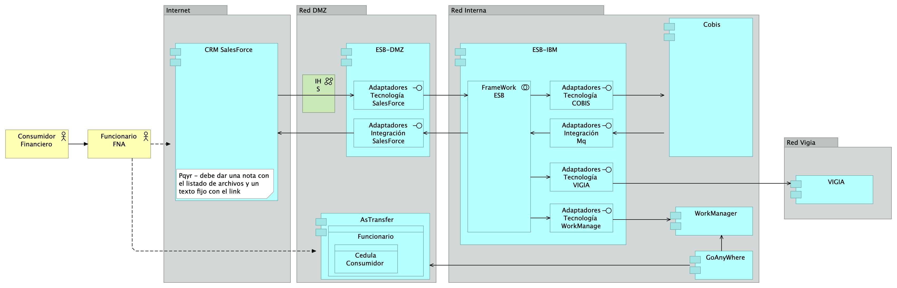

---
title: Diagnóstico SOA Actual FNA
keywords:
- SOA
- madurez
- gobierno
lang: en-US
date-meta: '2023-01-31'
author-meta:
- Harry Wong
- Stefanini.com
header-includes: |
  <!--
  Manubot generated metadata rendered from header-includes-template.html.
  Suggest improvements at https://github.com/manubot/manubot/blob/main/manubot/process/header-includes-template.html
  -->
  <meta name="dc.format" content="text/html" />
  <meta property="og:type" content="article" />
  <meta name="dc.title" content="Diagnóstico SOA Actual FNA" />
  <meta name="citation_title" content="Diagnóstico SOA Actual FNA" />
  <meta property="og:title" content="Diagnóstico SOA Actual FNA" />
  <meta property="twitter:title" content="Diagnóstico SOA Actual FNA" />
  <meta name="dc.date" content="2023-01-31" />
  <meta name="citation_publication_date" content="2023-01-31" />
  <meta property="article:published_time" content="2023-01-31" />
  <meta name="dc.modified" content="2023-01-31T04:42:59+00:00" />
  <meta property="article:modified_time" content="2023-01-31T04:42:59+00:00" />
  <meta name="dc.language" content="en-US" />
  <meta name="citation_language" content="en-US" />
  <meta name="dc.relation.ispartof" content="Manubot" />
  <meta name="dc.publisher" content="Manubot" />
  <meta name="citation_journal_title" content="Manubot" />
  <meta name="citation_technical_report_institution" content="Manubot" />
  <meta name="citation_author" content="Harry Wong" />
  <meta name="citation_author_institution" content="Department of Something, University of Whatever" />
  <meta name="citation_author_orcid" content="XXXX-XXXX-XXXX-XXXX" />
  <meta name="twitter:creator" content="@johndoe" />
  <meta name="citation_author" content="Stefanini.com" />
  <meta name="citation_author_institution" content="Department of Something, University of Whatever" />
  <meta name="citation_author_institution" content="Department of Whatever, University of Something" />
  <meta name="citation_author_orcid" content="XXXX-XXXX-XXXX-XXXX" />
  <link rel="canonical" href="https://hwong23.github.io/fna-devdocs-f2/" />
  <meta property="og:url" content="https://hwong23.github.io/fna-devdocs-f2/" />
  <meta property="twitter:url" content="https://hwong23.github.io/fna-devdocs-f2/" />
  <meta name="citation_fulltext_html_url" content="https://hwong23.github.io/fna-devdocs-f2/" />
  <meta name="citation_pdf_url" content="https://hwong23.github.io/fna-devdocs-f2/manuscript.pdf" />
  <link rel="alternate" type="application/pdf" href="https://hwong23.github.io/fna-devdocs-f2/manuscript.pdf" />
  <link rel="alternate" type="text/html" href="https://hwong23.github.io/fna-devdocs-f2/v/a7188418024b8d23e87662c96641aca12e08b8fb/" />
  <meta name="manubot_html_url_versioned" content="https://hwong23.github.io/fna-devdocs-f2/v/a7188418024b8d23e87662c96641aca12e08b8fb/" />
  <meta name="manubot_pdf_url_versioned" content="https://hwong23.github.io/fna-devdocs-f2/v/a7188418024b8d23e87662c96641aca12e08b8fb/manuscript.pdf" />
  <meta property="og:type" content="article" />
  <meta property="twitter:card" content="summary_large_image" />
  <link rel="icon" type="image/png" sizes="192x192" href="https://manubot.org/favicon-192x192.png" />
  <link rel="mask-icon" href="https://manubot.org/safari-pinned-tab.svg" color="#ad1457" />
  <meta name="theme-color" content="#ad1457" />
  <!-- end Manubot generated metadata -->
bibliography:
- content/manual-references.json
manubot-output-bibliography: output/references.json
manubot-output-citekeys: output/citations.tsv
manubot-requests-cache-path: ci/cache/requests-cache
manubot-clear-requests-cache: false
...

Documentación del proyecto 181-2020, E-Service, 
([permalink](https://hwong23.github.io/fna-devdocs-f2/v/a7188418024b8d23e87662c96641aca12e08b8fb/))
versión indicada a continuación, se encuentra en 
[a718841](https://github.com/hwong23/fna-devdocs-f2/tree/a7188418024b8d23e87662c96641aca12e08b8fb)
on January 31, 2023.

## Grupo E-Service

+ **Harry Wong**
   
    {.inline_icon width=16 height=16}
    [XXXX-XXXX-XXXX-XXXX](https://orcid.org/XXXX-XXXX-XXXX-XXXX)
    · {.inline_icon width=16 height=16}
    [hwong23](https://github.com/hwong23)
    · {.inline_icon width=16 height=16}
    [johndoe](https://twitter.com/johndoe)
     
  <small>
     Department of Something, University of Whatever
     · Funded by Grant XXXXXXXX
  </small>

+ **Stefanini.com**
  ^[✉](#correspondence)^ 
    {.inline_icon width=16 height=16}
    [XXXX-XXXX-XXXX-XXXX](https://orcid.org/XXXX-XXXX-XXXX-XXXX)
    · {.inline_icon width=16 height=16}
    [hwong23](https://github.com/hwong23)
     
  <small>
     Department of Something, University of Whatever; Department of Whatever, University of Something
  </small>

***

# Fase 2: SOA Objetivo FNA
# Contenido de los Productos Contractuales, 181-2020

 

# Producto 5: PR5. Comparativa de la industria y el FNA
Describir y comparar con el Fondo la manera cómo las empresas del segmento y de otros sectores de la industria enfrentan los retos de flexibilidad de negocio, independencia de proveedor tecnológico, y fortaleza SOA.

**Nota**: los análisis de este producto provienen únicamente de los objetivos del proyecto SOA: dependencia de proveedor (OBJ1), fortaleza SOA de las aplicaciones (OBJ2), y el tiempo de mercado (OBJ3).

 

## Justificación
La comparativa SOA de la industria proveerá al Fondo de hallazgos aplicables a sus procesos y productos. A la vez, esta información de guía puede ser traducida en futuras iniciativas pertenecientes a la hoja de ruta de mejora, tanto del gobierno como de los procesos SOA del Fondo.

## Contenidos
1. Arquitectura SOA
1. Portafolio de servicios
1. Gobierno SOA
1. Versionamiento de servicios
1. Monitoreo y operación SOA
1. Mantenimiento y evolución de servicios
1. Nuevas tecnologías

 

## Criterios de Aceptación

* Lista de oportunidades e iniciativas ralizables por el FNA
* Mejoras visibles para las capacidades de la arquitectura SOA del Fondo

*** 

|Tema|Comparativa de la industria y el FNA: **Comparación SOA FNA - Sector**
|----|-------------------------------------------------|
|Palabras clave|SOA, Situación actual, Comparativa|
|Autor||
|Fuente||
|Version|a718841 del 31 Jan 2023|
|Vínculos|[N003a Vista Segmento SOA FNA](N03a%a20Vsta%20aSegenta%20SOA%20FNA.md)|

 

# Comparación SOA FNA - Sector
Para presentar este análisis comparativo hemos selecionado algunas dimensiones que facilitan la presentación de la comparación en categorías. 

Los aspectos a tener en cuenta en la comparativa serán:

1. Arquitectura SOA
1. Portafolio de Servicios
1. Gobierno SOA
1. Estrategia de Versionamiento 
1. Monitoreo y Operación
1. Mantenimiento y Evolución
1. Nuevas tecnologías

 

Presentaremos cada uno de estos aspectos desde el sector financiero en general y; posteriormente serán aplicados al FNA.

 

## Arquitectura SOA

### Descripción
En esta categoría comparativa establecemos como criterios las prácticas asociadas al manejo de los modelos de arquitectura SOA. En este se encuentran consideraciones como si se cuenta con un depósito de arquitectura formal y un grupo de gobierno y desarrollo de la Arquitectura SOA dentro de la organización. Esto último incluye a los cargos y el nivel de formalismo en  realizar y mantener las arquitectura SOA en el Fondo.

### Prácticas del Sector Financiero

Depoósito de arquitectura
Análisis de modelos de arquitectura
Herramientas de modelado de arquitecturas de servicios

### Comparativa FNA

|**Práctica**|**Estado FNA**|**Estado Entidad Bancaria líder en Hispanomericana (BBVA)**|**Estado Entidad Bancaria líder mundial (Capital One)**|
| ------------ | ------------ | ------------ | ------------ |
| Depósito de arquitectura  |Mega y Archimate  |  | - Herramientas de AE como habilitadores, sin embargo documentando lo necesario bajo  enfoques de tipo: MVA (Minimum Viable Architecture) y JITA (Just In Time Architecture) -GitHub |
| Análisis de modelos de arquitectura  |  |   - Optimización de recursos - Buscar funcionalidades comunes - Elasticidad - Gestión de recursos y seguridad - Prescripción de modelos con base en casuistíca | Enfoque interno donde hay un enfoque donde se promueve el reuso por capacidades comunes: sistemas compartidos, componentes compartidos, plataformas compartidas, codigo compartido  |
| Herramientas de modelado de arquitecturas de servicios| Integration Designer IBM, Archimate| | Utilización de lenguajes estandarizados, sin atarse a una herramienta especifica |

 

## Portafolio de Servicios

### Descripción
Esta categoría busca establecer un comparativo entre el las prácticas del FNA y de la industria relacionadas con el manejo de los servicios y el manejo de su portafolio.  Herramientas relacionadas para su gestión, registro, búsqueda y documentación.

### Prácticas del Sector Financiero
Herramientas para el manejo del portafolio de servicios
Gobierno del portafolio de servicios

### Comparativa FNA

|**Práctica**|**Estado FNA**|**Estado Entidad Bancaria líder en Hispanomericana (BBVA)**|**Estado Entidad Bancaria líder mundial (Capital One)**|
| ------------ | ------------ | ------------ | ------------ |
| Herramientas para el manejo del portafolio de servicios | Archimate | - API Market - APIGateway| API Gateway|
| Gobierno del portafolio de servicios | Arquitectura de aplicaciones oficina de informática fondo nacional del ahorro | | Definición de practicas internas basadas en microservicios: - Principio de una sola responsabilidad - Tener un repositorio de datos para cada microservicio - Utilizar la comunicación asíncrona para lograr un acoplamiento flexible - Fallos rápidos mediante un disyuntor para lograr tolerancia a fallos -  Proxy de las solicitudes de microservicios a través de una pasarela API - Asegurar que los cambios en la API son compatibles con versiones anteriores - Versionar  microservicios para cambios disruptivos - Disponer de una infraestructura dedicada para alojar su microservicio - Crear un "tren de liberación" independiente - Crear eficacia organizativa |

 

## Gobierno SOA

### Descripción
Esta categoría busca comparar las mejores prácticas de gobierno SOA en el sector y en el FNA. Este item se relaciona de forma directa con el punto de portafolio de servicios pero va mas allá.  En esta categoría se establecen criterios como políticas, guías y procedimientos asociados a la dirección de la arquitectura de servicios de la organización.

### Mejores prácticas en el sector
Comité de arquitectura
Políticas y lineamientos
Arquitectura de referencia
Toma de decisión 
Priorización de servicios

### Comparativa FNA
|**Práctica**|**Estado FNA**|**Estado Entidad Bancaria líder en Hispanomericana (BBVA)**|**Estado Entidad Bancaria líder mundial (Capital One)**|
| ------------ | ------------ | ------------ | ------------ |
| Comité de arquitectura | No existe formalmente | | Comité conformado donde se involucran todos los especialistas, con  un enfoque de la "solución" es lo primordial.|
| Políticas y lineamientos | Arquitectura de aplicaciones oficina de informática fondo nacional del ahorro | Orentación a procesos y automatización | Claramente establecidos, de conocimiento publico y en constante evolución. - Innersource: "Desarrollo de aplicaciones empresariales con prácticas de código abierto"|
| Arquitectura de referencia |  - Bus de servicios de Entidad (ESB). - Arquitectura de referencia SOA |  - Service mesh - Domain driven Design - REST - GraphQL - Cloud computing | Uso de arquitecturas de referencia con un enfoque proactivo más que reactivo. Donde se busca que la mejor documentación se encuentre en el futuro propuesto. - Cloud Computing - Microservicios - Arquitectura orientada a eventos - Event-Driven Architectures (EDA) - Serverless - Service mesh |
| Toma de decisión | Fragmentados en silos |  metodología SGMM (SOA Governance and Management Method) | Decisiones de arquitectura basadas al tener en cuenta diferentes perspectivas pasando desde el negocio a lo técnico. |
| Priorización de servicios | Orientado por necesidades de área de negocio | | Enfoque desde el punto de vista de minimizar los "Riesgos para el negocio" |

 

## Estrategia de Versionamiento 

### Descripción
Esta categoría busca establecer los mecanismos, herramientas y mejores prácticas relacionadas con el manejo de las versiones de los servicios.  

 

### Prácticas del Sector Financiero

Manejo de la gestión del cambio
Herramientas para documentación y gestión de las versiones de servicios
Documentación de los servicios y sus versiones

 

### Comparativa FNA
|**Práctica**|**Estado FNA**|**Estado Entidad Bancaria líder en Hispanomericana (BBVA)**|**Estado Entidad Bancaria líder mundial (Capital One)**|
| ------------ | ------------ | ------------ | ------------ |
| Manejo de la gestión del cambio | Definida al interior de la organización | | API Gateway, con versiones para cada cambio |
|Herramientas para documentación y gestión de las versiones de servicios | | | Swagger, MadCap Flare |
| Documentación de los servicios y sus versiones | Definida al interior de la organización. No centralizada, ni alineada a un gobierno | | OpenAPI, Swagger|

 

## Monitoreo y Operación

### Descripción
Esta categoría analiza las diferentes herramientas, mecanismos y mejores prácticas relacionadas con el monitoreo y operación de los servicios en operación.  

### Prácticas del Sector Financiero
Herramientas utilizadas para gestionar el despliegue y operación de los servicios
Herramientas para monitoreo de la operación, gestión de alarmas y notificaciones

### Comparativa FNA
|**Práctica**|**Estado FNA**|**Estado Entidad Bancaria líder en Hispanomericana (BBVA)**|**Estado Entidad Bancaria líder mundial (Capital One)**|
| ------------ | ------------ | ------------ | ------------ |
| Herramientas utilizadas para gestionar el despliegue y operación de los servicios | IBM Jazz | GitLAB CI | Jenkins,  herramientas del proveedor de nube, kubernetes|
|Herramientas para monitoreo de la operación, gestión de alarmas y notificaciones | Herramientas para monitoreo a nivel de Infraestructura |New Relic |herramientas del proveedor de nube|

 

## Mantenimiento y Evolución

### Descripción
Esta categoría analiza las estrategias recomendadas para favorecer el mantenimiento y evolución de los servicios.  Es decir la capacidad de la organizacón de poder mantener, mejorar, corregir y evolucionar los servicios de la organización.

### Prácticas del Sector Financiero
Gestión del cambio
Manejo de solicitudes de cambio
Gestión de prioridades para los cambios
Gestión de inconformidades y defectos 

### Comparativa FNA
|**Práctica**|**Estado FNA**|**Estado Entidad Bancaria líder en Hispanomericana (BBVA)**|**Estado Entidad Bancaria líder mundial (Capital One)**|
| ------------ | ------------ | ------------ | ------------ |
| Gestión del cambio | Comité de cambios | PI Planning , Oficina Agile | Enfoque en "reducción del riesgo" |
| Manejo de solicitudes de cambio | Procedimiento interno | | Implementación de microservicios con separación de lógica y responsabilidades |
| Gestión de prioridades para los cambios | Comité de cambios | | Service Design: diseñar la experiencia orquestada de todos los puntos de contacto del servicio. |
| Gestión de inconformidades y defectos  | Procedimiento interno | | El principio de "sala blanca"(clean room) se centra en la prevención de defectos  |

 

## Nuevas tecnologías

### Descripción
En esta categoria se analizan las prácticas del FNA comparadas con la industria  en temas relacionados con la vigilancia de nuevas tecnologías asociadas a servicios, así como las políticas de renovación y adopción de dichas tecnologías.

### Prácticas del Sector Financiero

Políticas de vigilancia
Laboratorios para experimentación de nuevas tecnologías
Capacitación y entrenamiento
Plan programado de adopción y migracións

### Comparativa FNA
|**Práctica**|**Estado FNA**|**Estado Entidad Bancaria líder en Hispanomericana (BBVA)**|**Estado Entidad Bancaria líder mundial (Capital One)**|
| ------------ | ------------ | ------------ | ------------ |
| Políticas de vigilancia | No existe formalmente |  'Reinventar la empresa en la era digital' | Observación del mercado, revisión interna y constante experimentación |
| Laboratorios para experimentación de nuevas tecnologías | | BBVA Next Technologies | Equipo interno con orientación centrada al cliente, API abierta a integración con terceros, hackatons, iteraciones y prototipados agiles |
| Capacitación y entrenamiento | | Política de certificación con aliados claves de tecnología | Presupuesto interno para estimular el crecimiento academico, adicional hay enfoque en proyectos personales |
| Plan programado de adopción y migraciones | || Politica de salida a producción completamente automatizada, bajo el principio de "Sala blanca", donde el proceso garantiza que no hay dudas sobre lo que sale a producción|

# Fase 2: SOA Objetivo FNA
# Contenido de los Productos Contractuales, 181-2020

# Producto 6: PR6. Gobierno SOA
El gobierno SOA es el encargado de vigilar las relaciones entre las áreas de negocio incluidas en el segmento FNA del presente diagnóstico (la vicepresidencia de operaciones y la vicepresidencia de crédito del FNA) y la implementación y diseño de soluciones SOA. El modelo de gobierno SOA para el Fondo debe asistir en la aplicación y ejecución de un régimen (estándar) de implementación, observación y puesta en marcha de soluciones SOA.

**Nota**: los análisis de este producto están dirigidos a cumplir los objetivos del proyecto SOA: dependencia de proveedor (OBJ1), fortaleza SOA de las aplicaciones (OBJ2), y tiempo de mercado (OBJ3).

 

## Justificación
El cierre de brechas de alineación negocio FNA-SOA (Ver PR9. Portafolio de inciativas y brechas) es una de las principales razones por las que implementar el modelo de gobierno SOA. Pero no es la única. El gobierno también debe demostrar los beneficios de aumentar el nivel de eficacia (madurez) SOA, tanto en el segmento FNA seleccionado por este diagnóstico como a todo el Fondo. Por último, el gobierno SOA funciona como una disciplina para hacer frente a los retos futuros con una mirada en la inversión de tecnología, los riesgos operativos y en la alineación con el negocio del FNA.

## Contenidos
1. Definición de objetivos y capacidades del gobierno SOA
1. Equilibrio arquitectura y procesos SOA
1. Supervisión de efectividad y factibilidad SOA
1. Mejora de los índices de efectividad (madurez) SOA
1. Consideraciones para la puesta en marcha del gobierno SOA en el fna

 

## Criterios de Aceptación

* Objetivos y capacidades del gobierno SOA para el Fondo
* Índices de efectividad (madurez) SOA 1

*** 

|Tema|Gobierno SOA: **Definición de objetivos del gobierno SOA**
|----|-------------------------------------------------|
|Palabras clave|SOA, Situación actual, Capacidades de negocio|
|Autor||
|Fuente||
|Version|a718841 del 31 Jan 2023|
|Vínculos|[Fase 2 PR6 Gobierno SOA](N03a%a20Vsta%20aSegenta%20SOA%20FNA.md)|

 

## Definición de objetivos del gobierno SOA
Dado los niveles de complejidad que el FNA ha alcanzado y por los riesgos tecnológico que contraen las partes analizadas en la Fase 1 de este diagnóstico (ver [04b.Resumen Fase 1](N03a%a20Vsta%20aSegenta%20SOA%20FNA.md)), esto es, aplicaciones, servicios, procesos, infraestructura, entre otros, la figura de gobierno SOA es de carácter obligatorio en el Fondo. Esta sirve además para  complementar los procedimientos de TI del Fondo (ver anexo 1, [06n. Anexos](N03a%a20Vsta%20aSegenta%20SOA%20FNA.md)).

De las problemáticas encontradas en la Fase 1 del presente diagnóstico, nos estamos refiriendo explícitamente a las que incrementan la complejidad de las herramientas de software y soluciones tecnológicas del FNA, _como lo es el manejo de dependencias de los servicios SOA del Fondo_. Es muy conocido, y demostrado, que solo esta condición es la causa de la mayoría de los sobreesfuerzos en los cambios y de la dificultades a la hora de predecir su impacto.

Junto a esta complicación, que de por sí hace obligatoria la introdución de la figura del gobierno SOA en el Fondo, y que organizaciones como el OpenGroup señalan que se dan por la falta de Arquitectura Empresarial, y por consiguiente, por un débil gobierno, se encuentran otras que fueron levantadas en la Fase 1 del presente diagnóstico: agilidad limitada, complejidad e imprecisión en la trazabilidad, ocultamiento de funcionalidades (ver [04b.Resumen Fase 1](N03a%a20Vsta%20aSegenta%20SOA%20FNA.md)).

 

### Objetivos Principales del Gobierno SOA del FNA
Una vez identificadas estas problemáticas de orden mayor existentes en la empresa y que podemos resumir en tres: riesgo tecnológico, complejidad y nivel de adopción SOA presente en los desarrollos e implementaciones del FNA, el gobierno SOA propuesto para el Fondo debe incluir entre sus objetivos, como mínimo, los siguientes

[Imagen.]() Objetivos principales del gobierno SOA del FNA.

_Fuente: elaboración propia._

 

1. Vigilancia del riesgo tecnológico en tres vías. Primero, hacer seguimiento a la inversión tecnológica, el cual involucra a los provedores del FNA y colaboración con externos; segundo, evaluar y constatar la implementación de herramientas de software, la cual podría limitarse a servicios SOA; y finalmente, controlar la adopción de nuevos diseños, nuevos marcos de trabajo, librerías o componentes de terceros.
1. Del objetivo anterior (Vigilancia del riesgo tecnológico) se desprende este para enfatizar el control sobre la inversión de TI: vigilar la efectividad y factibilidad de los proyectos SOA de la organización en términos del área de efectividad del costo y factibilidad SOA. Ambos conceptos explicados en [Supervisión de efectividad y factibilidad SOA](N03a%a20Vsta%20aSegenta%20SOA%20FNA.md).
1. Vigilar el crecimiento de la complejidad y el impacto de los nuevos cambios en la arquitectura de referencia SOA del Fondo, bien sea por medio de las revisiones de diseño, el comité de arquitectura, o por el desarrollo y distribución de un catálogo de soluciones preconstruídas que alivie y guíe a las fábricas y desarrolladores que trabajan para la empresa.
1. Vigilar y perseguir el aumento de los índices de adopción, adaptación y efectividad SOA presentes en los análisis de madurez como el realizado en la Fase 1 del diagnóstico presente (ver [02.Fase 2 PR2 Estudio Madurez SOA FNA](N03a%a20Vsta%20aSegenta%20SOA%20FNA.md)).
1. Poner el marcha el proceso de gobierno SOA del FNA descrito más adelante en este ejercicio (181-2020). Adaptar y monitorear los índices de rendimiento (KPI) del proceso.

 

### Otros Objetivos del Gobierno SOA
Para complementar la lista de objetivos del gobierno SOA recomendados por este diagnóstico al Fondo, la lista siguiente expone objetivos que pueden ser conseguidos de forma indirecta, o con la mediación de proyectos transformadores, como la Arquitectura Empresarial, transformación digital, arquitectura de negocio, entre otros.

1. Desde el área, o rol, de gobierno SOA del FNA, servir de guía en la entrega de soluciones de software conforme a la arquitectura de referencia estregada por esta consultoría.
1. Informar de desviaciones en la relación de efectividad de costos de los proyectos SOA del FNA (en términos del área de inefectividad de costo e infactibilidad SOA.
1. Hacer el seguimiento de las implementaciones de los cambios en la arquitectura de referencia: phase G, Implementation Governance, TOGAF ADM.

 

[Imagen.]() Objetivos secundarios del gobierno SOA del FNA.

_Fuente: elaboración propia._

|Tema|Gobierno SOA: **Riesgos tecnológicos del FNA**
|----|-------------------------------------------------|
|Palabras clave|SOA, Gobierno, Riesgo, Objetivos de negocio|
|Autor||
|Fuente||
|Version|a718841 del 31 Jan 2023|
|Vínculos|[Fase 2 PR6 Gobierno SOA](N03a%a20Vsta%20aSegenta%20SOA%20FNA.md)|

 

## Riesgos Tecnológicos del FNA
Los riesgos tecnológicos encontrados en el diagnóstco SOA de Fase 1 (ver [03.Fase 1 PR3 Resultado Diagnóstico Situación Actual](N03a%a20Vsta%20aSegenta%20SOA%20FNA.md)), y que describimos abajo, están incorporados a las vigilancias del gobierno SOA propuesto. A la vez, estos mismos riesgos descritos a continuación deben ser agregados a la matriz de gestión actual del Fondo, y gestionados por los métodos propios con los que ya cuenta el FNA.

 

### Gobierno SOA y Riesgos Tecnológicos del FNA
El gobierno SOA del FNA debe buscar la capacidad para medir y gestionar (agregar a la lista de riesgos de la empresa) los riesgos que lo están afectando.

* R1. Riesgo de agilidad limitada (ver imagen 1)
* R2. Riesgo de baja orquestación SOA (ver imagen 2a y 2b)
* R3. Riesgo de crecimiento de dependencias entre servicios SOA
* R4. Riesgo de crecimiento de adaptadores particulares --opuesto al estándar-- (ver imagen 3)
* R5. Riesgo de baja reutilización de servicios SOA
* R6. Riesgo de permanencia de aplicaciones silos
* R7. Riesgo de falta de trazabilidad para la evolución e implementación de los servicios SOA

 

[Imagen 1.]() Riesgo no. 1 y 2. Agilidad limitada por el proliferación de la copmlejidad en los servicios SOA del Fondo.

_Fuente: elaboración propia, ae_fna_as_is.archimate._

 

[Imagen 2a.]() Riesgo no. 2. En el modelo "ae_fna_as_is.archimate" de situación actual del FNA no aparecen relaciones de este con los procesos de negocio. La principal utilización del bus (ESB-IBM, en la imagen) está destinada a la integración de aplicaciones. 

_Fuente: ae_fna_as_is.archimate._

 

[Imagen 2b.]() En el modelo "ae_fna_as_is.archimate" no es posible encontrar relaciones del bus con los procesos.

_Fuente: ae_fna_as_is.archimate._

 

[Imagen 3.]() Riesgo no. 4 y 5. Caso de CRM del FNA. Le afecta el riesgo de estándarización en la interoperabilidad, aumenta la cantidad de adaptadores particulares.

_Fuente: ae_fna_as_is.archimate._

|Tema|Gobierno SOA: **Capacidades FNA por Desarrollar para el Gobierno SOA**
|----|-------------------------------------------------|
|Palabras clave|SOA, Situación actual, Capacidades de negocio|
|Autor||
|Fuente||
|Version|a718841 del 31 Jan 2023|
|Vínculos|[Fase 2 PR6 Gobierno SOA](N03a%a20Vsta%20aSegenta%20SOA%20FNA.md)|

 

### Capacidades FNA por Desarrollar para el Gobierno SOA
Las capacidades requeridas por el gobierno SOA del Fondo, que a la vez soportan a la matriz de roles y responsabilidades (RACI) futuras del equipo de gobierno SOA o del Comité de arquitectura del Fondo están relacionados directamente con los objeitvos del gobierno SOA y con los riesgos tecnológicos encontrados en la Fase 1 (ver [06a.Objetivos gobierno](N03a%a20Vsta%20aSegenta%20SOA%20FNA.md), y [06c.Riesgos tecnológicos SOA](N03a%a20Vsta%20aSegenta%20SOA%20FNA.md)).

 

>**Nota**: no es del alcance de esta consultoría, E-Service (contrato 181-2020), desarrollar estas capacidades. Esto requeriría de la ejecución de otro(s) proyecto. El Fondo podría desarrollar estas capacidades indicadas por este diagnóstico de forma interna, o contratar proyectos para la creación y gestión de estas capacidades.

 

[Imagen 1.]() TOGAF 9, Fase G, Implementation governance para la implementación de las capacidades de ejecución de hojas de ruta del FNA.

_Fuente: elaboración propia._

 

1. CAP1. Realizar e implementar estrategias y entregables para planear y analizar la arquitectura de referencia SOA del Fondo (resultado Fase 2 de este diagnóstico).
1. CAP2. Relacionar elementos de la arquitectura de referencia SOA (181-2020), esto es, procesos de negocio, servicios, datos, aplicaciones, componentes, tecnologías, etc., y vincular distintas perspetivas a una vertical de negocio del  Fondo, como, Gestión Comercial, Cesantías, Ahorro Voluntario para desarrollar modelos consistentes y desarrollar la oportunidad de dirigir cambios y atacar los problemas de integralidad de las pruebas.
1. CAP3. Realizar y gestionar la puesta en marcha de hojas de ruta para cerrar brechas y alcanzar estados futuros de la arquitectura (TOGAF 9, Fase G, Implementation governance). Ver anexo 1.
1. CAP4. Ejercitar la trazabilidad de los activos y productos de TI con los productos y decisiones de negocio de las áreas del FNA, como la vicepresidencia de Crédito y la de Operaciones ante la llegada de impactos, cambios, reformas y bajas tecnológicas.
1. CAP5. Realizar análisis de impacto, riesgos, costo beneficio, capacidad usada, y gestión de demanda ante la evaluación de cambios a la arquitectura de referencia SOA y activos de TI, cuando lo amerite.
1. CAP6. Emitir y gestionar los contenidos de documentación técnica, como principios, restricciones tecnológicas, marcos de trabajo, normas, diseños, y estándares para el uso de los proveedores, servicios de fábricas del FNA, planta interna, Comunicación y Planeación.
1. CAP7. Emitir y actualzar el marco de trabajo de gobierno SOA que complemente el de TI del Fondo y que enuncie los procesos, procedimientos y responsabilidades de este con el fin de generar la autoridad y asistir en la toma de deciones internas (áreas de TI y Planeación del Fondo) y externas (proveedores del Fondo)

 

### Anexo 1. Proceso de Arquitectura Empresarial

[Imagen 2.]() TOGAF 9, Fase G, Implementation governance para la implementación de las capacidades de ejecución de hojas de ruta del FNA.

_Fuente: www.opengroup.org/soa/source-book/togaf._

|Tema|Gobierno SOA: **Mejora de los indicadores de efectividad (madurez) SOA**
|----|-------------------------------------------------|
|Palabras clave|SOA, Inversión TI, Eficacia, KPI, Proceso SOA|
|Autor||
|Fuente||
|Version|a718841 del 31 Jan 2023|
|Vínculos|[Fase 2 PR6 Gobierno SOA](N03a%a20Vsta%20aSegenta%20SOA%20FNA.md)|

 

## Indicadores de Efectividad del Gobierno SOA
Más allá de los índices propuestos por el análisis de madurez SOA desarrollado en la Fase 1 de este diagnóstico, _para el FNA es clave mantener activo el vínculo de sus activos tanto de infraestructura como los activos SOA (y de todos, aunque se escapen del alcance de este ejercicio) con el contexto de negocio de las vicepresidencias de Operaciones y de Crédito_. Esto es, el principal indicador del gobierno SOA es la existencia y actualidad de los vínculos entre los contextos de negocio y la arquitectura de referencia SOA FNA, y su tecnología.

Este solo indicador del gobierno SOA, el del vínculo de los contextos negocio-tecnología SOA, que es útil también para otras disciplinas de gestión TI, _identifica y justifica los costos de un cambio en relación al Valor de negocio que pueda traer_. Sirve de base para los procesos de obsolutamente todas las decisiones de cambio, mejora, inversión, recorte, y otras propias de la gestión de la tecnología SOA.
Sirve además para medir la confiabilidad de los análisis que sobre los modelos se realicen. _Es por estas razones que para el Fondo este es el principal indicador de gobierno SOA a desarrollar_.

De todos, el indicador de Vínculo Contexto Negocio-SOA es el más importante para el FNA. Para mantener el puntaje de este indicador alto debe recurrir a la actualización y mantenimiento del repositorio de arquitectura. En la medida en que este repositorio capture la mayor cantidad de información de los contextos referidos, el indicador aumentará, a la vez que el repositorio será un activo clave para todas las opeaciones de gestión de TI del FNA.

[Imagen 1.]() Indicador principal del gobierno SOA: KPI de Vínculo Contexto Negocio-SOA. Identifica y justifica los cambios SOA en relación al Valor de negocio.

_Fuente: elaboración propia._

 

## Indicadores Complementarios del Gobierno SOA
Los siguientes indicadores han sido escogidos para atacar los problemas en la gestión de SOA encontrados en la Fase 1 del presente diagnóstico (ver [04b.Resumen Fase 1](N03a%a20Vsta%20aSegenta%20SOA%20FNA.md)). sirven de base de pirámide para el indicador principal. 
 
1. Índice de alineación de la arquitectura de referencia SOA con las capacidades de negocio
1. Índice de conformidad de los servicios SOA a los estándares de diseño orientados a servicio 
1. Índice de reutilización y composición de los servicios SOA del portafolio FNA

 

Cada uno de estos indicadores debe ser soportados con fuentes de información existentes o por desarrollar, que aparecen en la imagen como _Objeto de información_.

[Imagen 1.]() Indicador principal del gobierno SOA: KPI de Vínculo Contexto Negocio-SOA. Identifica y justifica los cambios SOA en relación al Valor de negocio.

_Fuente: elaboración propia._

 

Algunas fuentes u objetos de información sugeridas y ya existentes en el FNA son, por ejemplo, el número y tipo de requerimientos registrados en las herramienta de gestión, como Clear Case (IBM); los resultados de las evaluaciones de calidad de las implementaciones de los proveedores del Fondo; o el número de casos correctivos en un período contenidos en el Service Manager, entre otros.

## Anexos 

### Procedimiento del Área TI del FNA

# Fase 2: SOA Objetivo FNA
# Contenido de los Productos Contractuales, 181-2020

# Producto 7: PR7. Vigilancia Tecnológica SOA
Describir y justificar la selección de tecnologías y las técnicas de diseño, implementación y gestión de servicios SOA aplicables al Fondo Nacional del Ahorro (FNA).

**Nota**: los análisis de este producto están dirigidos a cumplir los objetivos del proyecto SOA: dependencia de proveedor (OBJ1), fortaleza SOA de las aplicaciones (OBJ2), y tiempo de mercado (OBJ3).

 

## Justificación
Identificar los avances en el desarrollo SOA que impulsen a las iniciativas y propuestas de solución SOA para el FNA.

## Contenidos
1. Lista tecnologías SOA afines al Fondo
1. Lista de beneficios al FNA por las tecnologías seleccionadas
1. Implicaciones para la adquisición y adopción tecnológica

 

## Criterios de Aceptación

* Evaluación e Identificación de la tecnología SOA en alineación con los objetivos del proyecto
* Presentación de una arquitectura SOA candidata versión 1.1

*** 

|Tema|Vigilancia Avances de Industria: **Estrategia de modelado e identificación de servicios**
|----|-------------------------------------------------|
|Palabras clave|SOA, Tecnologías, Vigilancia, Avances|
|Autor||
|Fuente||
|Version|a718841 del 31 Jan 2023|
|Vínculos|[N003a Vista Segmento SOA FNA](N03a%a20Vsta%20aSegenta%20SOA%20FNA.md)|

 

# Estrategia de modelado e identificación de servicios 

## Domain-Driven Design
Una de las principales estrategias de diseño de arquitecturas orientadas a servicios / microservicios, es la de reemplazar la búsqueda de reutilización por la facilidad de mantenimiento de los servicios.

En SOA es usual propender por servicios que puedan ser reutilizados a lo largo de toda la organización y en diferentes aplicaciones.  El ojetivo es que un servicio pueda solucionar necesidades de diferentes unidades organizacionales y diferentes procesos de negocio, esto implica usualmente servicios que manejan formatos canónicos y tienen reglas de negocio bastante particulares para solucionar casos puntuales y específicos de las unidades de negocio.  Si bien en un principio se veía esta reutilización como algo favorable, normalmente implicaba un desbalance con la facilidad de modificación.  Un cambio en una regla de negocio implica un versionamiento del servicio y afectar a todos los usuarios del servicio.

Una propuesta diferente que se está utilizando actualmente es la de modelar los servicios a partir de estrategias como Domain-Driven Design o DDD. En esta propuesta se busca tener servicios dedicados al dominio así no sean reutilizados

DDD reconoce los dominios y subdominios de negocio como elemento fundamental para la estrategia de servicios. Se busca tener una alineación entre negocio y tecnología, comenzando por los subdominios de negocio de la organización.

[Imagen. ]() Ilustración Domain-Driven Design.

_Fuente: elaboración propia._

 

Los subdominios pueden ser clasificados en subdominios Core, Soporte y General. El subdominio Core representa lo misional de la organización, los de soporte, representan servicios generales y transversales a las organizaciones y los generales los orientados a las unidades de negocio no core.

[Imagen. ]() Ilustración Domain-Driven Design.

_Fuente: elaboración propia._

 

Una vez se identifican los subdominios de la organización se hace una relación entre subdominio y los llamados contexto acotados. Los contexto acotados pueden verse como agrupaciones de servicios asociadas a subdominios de la organización

Es posible que un subdominio de negocio tenga asociados varios contextos acotados, es decir que el subdominio se represente con agrupaciones de servicios separadas pero asociadas a un mismo concepto de negocio.

[Imagen. ]() Ilustración Domain-Driven Design.

_Fuente: elaboración propia._

 

Una característica de un contexto acotado es el uso de un lenguaje ubicuo.  Esto quiere decir que conceptos como cliente, producto o servicio, pueden tener significados diferentes en diferentes contextos acotados.

Lo anterior hace que ya no se busque encapsular en un solo servicio, por ejemplo cliente, todas las posibles reglas de negocio de la organización, sino que existan diferentes servicios Cliente, con funcionalidades más pequeñas y acotadas, en cada contexto. Esto hace que se pierda la reutilización pero se gana en mantenimiento de la solución.

[Imagen. ]() Ilustración Domain-Driven Design.

_Fuente: elaboración propia._

 

El proceso de identificación de los contextos acotados y sus lenguajes ubicuos se denomina diseño estratégico. Como se ha explicado, el diseño estratégico identifica agrupaciones de servicios.

La siguiente fase es la del diseño táctico. En esta fase, se identifican componentes más pequeños denominados agregados. Los agregados se pueden ver como las unidades de implementación en SOA, es decir los servicios. Un agregado es usualmente un servicio.

[Imagen. ]() Ilustración Domain-Driven Design.

_Fuente: elaboración propia._

 

El conjunto de agregados irán conformando el portafolio de servicios de la organización.

[Imagen. ]() Ilustración Domain-Driven Design.

_Fuente: elaboración propia._

 

* Entity. Modela un elemento de forma individual Tiene un identificador único.
* Value Objects. Modela un concepto inmmutable, el cual no tiene identificador único. Usualmente se usa para describir, cuantificar o medir un Entity.
* \<\<root>> Entity. Da el nombre a la agregación y contiene todos los otros elementos (entidades y values). Es el único punto de entrada a la agregación.

[Imagen. ]() Ilustración Domain-Driven Design.

_Fuente: elaboración propia._

 

Por último, cada Aggregate, forma una frontera transaccional. Al interior todo las partes son consistentes.

1. Las innvariantes de negocio se protegen dentro de un Aggregate
1. Propender por diseñar Aggregates pequeños
1. Solo se referencian otros aggregates por su identificador
1. Los Aggregates se actualizan mediante la consistencia eventual

# Fase 2: SOA Objetivo
# Contenido de los Productos Contractuales, 181-2020

# Producto 8: PR8. Arquitectura SOA Candidata para FNA
La arquitectura SOA candidata para el FNA es la continuación de la referencia SOA desarrollada en la Fase 1 del presente diagnóstico. Esta nueva edición de la arquitectura es la base para planear el fortalecimiento SOA y de las capacidades de negocio del segmento de la empresa FNA. La arquitectura candidata recoge principalmente los análisis previos de situación actual SOA del Fondo, análisis de madurez SOA, el análisis de vigilancia tecnológica y estilos SOA, y el de la comparativa con el sector de la industria. 

**Nota**: los análisis de este producto están dirigidos a cumplir los objetivos del proyecto SOA: dependencia de proveedor (OBJ1), fortaleza SOA de las aplicaciones (OBJ2), y tiempo de mercado (OBJ3).

 

## Justificación
La arquitectura SOA candidata del FNA sirve de base para la planeación de cambios de cierre de brecha de la situación actual SOA del Fondo (ver Fase 1).

## Contenidos
1. Arquitectura de referencia SOA FNA, versión 2.0
1. Consideraciones para gobierno y adaptabilidad de la arquitectura 2.0
1. Administración de requerimientos de arquitectura para evolución y mantenimiento
1. Procedimientos de evaluación de la arquitectura candidata FNA (req. no funcionales)

 

## Criterios de Aceptación

* Arquitectura de referencia SOA FNA, versión 2.0
* Articulación con gobierno SOA del FNA

*** 

# Fase 2: SOA Objetivo
# Contenido de los Productos Contractuales, 181-2020

# Producto 8: PR8a. Portafolio de Inciativas y Brechas
La técnica del portafolio de brechas es utilizada en el desarrollo de este ejercicio de diagnóstico SOA del FNA para analizar la situación actual SOA (Fase 1 del proyecto) desde la perspectiva de proyectos ejecutables. La idea principal del análisis de brecha es resaltar los proyectos o ítems omitidos, o por definir, entre la situación actual SOA del FNA y la situación objetivo, incluso cuando esta última está todavía en evolución. Lo anterior da origen al portafolio de iniciativas priorizadas que ser ejecutadas cierra las brechas analizadas.

**Nota**: los análisis de este producto están dirigidos a cumplir los objetivos del proyecto SOA: dependencia de proveedor (OBJ1), fortaleza SOA de las aplicaciones (OBJ2), y tiempo de mercado (OBJ3).

 

## Justificación
Asegurar que la arquitectura SOA del Fondo apegada a la [Vista de Segmento FNA](vistadesegmento.md) soporte al procesamiento de información, a los sistemas de información, a las capacidades de negocio, y tecnologías requeridas para cumplir los objetivos de este ejercicio de diagnóstico SOA. Dar continuidad y orden al impacto y realiación de los cambios entre evoluciones de la arquitectura SOA.

## Contenidos
1. Arquitectura SOA candidata para el segmento FNA (vista de segmento)
1. Matriz de brechas de las partes del segmento FNA
1. Bloques de cambios para el segmento FNA: ítems por retener, rediseñar, actualizar, retirar
1. Análisis de impacto y dependencia entre los cambios en el segmento de la empresa
1. Ficha descriptiva de iniciativas de mejora para el segmento FNA (justificación)
1. Hoja de ruta preliminar hacia un objetivo de mejora

 

## Criterios de Aceptación

* Lista de cambios para el segmento FNA: ítems incluídos, por mejorar, nuevos y eliminados
* Hoja de ruta preliminar hacia un objetivo de mejora

*** 

